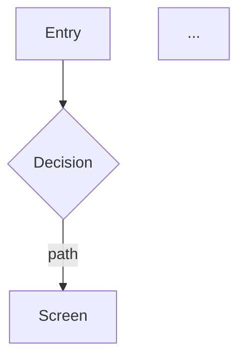
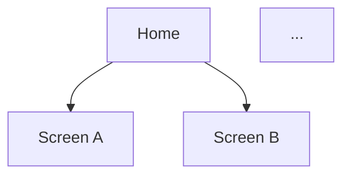

Produce the **design/engineering spec** for a synthesized, reviewed research study: a single `SPEC.md` that turns *what we learned* into *what to build*. This is the bridge between research and design — where `brief-feature` makes the stakeholder *narrative* ("should we build this"), `draft-spec` makes the maker's *definition* ("here is what to build"), and `design-prototype` makes the clickable *artifact* ("here is what it looks and feels like"), for a designer picking up Figma or an engineer scoping work.

It is an **optional, additive** step (like the benchmark lenses), run only when the user asks — not part of the required spine. One `SPEC.md` per study, written at the study root next to `SYNTHESIS.md`.

This is a synthesis-to-deliverable step, not a capture step. **Every requirement must trace back to a synthesis feature/finding and its evidence — do not invent features, flows, screens, metrics, or sources** (same non-fabrication guardrail as the rest of the workspace). Where the spec must extrapolate beyond what the research supports, say so explicitly as a flagged **assumption**, exactly as the lenses flag inference.

## Steps

1. **Locate the study & its synthesis.** If arguments name a study folder, use it; otherwise resolve it per `.claude/references/active-research.md` (this terminal's binding, else the sole active study, else ask). If nothing resolves, STOP and tell the user to pass a study folder or run `new-research`. Confirm `<folder>/SYNTHESIS.md` exists — if not, STOP and tell the user to run `synth-findings` first (there is nothing to spec yet).

2. **Require a reviewed synthesis (hard gate).** Check that `SYNTHESIS.md` contains a `## Peer Review` section (written by `review-research`), or a legacy `## Agent Review` section from a study reviewed before the peer-review debate existed. If **neither** is present, STOP and tell the user to run `review-research` first: a spec commits design and engineering effort, so it builds only on findings that have been debated and strengthened. Proceed only if the user explicitly overrides after being told.

3. **Read the ground truth & note the type.** Read `SYNTHESIS.md` in full (including its `## Peer Review` (or legacy `## Agent Review`) verdicts and any `## Gaps & caveats`), plus the research `README.md` for the `Type` and the stated `## Goal` / `## Scope`. The spec branches on `Type`:
   - **benchmark** → a **forward spec.** The synthesized features are "what good looks like"; the spec defines the product *we* would build informed by them. Priority follows the synthesis's own recommendation/sequencing and the `## Peer Review` strengthening (drop Unsupported findings; do not build on findings the debate could not support). Go/No-Go is decided here at spec time by the stakeholder review in step 5, not read from the synthesis.
   - **usability** → a **redesign spec.** The findings' recommendations become the requirements (fixes); the user flow is the *corrected* flow; the IA is the *revised* structure. Priority follows **severity** (severity 4 → Must, and so on), tempered by the review verdicts.
   Also note which evidence (screenshots, `flow.gif`, sessions) the synthesis cites, so the spec can point at real captures.

4. **Draft `SPEC.md` WITH the user — do not finalize yet.** Work through the document section by section (template below), pulling every requirement from a synthesis entry. Draft, in order:
   - **Functional requirements** — MoSCoW-prioritized, each with a stable ID, a one-line statement, a **Source** back-reference to the synthesis entry + its evidence, **acceptance criteria** (Given/When/Then or a testable checklist), and any **notable edge cases** for that requirement.
   - **User flow** — a **Mermaid** `flowchart` of the core flow (entry point → goal), plus a written **numbered step-by-step** (mirroring the `flow.md` convention: one step per user action, what the user does + what the screen shows), calling out decision points, error branches, and dead-ends.
   - **Information architecture** — a **Mermaid** sitemap/tree of the screens and a screen-inventory table (screen → purpose → parent → the FRs it satisfies).
   - **Screen list (wireframe-level)** — one entry per screen: purpose, key content blocks, primary action(s), the FRs it satisfies, and its states (empty / loading / error / success).
   - **Edge cases & error states** — the cross-cutting ones (offline, permission denied, empty data, validation failure) not tied to a single FR.
   - **Traceability matrix** — FR ↔ synthesis source ↔ screen, so the whole spec is auditable and nothing is unsupported.
   - **Assumptions & open questions** — every place the spec extrapolates beyond the research, flagged, with what to validate next.

   Keep the requirements grounded and minimal: prefer the smallest set that satisfies the goal. Present the draft in chat and refine it with the user before review.

6. **Principal Designer review (Mode S — quality gate).** Dispatch the Principal Designer as a subagent (Agent tool, `general-purpose`) in **Mode S**, handing it `.claude/personas/principal-designer.md`, the drafted `SPEC.md`, `SYNTHESIS.md` (incl. its `## Agent Review`), and the `README.md` (goal + type). It judges the spec for **traceability** (every FR maps to a synthesis source — nothing invented), **scope discipline** (no unsupported features; No-Go/low-priority findings not smuggled in as Musts), **flow completeness** (no dead-ends, error/empty branches covered), **IA coherence** (every screen reachable and justified by an FR), and **completeness of the set** (all sections present). It returns a verdict — **ready / revise / reject** — with specific, section-referenced reasons. **Revise the spec** to address its points, then re-run if it said *reject*. Relay the verdict to the user.

7. **PII / guardrail gate.** Any capture the spec embeds carries the same PII rules as the rest of the workspace — re-check that no un-redacted real names (incl. third parties on social/leaderboard captures), avatars, emails, account data, or un-pseudonymized participants ride along. Never invent evidence to fill a gap.

8. **Checkpoint — get explicit approval to write.** Present the review-cleared spec and confirm the user wants it saved. Only on a clear yes, write `SPEC.md` to the study folder root. (Mirrors the workspace rule to confirm before writing a deliverable.)

9. **Optional docx.** If arguments contain `--docx`, run: `python3 .claude/scripts/md_to_docx.py "<research-folder>/SPEC.md"` and confirm the path. Note to the user that Mermaid diagrams render as fenced code blocks in the `.docx` (python-docx does not render Mermaid) — the GitHub view is the diagram source of truth.

10. **Update the log** in the study `README.md` with a dated "spec drafted" entry (FR count, screen count, Principal Designer Mode S verdict).

11. **Report** to the user: the spec path, the requirement/screen counts, the Principal Designer's verdict and what was addressed, any assumptions flagged for validation, and any PII items caught.

---

`SPEC.md` template (adapt the requirement/flow framing to the study `Type`):

```
# Spec: <Product / feature area>

- **Source study:** <study-folder> (Type: benchmark | usability)
- **Derived from:** SYNTHESIS.md (reviewed <date of ## Agent Review>)
- **Audience:** design (Figma pickup) + engineering (scoping)
- **Status:** Draft | Reviewed (Mode S: ready/revise) | Approved

## Overview
What this product/feature is and the goal it serves (from the README goal), in a few
lines. One sentence on how the research shaped it.

## 1. Functional Requirements
MoSCoW-prioritized. Each requirement:

### FR-01 — <short name>  ·  Priority: Must | Should | Could | Won't
- **Requirement:** <one-line "the system must…" statement>
- **Source:** SYNTHESIS §"<feature/finding>" [<evidence: screenshot / flow / session>]
- **Acceptance criteria:**
  - Given <context>, when <action>, then <observable result>.
  - …
- **Edge cases:** <notable per-requirement edge/error conditions>

(benchmark → requirements are forward-looking, informed by the benchmarked feature.
 usability → requirements are fixes; priority tracks the finding's severity.)

## 2. User Flow
One-line summary: <entry point> → <goal>.



Then the written step-by-step (mirrors platforms/*/flow.md):
1. **<User action>** — what the user does; what the screen shows in response.
2. …
Note where friction, error branches, or dead-ends occur.

## 3. Information Architecture


| Screen | Purpose | Parent | Satisfies FRs |
|---|---|---|---|
| … | … | … | FR-01, FR-03 |

## 4. Screen list (wireframe-level)
### S1 — <screen name>
- **Purpose:** …
- **Key content blocks:** …
- **Primary action(s):** …
- **Satisfies:** FR-01, FR-02
- **States:** empty / loading / error / success — <what each shows>

## 5. Edge cases & error states (cross-cutting)
- <offline / permission denied / empty data / validation failure / interrupted session…>

## 6. Traceability matrix
| FR | Synthesis source | Screen(s) |
|---|---|---|
| FR-01 | §"…" | S1, S2 |

## 7. Assumptions & open questions
- **Assumption:** <where the spec extrapolates beyond the research> — validate by <…>.
- **Open question:** <unresolved decision the research didn't settle>.
```
