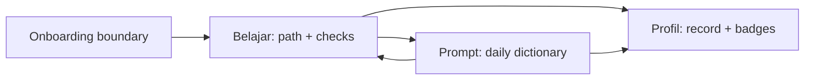

# AI-Literacy App Design Notes

## Purpose

This folder captures the Principal Designer direction for **AI-Literacy App**, a mobile-first app for Indonesian teachers learning and applying AI literacy.

The product direction is grounded in:

- `research/2026-07-14-ai-literacy-upskilling-indonesian-teachers`
- `research/2026-07-13-onboarding-activation-education-apps`

## Product Thesis

AI-Literacy App should feel like a practical teacher assistant that also teaches judgment.

The app has three durable jobs:

1. **Belajar** builds AI literacy and safe-use judgment through a Duolingo-style learning path.
2. **Prompt** helps teachers use AI in daily work through a job-based prompt dictionary.
3. **Profil** records teacher context, progress, badges, saved prompts, and settings.

The prompt dictionary is a repeat-use engine. The learning path is the safety and fluency layer. They should reinforce each other, not compete.

## Approved IA Direction

Top-level tabs:

- **Belajar**
- **Prompt**
- **Profil**

There is no separate `Beranda` tab. `Belajar` is the default home after onboarding.

Badges are merged into `Profil`, not a standalone tab. There is no formal certificate in v1.

## Scope Notes

- Onboarding is a boundary flow, detailed in `onboarding.md` (deferred, guest-first, with
  the account moment moved to the first win).
- v1 IA should be **generation-ready but prompt-only functional**:
  - teachers can copy/adapt prompts for use in external AI tools now;
  - future in-app generation can be added without changing the IA.
- Prompt categories can be safety-gated:
  - low-risk prompts are open immediately;
  - sensitive prompts unlock after relevant learning checks.

## Files

- `information-architecture.md` defines the top-level IA and key child surfaces.
- `user-journey.md` defines the core teacher journey and flow states.
- `validation-model.md` defines module validation tools and badge logic.
- `onboarding.md` details the onboarding boundary flow (IA, journey, and the deferred
  account moment), grounded in the Indonesian-teacher onboarding and audience research.
