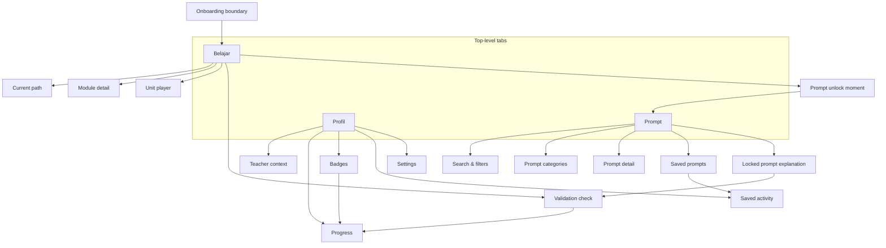
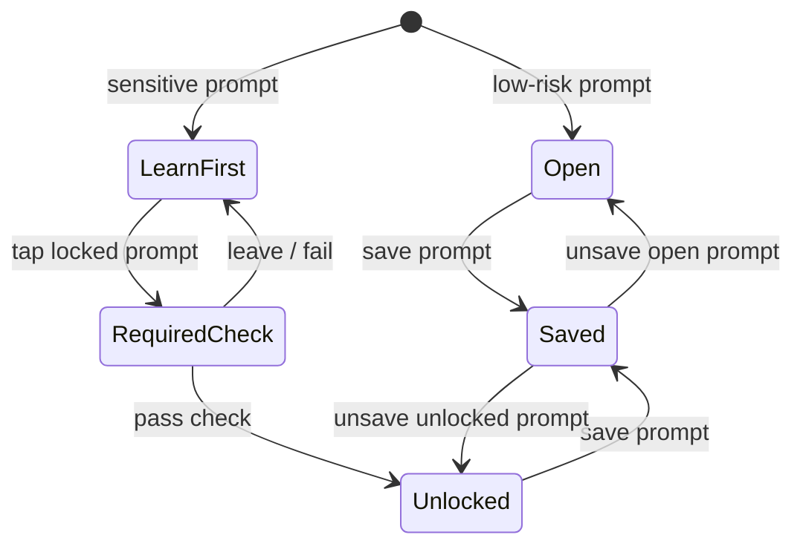

# Information Architecture

## IA Principle

**Belajar owns progression. Prompt owns utility. Profil owns record.**

The IA should stay small enough for a low-confidence, mobile-first teacher to understand quickly. The app has three top-level tabs:

1. **Belajar**
2. **Prompt**
3. **Profil**

Onboarding happens before the tabbed app as a boundary flow. Its IA, journey, and the
deferred account moment are detailed in `onboarding.md`.

---

## 1. Belajar

**Purpose:** default home, learning path, validation, and competency milestones.

`Belajar` is the main entry after onboarding. It uses a Duolingo-style path rather than a dashboard: teachers see where they are, what comes next, and which prompt categories or badges each learning step unlocks.

### Child IA

| Surface | Purpose |
|---|---|
| Current path | Shows next active node, completed nodes, locked nodes, and upcoming milestones. |
| Module detail | Explains module goal, estimated time, units/checks inside the module, and badge milestone. |
| Unit player | Runs a short learning loop: hook, model, practice, validation, feedback. |
| Validation check | Tests knowledge or judgment through structured checks. |
| Prompt-use moment | Sends the teacher to use a relevant prompt and save it to the dictionary. |
| Badge milestone | Confirms completion of a module or readiness check. |

### Recommended Module Path

1. **AI tidak akan menggantikan Anda**
   - Fear reduction, basic AI literacy, privacy ground rule.

2. **Prompt pertama Anda**
   - First practical win using a low-risk prompt for a real teaching task.

3. **Jangan percaya buta**
   - Hallucination, verification, output critique.

4. **Pakai AI dengan aman**
   - Student data, privacy, bias, academic integrity.

5. **AI untuk kelas**
   - Classroom use, student-facing activities, proper-use dilemmas.

6. **Siap pakai sehari-hari**
   - Daily workflows: planning, assessment, differentiation, communication, administration.

7. **Final readiness check**
   - Short structured validation that unlocks the final readiness badge.

### Node Types

| Node type | Description |
|---|---|
| Lesson | Short concept or model, written in plain Bahasa. |
| Practice | Apply the idea to a teacher task. |
| Validation | MCQ, sorting, spot-risk, prompt repair, or output critique. |
| Prompt challenge | Use or adapt a prompt from the dictionary. |
| Unlock | Opens a prompt category after a safety check. |
| Badge | Marks a competency milestone. |

### Belajar Rules

- Do not front-load a long AI tutorial.
- Show time estimates for modules and units.
- Keep validation short and mobile-friendly.
- Let teachers revisit completed nodes.
- Locked nodes should explain why they are locked and what to do next.

---

## 2. Prompt

**Purpose:** daily prompt dictionary and repeat-use teacher utility.

`Prompt` is organized by teacher jobs, not AI concepts. Teachers should be able to find a useful prompt quickly even if they do not remember the learning module where it was introduced.

### Child IA

| Surface | Purpose |
|---|---|
| Search | Find prompts by keyword, teaching task, jenjang, or mapel. |
| Categories | Browse prompts by teacher job. |
| Prompt list | Shows prompt title, use case, safety state, and save state. |
| Prompt detail | Editable prompt template with placeholders, safety reminder, copy action, save/favorite. |
| Saved prompts | Favorites, recently copied prompts, adapted prompts. |
| Locked prompt explanation | Explains required learning/check and links back to exact `Belajar` node. |

### Prompt Categories

| Category | Risk posture | Example use |
|---|---|---|
| Rencana Mengajar | Open | Lesson plan ideas, opening activities, learning objectives. |
| Asesmen & Kuis | Safety-gated for grading/feedback | Quiz drafts, rubric ideas, assessment variations. |
| Diferensiasi | Open to gated depending on data use | Adapt material for different ability levels. |
| Komunikasi Orang Tua | Safety-gated | Draft parent messages without student PII. |
| Administrasi Guru | Open | Meeting notes, summaries, schedule planning. |
| Aktivitas Siswa | Safety-gated | Student-facing AI activities and proper-use guidance. |
| Etika & Penggunaan AI | Safety-gated | Academic integrity, AI-use policy, classroom discussion. |

### Prompt States

| State | Meaning |
|---|---|
| Open | Usable immediately. |
| Learn first | Requires a short learning node or safety check. |
| Unlocked | Available after completing the relevant check. |
| Saved/favorite | Marked for reuse by the teacher. |

### Prompt Detail Structure

Each prompt detail should include:

- title in teacher language;
- what this prompt helps with;
- editable prompt template;
- placeholder fields such as `jenjang`, `mapel`, `topik`, `tujuan`;
- safety reminder when relevant;
- primary action: **Salin prompt**;
- secondary action: **Simpan**;
- future-ready action slot: **Buat di aplikasi**.

The future generation action should not be required for v1. The prompt-only path must remain complete.

---

## 3. Profil

**Purpose:** personal record, teacher context, badges, saved activity, and settings.

`Profil` is not a social profile. It is the teacher's control and record surface.

### Child IA

| Surface | Purpose |
|---|---|
| Teacher context | Name/account, jenjang, mapel, teaching goals. |
| Progress | Completed modules, completed validation checks, unlocked prompt categories. |
| Badges | Module badges, proper-use badge, final readiness badge. |
| Saved activity | Saved prompts, copied prompt history, adapted prompts. |
| Settings | Language, theme, notifications, data/privacy, reset/change teaching context. |

### Badge Model

Badges are competence markers, not certificates.

They should not claim:

- official certification;
- PD hours;
- PKB recognition;
- government recognition.

Badge examples:

- **Mulai Pakai AI**
- **Paham Prompt Dasar**
- **Pemeriksa Kritis**
- **Aman dengan Data Siswa**
- **Siap Pakai AI dengan Aman**

---

## Cross-Tab Relationships

| From | To | Relationship |
|---|---|---|
| Belajar | Prompt | Learning nodes introduce prompts and unlock safer categories. |
| Prompt | Belajar | Locked prompt categories deep-link to required learning checks. |
| Prompt | Profil | Saved prompts and prompt history are recorded in Profil. |
| Belajar | Profil | Completed modules, checks, and badges are recorded in Profil. |
| Profil | Belajar / Prompt | Teacher context personalizes examples and prompt placeholders. |

## IA Risks

- If `Belajar` becomes too course-like, teachers may not return daily.
- If `Prompt` is too open, teachers may use sensitive prompts before learning safety rules.
- If safety gates are too heavy, the dictionary will feel blocked.
- If `Profil` becomes a dumping ground, progress and settings will be hard to find.

The design balance: immediate utility for low-risk prompts, structured learning for judgment, and lightweight gating for sensitive use.
