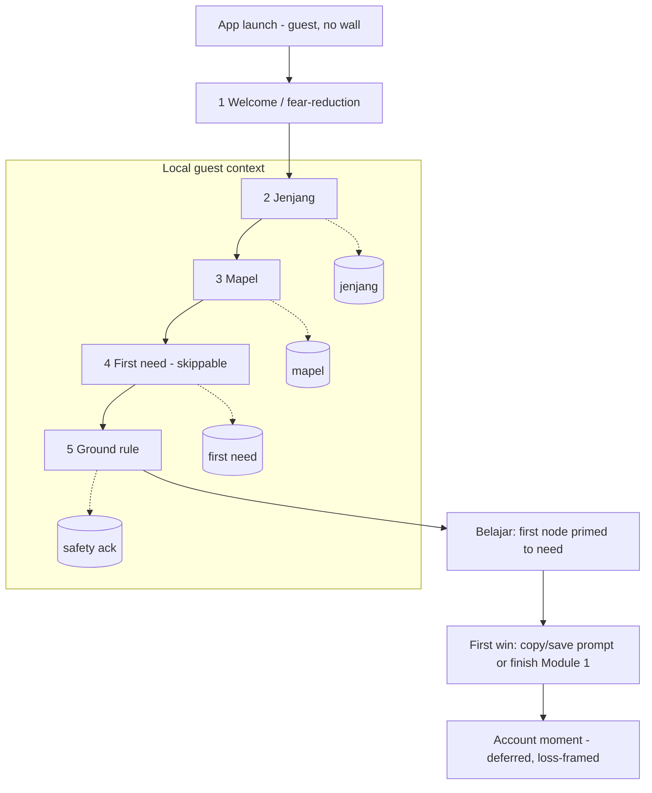
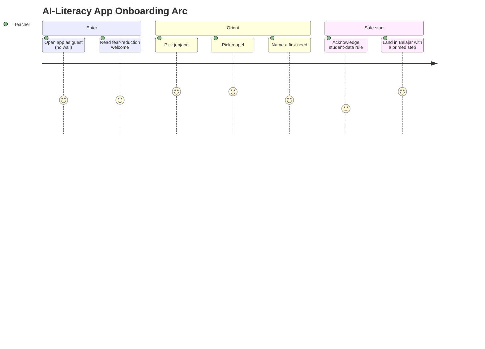
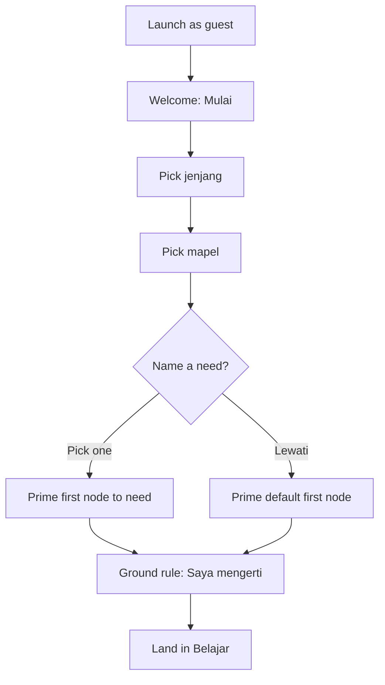
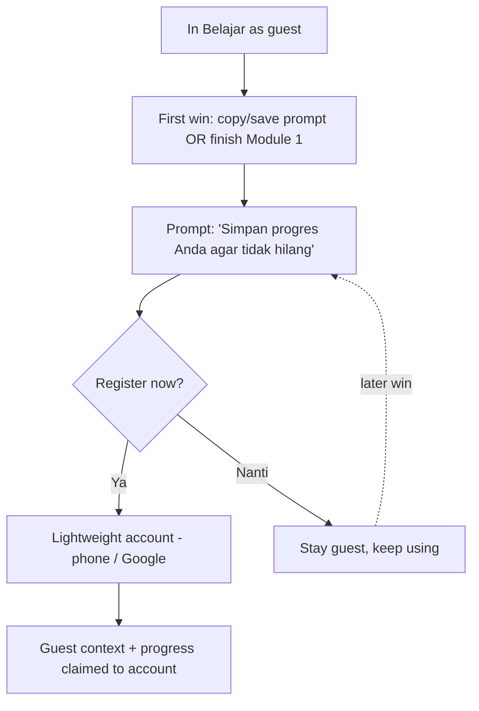

# Onboarding (Boundary Flow)

## What this is

Onboarding is the **boundary flow before the tabbed app**. It ends by dropping the
teacher into `Belajar` with a next step already chosen. It deliberately captures only
what `Belajar` and the `Prompt` dictionary need to feel relevant, plus the one
student-data safety rule. There is no account, no tutorial, and no feature tour here.

This file details what the README, `information-architecture.md`, and `user-journey.md`
each park as a boundary flow "to be detailed separately."

## Grounding

The decisions below are set by research already in this workspace, not by preference:

- `research/2026-07-16-indonesian-teacher-onboarding-literature/SYNTHESIS.md`
  - **F1 — Deferred "try-first" registration:** upfront account walls cause a 25–40%
    mobile session drop-off. No wall at launch.
  - **F2 — Loss-aversion trigger at the endowment moment:** ask for the account *after*
    the first win, framed as protecting earned progress (λ≈2.2), not "make an account."
  - **F3 — Context-anchored, icon-first intake:** a lightweight jenjang/mapel selector,
    bite-sized modules for low-bandwidth Android.
- `research/2026-07-14-ai-literacy-upskilling-indonesian-teachers/AUDIENCE-CONTEXT.md`
  - Mobile-first, Android-first, low-end devices; ~25% intermittently offline.
  - Digital self-efficacy is real but **age-linked** — onboarding cannot assume uniform
    confidence; scaffold older / rural teachers explicitly.
- `design/ai-literacy-app/validation-model.md`
  - **No certificate / PD-hour language.** Badges are competence markers only. The
    account hook is framed around saving progress + a competence badge, never a credential.

> **Deferred decision — certificate vs. badge framing at the account moment.** The
> onboarding-literature study found credential recognition (e-sertifikat / Jam Pelatihan)
> is a strong registration driver for Indonesian teachers, but the product guardrail
> (`validation-model.md`) forbids certificate claims. This conflict is **deferred pending a
> dedicated research pass**. Interim default: **badge-only framing** (so the flow stays
> buildable and guardrail-safe). Do not treat this as final — revisit once the research
> resolves whether badge-only framing converts as well as certificate framing.

---

## Onboarding Principle

**Reach the first `Belajar` node in under a minute, on a low-end Android, without an
account.** Capture the least intake that still personalizes the experience and keeps
students safe. Move the highest-friction step (the account) to the highest-motivation
moment (the first win), which happens *after* onboarding, inside `Belajar`.

---

## Information Architecture

### Screen inventory

| # | Screen | Purpose | Input | Exit |
|---|---|---|---|---|
| 1 | **Welcome / fear-reduction** | Lower threat; set the "assistant, not replacement" frame | None (read + tap) | **Mulai** → 2 |
| 2 | **Jenjang** | Capture teaching level | One tap: PAUD / SD / SMP / SMA / SMK | auto-advance → 3 |
| 3 | **Mapel** | Capture subject(s) | One+ chips | **Lanjut** → 4 |
| 4 | **First need** | Prime the first `Belajar` node with a real job | One tap of 3–4 options, or **Lewati** | → 5 |
| 5 | **Ground rule** | The student-data safety rule as a light acknowledgment | Tap **Saya mengerti** | → `Belajar` |

### IA diagram

### Data captured (all local until account)

| Field | Source screen | Used by |
|---|---|---|
| `jenjang` | 2 | Prompt placeholders, personalized examples, primed node |
| `mapel[]` | 3 | Prompt placeholders, category relevance |
| `first_need` | 4 (optional) | Which `Belajar` node is highlighted first |
| `safety_ack` | 5 | Recorded; reinforced by the PII-in-prompt guardrail later |

Nothing leaves the device until the teacher registers at the endowment moment. Guest
progress is local and is claimed onto the account at registration.

### What onboarding deliberately does *not* do

- **No** email/password wall, login, or permission prompts before value (avoids the
  25–40% mobile drop-off — onboarding-lit F1).
- **No** long AI tutorial or feature tour (Belajar rule: do not front-load a tutorial).
- **No** certificate / PD-hour language anywhere (validation-model guardrail).

---

## User Journey

**Journey principle:** *warm → oriented → safe → first step.*

### Step-by-step

1. **Land warm, not walled.** The app opens straight into Welcome — no login. Plain
   Bahasa: AI lightens their work rather than replacing them. *User question: "Apakah ini
   aman untuk saya?" → Design answer: a calm yes, and one button.*
2. **Say who you teach (jenjang).** Icon-first, one tap, auto-advances. Large targets for
   older / rural teachers (scaffolds the age-linked confidence gap).
3. **Say what you teach (mapel).** Subject chips; multi-select allowed; one **Lanjut**.
4. **Name a first need (optional).** *"Apa yang ingin Anda lakukan dulu?"* — e.g. *bikin
   rencana mengajar*, *bikin kuis*, *hemat waktu admin*. The pick sets which node
   `Belajar` highlights first. **Lewati** is always visible, so it never blocks.
5. **Learn the one rule.** A single light screen states the student-data rule and asks for
   **Saya mengerti**. Instructional, not a legal wall.
6. **Arrive with a next step already chosen.** The teacher lands in `Belajar` with the
   first node primed to their stated need and a time promise (*"Prompt pertama Anda.
   5 menit."*).

### Emotional arc

### Onboarding main flow

### The account moment (deferred sub-flow, outside onboarding)

The highest-friction step is moved to the highest-motivation moment and framed as loss,
not admin. This fires inside `Belajar`, after onboarding is complete.

---

## Failure & Recovery States

| Situation | Desired behavior |
|---|---|
| Poor / no connectivity during onboarding | Onboarding is local-only, so it completes offline; sync defers to the account moment. |
| Teacher taps **Lewati** on the need step | Fall back to the default first node (`Prompt pertama Anda`); no dead-end. |
| Teacher declines the account at first win | Stay in guest mode with full function; re-offer at the next win, never block. |
| Teacher picks the wrong jenjang / mapel | Editable later in `Profil → teacher context`; saved prompts preserved. |
| Older / low-confidence teacher hesitates | Large targets, one decision per screen, plain "Anda" copy, no jargon. |
| Guest data at risk (reinstall before account) | Be honest at the account prompt that unsaved guest progress is device-only until registration. |

---

## Guardrails

- Don't make the teacher hunt for the next step — they arrive with one primed.
- Don't gate first value behind an account or a tutorial.
- Keep the safety rule instructional, never punitive or legalistic.
- No certificate / credential language — competence-badge framing only.
- Assume mixed confidence and low bandwidth by default; never assume a fast phone or a
  confident user.

---

## Cross-References

- `information-architecture.md` — the `Onboarding boundary` node that hands off to `Belajar`.
- `user-journey.md` — stage "0. Boundary: Onboarding" in the core teacher journey.
- `validation-model.md` — the badge / no-certificate rule the account hook must honour.
