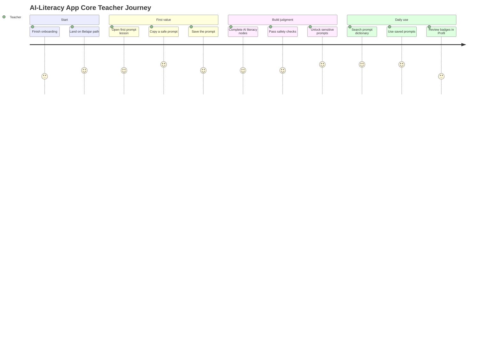
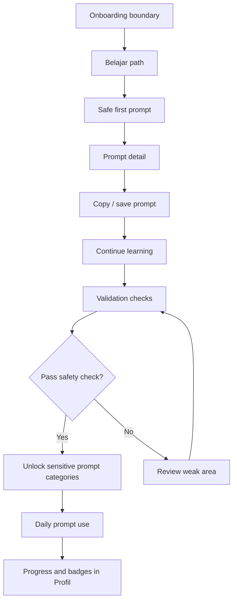
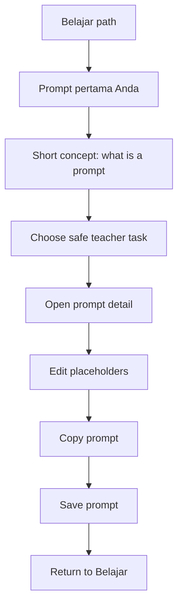
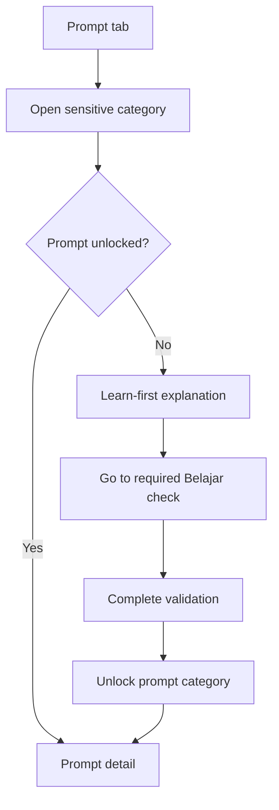
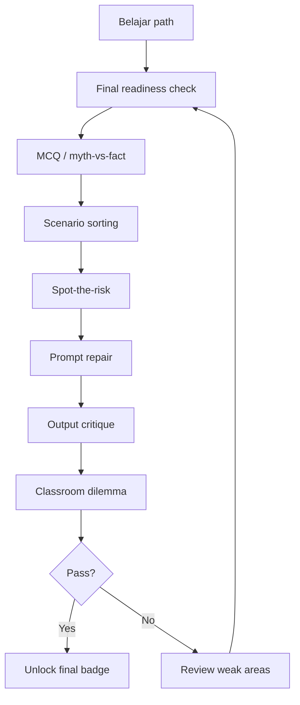

# Core User Journey

## Journey Principle

The teacher journey should move from confidence to competence:

**onboard -> first useful prompt -> AI literacy -> proper use -> daily prompt use -> badge-backed readiness**

The app should not ask teachers to study everything before receiving value. It should give a safe first win early, then use learning checks to unlock higher-risk prompt use.

---

## Primary Teacher Journey

### 0. Boundary: Onboarding

Onboarding happens before the tabbed app and is **detailed in `onboarding.md`** (IA,
journey, states, and the deferred account moment). In brief, it covers:

- fear reduction;
- student-data safety rule;
- jenjang/mapel context;
- first goal or teaching need.

After onboarding, the teacher lands in `Belajar` with the first node primed to their
stated need.

---

### 1. Land in Belajar

The teacher sees the learning path, with the first active node clearly highlighted.

**User question:** "Apa yang harus saya lakukan dulu?"

**Design answer:** one visible next step, with a short time estimate and a practical promise.

Example:

> Mulai dari prompt pertama Anda. 5 menit.

### 2. Get a Safe First Win

The first useful activity should connect learning to the prompt dictionary quickly.

Flow:

1. Teacher opens the early `Prompt pertama Anda` node.
2. The unit explains that a prompt is an instruction for AI.
3. The teacher chooses a low-risk task, such as lesson opening ideas.
4. The teacher opens a relevant prompt detail.
5. The prompt is prefilled with `jenjang`, `mapel`, and `topik`.
6. The teacher copies or saves the prompt.

This is prompt-only functional in v1. Later, the same surface can support in-app generation.

### 3. Continue Learning AI Literacy

The teacher progresses through short path nodes.

The learning pattern:

1. **Hook:** relatable teacher problem.
2. **Model:** short example.
3. **Practice:** try or inspect a prompt/output.
4. **Validation:** structured check.
5. **Feedback:** explain why the answer is safe, risky, or incomplete.

### 4. Unlock Safer Prompt Use

Some prompt categories are gated because misuse can affect students.

Example:

- Teacher opens `Komunikasi Orang Tua`.
- A prompt is marked `Learn first`.
- The app explains: "Prompt ini menyentuh data siswa. Selesaikan cek privasi dulu."
- CTA deep-links to the required `Pakai AI dengan aman` check.
- After passing, the prompt state changes to `Unlocked`.

The lock should be instructional, not punitive.

### 5. Use Prompt Dictionary for Daily Work

The teacher returns to `Prompt` outside learning time.

Common jobs:

- find a lesson planning prompt;
- adapt a quiz prompt;
- copy a parent communication prompt;
- save a useful prompt;
- revisit recently copied prompts.

The dictionary should remember context and reduce typing:

- `jenjang`;
- `mapel`;
- common topics;
- recently used categories;
- favorites.

### 6. Validate Readiness

Instead of a capstone or certificate, the teacher completes a final readiness check.

The readiness check should take around 10-12 minutes and combine:

- MCQ / myth-vs-fact;
- scenario sorting;
- spot-the-risk;
- prompt repair;
- output critique;
- classroom dilemma.

Passing it unlocks a final badge, not a certificate.

### 7. Return and Reuse

After the first pass through learning, the app becomes more utility-led:

- `Belajar` shows remaining nodes and review checks.
- `Prompt` becomes the main repeat-use surface.
- `Profil` stores badges, saved prompts, and unlocked categories.

---

## Key Flows

### Overall Flow

### Flow A: Learn to Prompt

### Flow B: Locked Prompt Category

### Flow C: Final Readiness Check

---

## Prompt Safety Gates

### Open Immediately

Low-risk prompts that do not involve student personal data, grading, or student-facing AI use.

Examples:

- lesson opening ideas;
- discussion questions;
- teacher summaries;
- classroom activity ideas without student data.

### Learn First

Prompts that touch assessment, student communication, student activity, or integrity.

Examples:

- parent communication;
- feedback on student work;
- grading rubric use;
- AI-use classroom policy;
- student-facing AI activity.

### Unlock Criteria

A prompt category unlocks after the teacher passes the relevant validation check in `Belajar`.

The app should show:

- why the prompt is gated;
- which check is required;
- expected time to complete;
- direct CTA to the exact node.

---

## Failure and Recovery States

| Situation | Desired behavior |
|---|---|
| Teacher fails a validation check | Show explanation, let them retry, point to the relevant lesson. |
| Teacher opens a locked prompt | Explain the safety reason and link to the required check. |
| Teacher lacks internet | Keep learning content and saved prompts accessible where cached. |
| Prompt copy fails | Show retry and allow manual selection. |
| Teacher changes jenjang/mapel | Update future prompt placeholders, preserve saved prompts. |
| Teacher tries to use student PII in a prompt | Show a firm warning and suggest anonymized wording. |

---

## Experience Guardrails

- Do not make the teacher hunt for the next step.
- Do not make the dictionary feel blocked by default.
- Do not hide safety learning inside long policy text.
- Do not use formal certificate language in v1.
- Do not require open-ended essays for validation in v1.
- Do not make in-app generation necessary for the prompt dictionary to be valuable.
