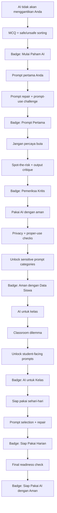
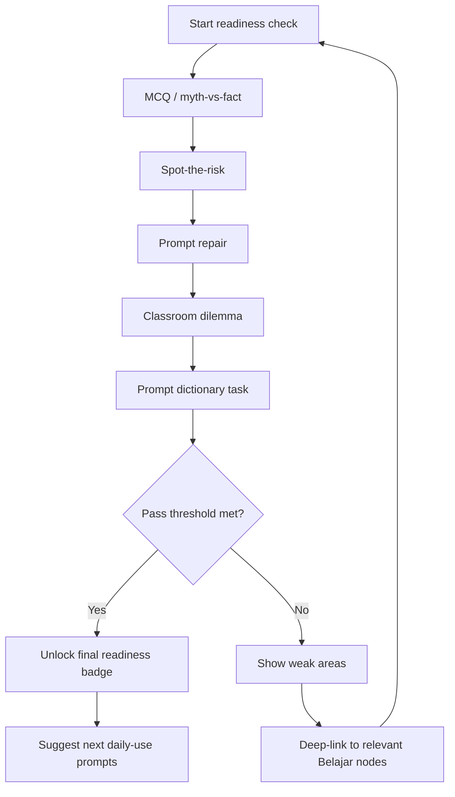

# Validation Model

## Purpose

Validation should confirm that teachers understand AI literacy and can use AI properly without requiring a heavy capstone project or formal certificate.

The model favors short, structured, mobile-friendly checks over open-ended essays.

## Validation Principles

- Match the check type to the learning target.
- Keep checks short enough for mobile completion.
- Give explanatory feedback, not just right/wrong.
- Use validation to unlock sensitive prompt categories.
- Award badges as competence markers, not formal credentials.

---

## Recommended Validation Tools

| Tool | Best for | Example |
|---|---|---|
| MCQ / myth-vs-fact | Basic AI concepts | "AI selalu benar." True or false? |
| Scenario sorting | Proper-use judgment | Sort into `boleh`, `jangan`, `tergantung`. |
| Spot-the-risk | Privacy, hallucination, bias, integrity | Identify what is risky in a prompt or output. |
| Prompt repair | Practical prompting skill | Choose or assemble a clearer prompt. |
| Output critique | Verification habit | Mark which part of an AI output needs checking. |
| Classroom dilemma | Nuanced classroom judgment | Decide whether a student AI use case is cheating, acceptable, or depends. |
| Confidence pulse | Self-efficacy and intent | "Saya bisa memakai ini minggu ini." 1-5. |

## Avoid in v1

- Long essay answers.
- AI-graded free text.
- Formal capstone submission.
- Student photo/work upload.
- Certificate-style assessment claims.

These add grading complexity, Bahasa evaluation risk, and unnecessary friction for the current IA.

---

## Module-Level Validation

| Module | Target | Recommended checks | Unlock / badge |
|---|---|---|---|
| AI tidak akan menggantikan Anda | Basic literacy + privacy rule | MCQ, safe/unsafe sorting | Badge: `Mulai Paham AI` |
| Prompt pertama Anda | Basic prompting | Prompt repair, prompt-use challenge | Badge: `Prompt Pertama` |
| Jangan percaya buta | Verification and hallucination | Spot-the-risk, output critique | Badge: `Pemeriksa Kritis` |
| Pakai AI dengan aman | Privacy, student data, integrity | Scenario sorting, spot-the-risk | Unlocks sensitive prompt categories; badge: `Aman dengan Data Siswa` |
| AI untuk kelas | Proper classroom use | Classroom dilemma, scenario sorting | Unlocks student-facing prompts; badge: `AI untuk Kelas` |
| Siap pakai sehari-hari | Daily workflows | Prompt selection, prompt repair | Badge: `Siap Pakai Harian` |
| Final readiness check | Integrated competence | Mixed check set | Badge: `Siap Pakai AI dengan Aman` |

---

## Final Readiness Check

The final readiness check replaces a capstone.

Recommended length: **10-12 minutes**.

Recommended composition:

| Section | Count | Purpose |
|---|---:|---|
| MCQ / myth-vs-fact | 4 | Tests basic AI literacy. |
| Spot-the-risk | 3 | Tests safety and verification. |
| Prompt repair | 2 | Tests practical prompting. |
| Classroom dilemma | 2 | Tests proper-use judgment. |
| Prompt dictionary task | 1 | Tests whether teacher can choose the right prompt for a real job. |

Passing result:

- unlock final readiness badge;
- unlock remaining safety-gated prompt categories;
- show suggested next daily-use prompts.

If the teacher does not pass:

- show weak areas;
- link back to specific learning nodes;
- allow retry without penalty.

---

## Prompt Unlock Mapping

| Prompt category | Required check |
|---|---|
| Rencana Mengajar | Open by default. |
| Administrasi Guru | Open by default. |
| Diferensiasi | Prompt repair or output critique check. |
| Asesmen & Kuis | Verification + proper-use check. |
| Komunikasi Orang Tua | Privacy / student-data check. |
| Aktivitas Siswa | Classroom-use dilemma check. |
| Etika & Penggunaan AI | Proper-use module check. |

## Badge Rules

Badges should:

- mark completion and competence;
- be visible in `Belajar` as milestones;
- be stored in `Profil`;
- use plain competence language;
- avoid certification or PD-hour claims.

Badges should not:

- imply official recognition;
- be framed as a reward for speed;
- replace actual feedback;
- become the main reason to complete the course.

## Feedback Model

Every validation item should explain:

1. what the correct answer is;
2. why it matters for teacher practice;
3. what to do next.

Example:

> Jangan masukkan nama siswa ke prompt. Ganti dengan deskripsi anonim seperti "siswa kelas 7 yang kesulitan memahami pecahan".

This keeps validation instructional rather than punitive.
