# Synthesis: Busuu's 3 most valuable learning-experience features

## Overview

- **Goal:** Identify the three features that most improve Busuu's *learning
  experience*, how effectively and enjoyably a user actually learns a language, with
  evidence and UX rationale, to inform our own learning-product design (input to a
  build decision).
- **Platform studied:** Busuu (`busuu.com`), observed from a logged-in **free**
  account on 2026-07-03 (English course, Beginner A1). Desk research only; no paid
  features were purchased or trialed, and all captures are redacted of personal data
  (the account holder and third parties).
- **Evidence:** `platforms/busuu/flow.gif` (lesson → instant feedback → finish →
  challenges → league → updated path) and screenshots `01`–`16`; see
  `platforms/busuu/flow.md`, `platforms/busuu/notes.md`, and `sources.md`.

**Headline takeaway.** Busuu's design thesis is stated in its own page title: *learn to
speak a language in ten minutes a day.* Everything serves short, daily, low-friction
practice. Against that goal, the three features below do the most work. In priority
order:

1. **Bite-sized learn-by-doing lesson player with instant, *instructional* feedback.**
2. **Community / Conversations**: human correction of your real output by native
   speakers (Busuu's genuine differentiator).
3. **Motivation & retention stack**: Stars/Score, streaks, daily challenges, and a
   weekly peer league.

A designer's read: #1 is the substance (where learning happens and where Busuu turns
grading into teaching); #2 solves the one thing automated apps cannot: getting your
own production corrected by a human; #3 is what converts intent into a daily habit,
which is the real failure mode in language learning. Spaced-repetition Review and AI
Speak are strong runners-up, discussed in Gaps.

---

## 1. Bite-sized learn-by-doing lesson player with instant instructional feedback

**Short description.** One-minute lessons that alternate modelled input (a native
speaker on video with replayable audio and a speed control, observed at 1×) with active practice
(fill-the-blank, matching), where **every answer, right or wrong, returns the correct
form, its audio, and a plain-language grammar rule** in one consistent panel.

**Key findings.**
- Lessons are explicitly **time-boxed and typed** before you start: a preview tooltip
  reads "VOCABULARY · 1 MIN · Let's go!", setting a one-minute expectation. New
  language is introduced as **real people speaking on video**, with an audio scrubber
  and a **speed control (observed at 1×)** and a save-word bookmark, not text alone. Evidence:
  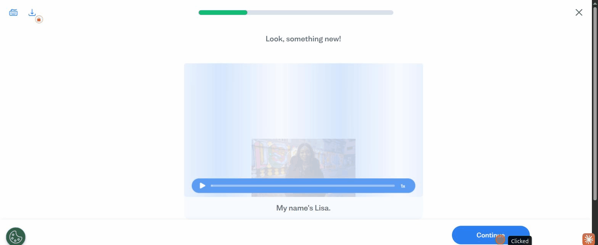
- Practice is **scaffolded and fast**: fill-the-blank sentences with word tiles that
  each carry a **keyboard shortcut number** for mouse-free answering, plus a
  format switch to **"Match the pairs"** so a short lesson still feels varied.
  Evidence:
  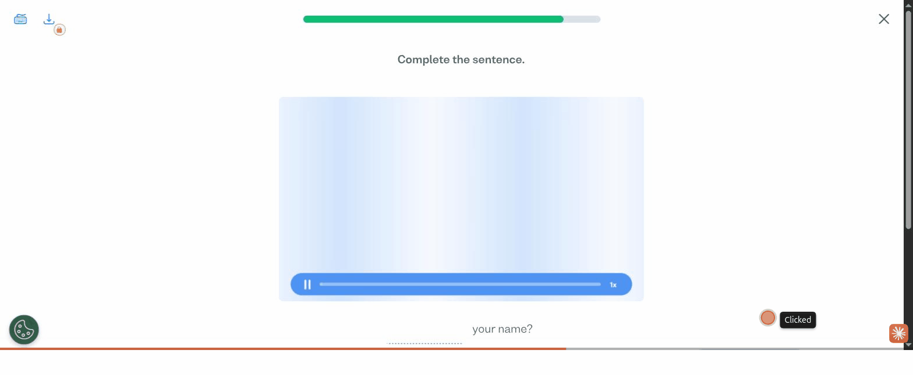
  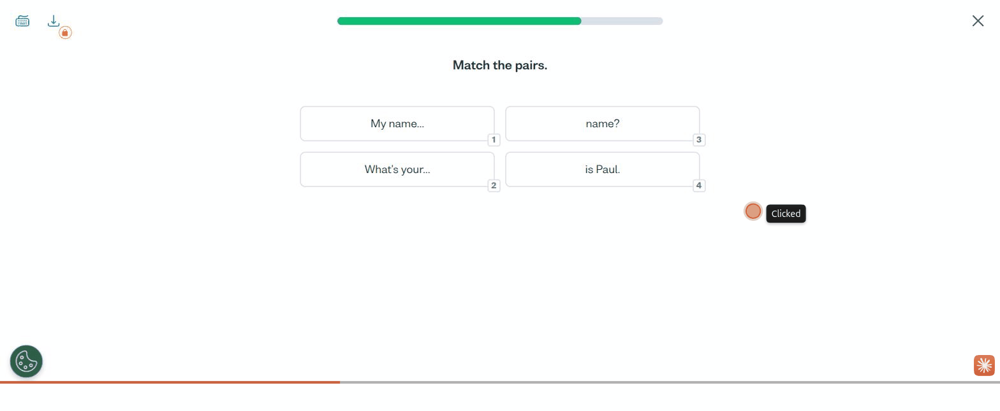
- **Feedback teaches instead of just scoring.** A wrong tile turns red and slides up a
  panel with the correct sentence, **replayable audio**, and the rule ("We use 'What's
  your name?' to ask someone for their name"). A correct tile turns green and shows the
  *same* panel shape with varied praise ("Great job!", "Well done", "You did it",
  "Amazing work") and, on some, a confetti burst. Right and wrong are taught
  identically. Evidence:
  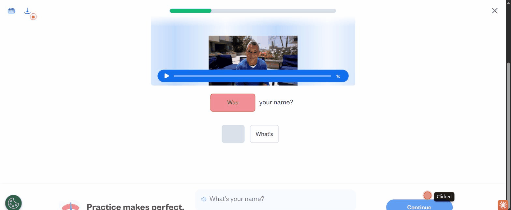
  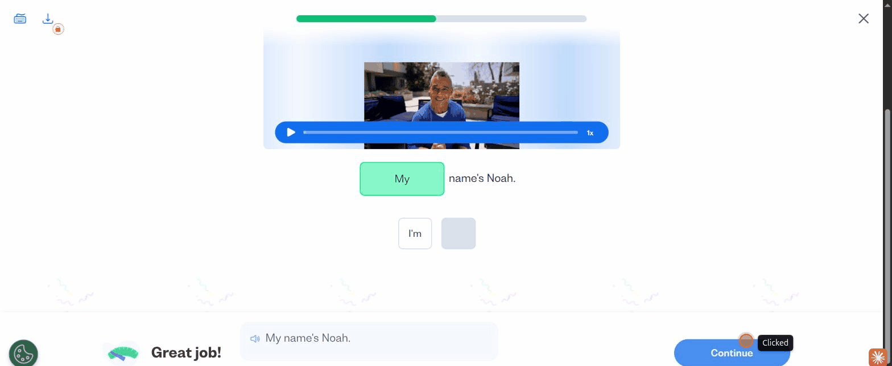
  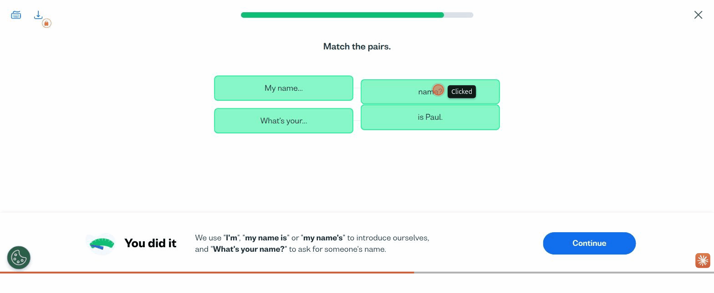
- The loop is captured end-to-end in `platforms/busuu/flow.gif`.

**Why this feature works (rationale).** In our assessment as designers, the
highest-leverage pattern here is the pairing of active recall (the learner produces the
answer) with immediate feedback, and Busuu operationalises both in a loop that
takes seconds: *see modelled speech → attempt → be corrected with the rule and the
audio → continue.* Two choices stand out. First, **front-loading real spoken input**
(video + replayable audio) trains listening and pronunciation from the very first
vocabulary step, which matters more for language than for most subjects. Second, and
most important, **the feedback panel is a teaching surface, not a scoreboard**: because
a wrong answer returns the correct form, its audio, and a one-line rule, the moment of
being graded becomes the moment of learning, and the "punished for guessing" feeling
that makes learners cautious disappears. The one-minute framing and keyboard shortcuts
keep the friction low enough to fit the "ten minutes a day" promise.

**How to validate this feature in the future.**
- **Prototype A/B:** compare the rich instructional-feedback panel (correct form +
  audio + rule) against a bare red/green correctness marker on the same exercises;
  measure a delayed (48h) retrieval-quiz score and next-exercise accuracy.
- **Metric:** track lesson completion rate and median time-to-complete; confirm the
  "1 MIN" lessons actually land near one minute and that drop-off inside a lesson is low.
- **Usability test (5–8 first-time learners):** do they notice and use the audio
  replay and speed control? Do they read the rule on a wrong answer or just click
  Continue?
- **Input-modality test:** compare video-modelled vocabulary vs. text+audio only on
  early-lesson listening comprehension.

---

## 2. Community / Conversations: human correction by native speakers

**Short description.** A social layer where learners submit short **writing and speaking
exercises** and get them **corrected by other members of the community** (Busuu frames
these correctors as native speakers), and in turn correct others' submissions. It is the
part of Busuu an automated app cannot easily copy.

*Evidence note:* what was directly observed is the hub framing, the feed of others'
submissions, and the learner-facing "Give correction" / "Give feedback" mechanic
(screenshots `12`–`14`). The "native speakers" attribution is Busuu's own copy plus the
per-submission "Speaks / Learns" language tag; the receiving side (corrections arriving
on your own work) was not observed in-session (see Gaps).

**Key findings.**
- The **Community** hub frames the value plainly: "Connect with other learners and
  exchange feedback with **native speakers**," organised into **Discover / Friends /
  Community corrections** tabs. Evidence:
  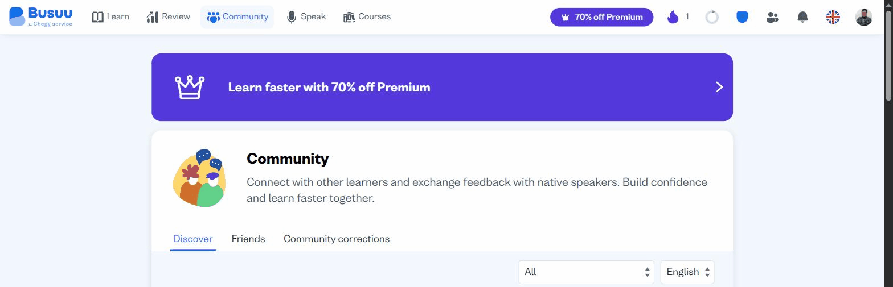
- **Discover** is a feed of other learners' real submissions, each tagged with a
  **"Speaks / Learns" language pair** and a **"Give correction"** button, so correcting
  others is a first-class, one-tap action, not a buried feature. Evidence:
  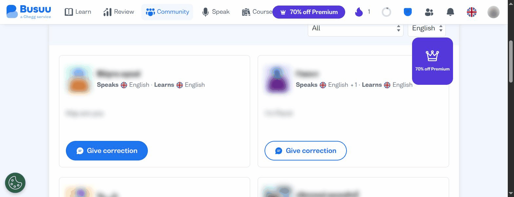
- Opening a submission shows the **prompt, the author, their attempt** (e.g. an English
  learner's "Hep are you"), and a **"Give feedback"** action to correct it. The
  reciprocal design (you correct others, and your own work is corrected in return) is
  what scales human feedback socially. Evidence:
  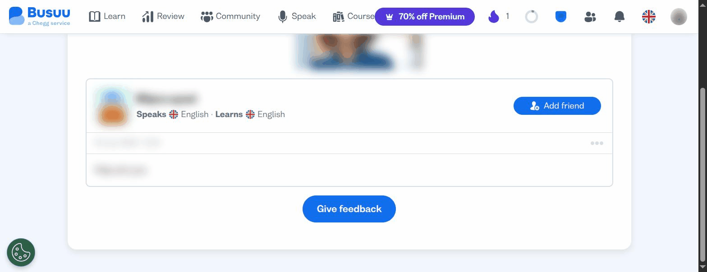
- The lesson path also surfaces AI-assisted variants of this job ("AI CONVERSATIONS",
  "SPEAKING PRACTICE" lesson tags), showing Busuu is extending the correction job with
  AI alongside the human community. Evidence: `platforms/busuu/notes.md`.

**Why this feature works (rationale).** The hardest, most-avoided part of learning a
language is **producing real output and finding out where it is wrong**. Automated
grammar exercises rarely tell you whether what you actually wrote or said sounds
natural. Busuu answers this by routing your production to other community members (whom
it frames as native speakers), which approximates the kind of one-to-one, individualised
feedback we consider hardest to scale in a self-serve product, delivered here at
community scale and near-zero marginal cost.

The reciprocity loop
(correct others to earn corrections) does double duty: it supplies the correction
labour and it builds a social obligation that pulls learners back. Because corrections
arrive **asynchronously**, the feature is also a re-engagement engine: "someone
corrected your work" is a concrete reason to return tomorrow, not a generic nudge.

**How to validate this feature in the future.**
- **Supply/demand instrumentation:** measure submission→first-correction time and the
  correction:submission ratio; a human-correction network fails if corrections are slow
  or scarce, so this is the make-or-break metric.
- **Quality audit:** sample corrections for accuracy and helpfulness (do native speakers
  actually fix the error and explain, or just rewrite?); compare human vs. AI-generated
  corrections on the same submissions.
- **Retention experiment:** does receiving a correction raise D1/D7 return rate versus a
  matched cohort that never submitted? Isolate the "you've been corrected" re-entry
  effect.
- **Usability test:** do beginners feel safe submitting imperfect output publicly, or
  does exposure anxiety suppress participation? Test anonymity/audience controls.

---

## 3. Motivation & retention stack (Stars, streak, daily challenges, weekly league)

**Short description.** A layered motivation loop (points and a score per lesson, a
daily streak, a set of **daily challenges**, and a time-boxed **weekly peer league**)
that turns "I should learn a language" into a daily habit and answers "why open the app
today?"

**Key findings.**
- Finishing a lesson pays out immediately: a celebratory screen with **Stars +10**, a
  **Score (80%)**, and a **Vocabulary +3** words-learned counter, plus a persistent
  daily-streak flame in the top bar. Evidence:
  
- **"Today's challenges"** reframes a single lesson as progress toward the day's goals:
  "Earn 20 stars" (done), "Complete 3 lessons" (2/3), "Score over 80% in 2 lessons"
  (1/2), each with a progress bar. Evidence:
  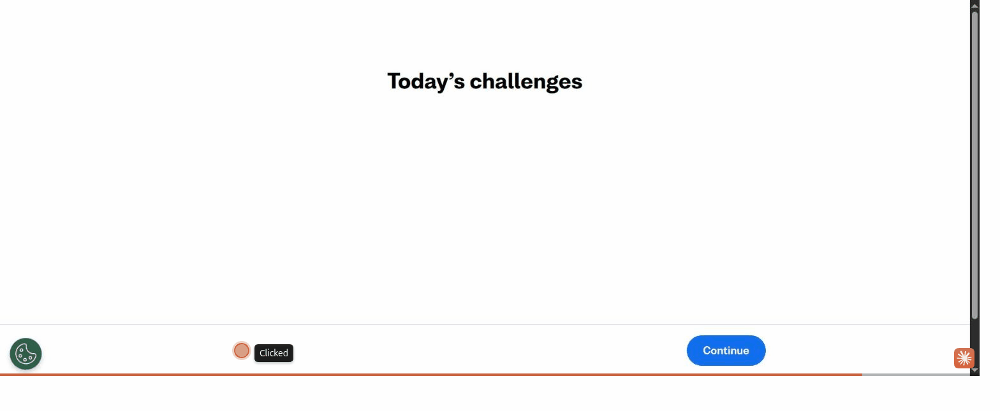
- A weekly **Blue League** adds social competition: a ranked table of ~20+ learners by
  weekly points, with the learner's own row highlighted (peers redacted). It is
  time-boxed and resets, manufacturing urgency without permanent punishment. Evidence:
  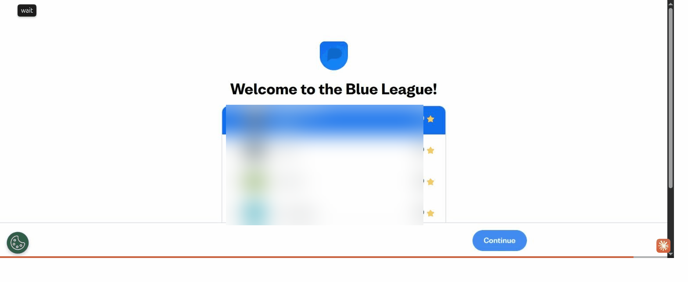
- The reward stack fires as a sequence right after the lesson (personal → daily →
  social), captured in `platforms/busuu/flow.gif`.

**Why this feature works (rationale).** Language learning fails on **consistency, not
comprehension**: most people understand the material but stop showing up, and Busuu's
whole "ten minutes a day" positioning is a bet on habit. The stack attacks habit at three
altitudes: **Stars/Score** give the frequent, tangible progress signal that the slow
payoff of fluency lacks; **daily challenges + streak** exploit goal-gradient and
loss-aversion (don't break the chain, finish the day's set); and the **weekly league**
adds social proof and a deadline that resets, so it motivates without permanently
demoralising. Together they convert a vague intention into a daily return.

**How to validate this feature in the future.**
- **Retention cohort analysis:** D1/D7/D30 return rate and sessions/week for users who
  form a streak vs. those who don't; isolate the streak's marginal effect from
  self-selection.
- **League opt-in test:** does league participation raise weekly active minutes, and
  watch for a **demotivation tail** among bottom-ranked learners (segment by rank).
- **Challenge-design experiment:** vary the daily target (e.g. "complete 1 vs. 3
  lessons") and measure completion and next-day return without inflating empty activity.
- **Guardrail metric:** correlate Stars/XP earned with actual learning gains (retrieval
  or placement improvement) to ensure points reward learning, not gaming.

---

## Gaps & caveats

- **Strong runners-up left out of the top 3.** Two features are genuinely valuable and
  narrowly missed:
  - **Spaced-repetition Review**: vocabulary bucketed by **Weak / Medium / Strong**
    word strength with a "Review now" flow, which makes the invisible SRS state legible
    and gives learners a "turn red words green" target. It is a top learning-*effectiveness*
    feature; it ranks 4th here only because it is freemium-capped ("2/2 FREE REVIEWS
    LEFT") and supports the core loop rather than defining the experience. Evidence:
    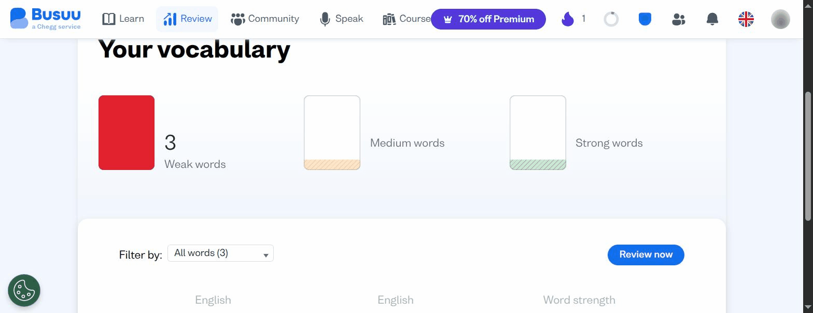
  - **AI pronunciation (Speak)**: "instant, personalised feedback" on speaking, a
    Premium Plus surface observed only from its free entry point. Evidence:
    
- **Single free account, single platform.** Findings are Busuu-specific and drawn from a
  free tier. Premium / Premium Plus interiors (full Grammar Review, unlimited Vocabulary
  Review, Speak lessons, deeper AI feedback) are described from their entry points, not
  their interiors. A cross-benchmark (Duolingo, Babbel, Memrise) would test how reusable
  these patterns are.
- **Freemium friction is pervasive and shapes the free experience.** Two full-screen
  upsells fire immediately after each lesson, interrupting the reward moment, and a
  "70% off Premium" button is always present. This is a monetisation pattern, not a
  learning feature, but it materially affects the learning experience for free users.
  Evidence:
  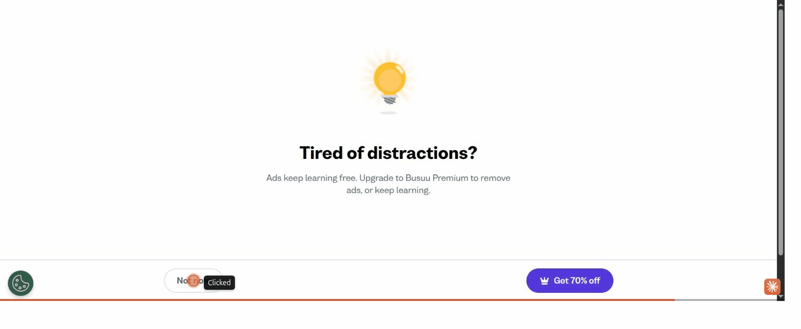
- **Conversations receiving side unobserved.** Native-speaker corrections arriving on
  your *own* submissions are asynchronous and were not seen in-session; the submission
  and correcting-others sides were captured, and the receiving side is described from
  its entry points.
- **`flow.gif` starts mid-lesson.** The recorder's rolling buffer dropped the
  dashboard→lesson-entry opening; those steps are covered in `flow.md` and screenshot
  `01`.

---

## Principal Researcher QA — 2026-07-03
- Prose pass: 0 AI-slop rewrites, 55 em-dashes removed across the three files
  (SYNTHESIS.md 21, notes.md 18, flow.md 16). Process arrows (`→`) preserved.
- Flagged for resolution: 4 content issues (see inline `> [Principal Researcher]`
  callouts): (1) F1 "adjustable-speed audio" inferred from a "1×" label only;
  (2) F1 rationale cites "best-evidenced pair in learning science" without a source;
  (3) F2 native-speaker correction rests on Busuu's copy + an unobserved receiving
  side, while the captured mechanic is learner-to-learner correction; (4) F2 rationale
  cites the "one-to-one tutoring" effect without a source.
- Structure check: all three features carry the five required fields in order, every
  cited screenshot (`01`–`16`) and `flow.gif` exists on disk, and gaps/overlaps
  (runners-up, freemium friction, single-account/single-platform scope) are called out.
- Overall: needs the 4 flagged items resolved (soften-or-cite / re-anchor to evidence)
  before /review-research. The flags are precision fixes, not structural rework.

**Resolution (2026-07-03, researcher).** All 4 flags resolved by softening to observed
evidence, no new sources invented: (1) audio "speed control (observed at 1×)" instead of
"adjustable-speed"; (2) the recall+feedback claim reframed as our designer reasoning, not
established science; (3) F2 "corrected by native speakers" re-anchored to Busuu's own
framing plus an explicit evidence note that only the hub copy, the feed, and the
learner-facing correction mechanic were observed (receiving side unobserved); (4) the
"one-to-one tutoring" claim reframed as designer reasoning about hard-to-scale
individualised feedback. Inline annotations removed. Synthesis is ready for
/review-research.

---

## Agent Review

*Recorded 2026-07-03 · three chained stakeholder personas (PM → Tech Lead → Head of
Product) reviewing the three synthesized features. Judged with a **build-decision lens**
(soundness AND build value), grounded in the captured evidence above; no new findings
introduced.*

### Product Manager — product-side soundness
- **F1 Lesson player + instant feedback — Sound.** Right feature, strongest evidence
  (`02`–`07` + `flow.gif`); the load-bearing insight is the **instructional feedback
  panel** (turn grading into teaching), not the bite-sizing, and that is the sliceable
  MVP. Evidence honestly caveated after QA (audio "1×", learning-science reframed).
- **F2 Community / Conversations — Needs refinement.** Only the *give-correction* side
  was observed (`12`–`14`); the **receiving side** (corrections on your own work) and the
  "native speakers" claim were never observed, and that is the build-critical half. It is
  a **two-sided marketplace** with zero liquidity evidence. Validation correctly names
  submission→first-correction time as make-or-break.
- **F3 Motivation stack — Sound.** Sharpest problem ("fails on consistency, not
  comprehension"), directly serves the "10 min/day" thesis; evidence solid (`08`, `10`,
  `11`). But it bundles four mechanics of very different cost; the bottom-league
  **demotivation tail** is the one named harmed segment; strong XP-vs-learning guardrail.
- **Cross-cutting:** every finding is from a **single free A1 account** (so all findings
  are *free-tier*); over-bundling is systemic (F1≈2, F3≈4 components, so ~6 buildable
  pieces, declare sliceable MVPs); evidence confidence **F1 > F3 > F2**; single-platform
  gives no reusability read; segmentation is thin except F3.

### Tech Lead — implementation feasibility
- **F1 — Low** (Medium once content is scoped). The feedback is **authored, item-attached
  content, not AI**: deterministic, no model in the core loop. *Top risk:* content-
  authoring throughput (rule + audio + video per item), not code.
- **F2 — High.** A two-sided async marketplace **plus** a UGC moderation/safety surface
  (likely minors), two of the hardest things here stacked. *Top risk:* cold-start
  **liquidity + moderation liability**; the most expensive half (receiving side) was never
  observed, so any estimate is low-confidence by construction. Build it last, or prototype
  walled / AI-backfilled first.
- **F3 — Medium, scope as two bets.** Stars/streak/challenges = Low–Med (single-player);
  **Blue League = Medium** (cohort matchmaking, weekly jobs, needs critical mass). *Top
  risk:* shared-state design + league critical mass.
- **Cross-cutting:** **design one shared XP/event ledger first** (counters, streak,
  challenges, league, and the XP-vs-learning guardrail all read from it). **Build effort
  inverts the value ranking** (F2 High > F3 Med > F1 Low), so cheapest = highest-confidence
  = highest-value. **No ML is needed for any core loop**; AI only enters at the edges
  (Speak, AI Conversations, moderation).

### Head of Product — business judgment (decides last)
- **F1 — Go.** Highest-confidence insight, cleanest evidence, tightest strategic fit,
  lowest cost. Scope guidance: resource the **content pipeline**, and ship the **feedback
  panel first**, with exercise variety as a fast-follow.
- **F2 — Conditional Go**, held behind a **pre-build viability spike** (no production build
  until it passes): (a) **liquidity** (can we hit an acceptable submission→first-correction
  time at expected volume?) and (b) **safety cost** (scope UGC moderation + minor-safety as
  an ongoing operating tax). Real moat, but will not commit engineering against a two-sided
  network we have seen one side of.
- **F3 — Conditional Go (split).** **Stars/Score + streak + daily challenges → Go now**
  (cheap, single-player, ships with F1). **Blue League → gated** on enough concurrent
  learners to populate credible cohorts *and* the demotivation-tail guardrail being live.
  The XP-vs-learning guardrail is non-negotiable.
- **Sequencing:** **Foundation** = shared XP/event ledger. **Wave 1 (Go)** = F1 feedback
  player + F3 single-player motivation on that ledger (the whole "10 min/day" loop, lowest
  risk). **Wave 2 (gated on scale)** = Blue League. **Parallel spike, not a build** = F2
  liquidity + safety viability.
- **Overall verdict:** the cheapest, best-observed features are also the highest-value;
  build Wave 1 now and hold the two crowd-scale features (Community corrections, Blue
  League) behind a critical-mass-and-safety gate. Do not let the "moat" narrative pull F2
  ahead of its evidence. **Single most important next step: design the shared XP/event
  ledger and build Wave 1 against it, instrumenting the XP-vs-learning guardrail from day
  one.**

### Consolidated verdict

| Feature | PM | Tech Lead | Head of Product |
|---|---|---|---|
| **F1 — Lesson player + instant feedback** | Sound | Low (authored, not AI) | **Go** |
| **F2 — Community / Conversations** | Needs refinement (one side unobserved) | High (2-sided marketplace + UGC safety) | **Conditional Go** (liquidity + safety spike first) |
| **F3 — XP + streak + daily challenges** | Sound | Low–Medium | **Go** |
| **F3 — Blue League leaderboard** | Sound (scope separately) | Medium (matchmaking + critical mass) | **Conditional Go** (critical mass + demotivation guardrail) |

### Legend

**PM — soundness:** **Sound** = right feature for the goal, well-scoped and coherent →
ship/validate as-is · **Needs refinement** = valuable but has scope, framing, or evidence
gaps to resolve before committing · **Reject** = not the right feature for the goal, or not
worth pursuing.

**Tech Lead — build effort:** **Low** = authored content/config or standard components; no
novel infra or ML · **Medium** = non-trivial but well-trodden engineering (state,
scheduling, aggregation); no major new risk surface · **High** = a major workstream (novel
infra, a security surface, or recurring ML/inference cost plus eval).

**Head of Product — call:** **Go** = build it; clear impact and fit · **Conditional Go** =
pursue only once a stated condition is met (condition named inline) · **No-Go** = do not
build now.

**Flagged as high-risk / gated:** **F2 Community / Conversations** (two-sided marketplace +
UGC-safety, and its build-critical receiving side was never observed) and **F3 Blue League**
(needs critical mass; demotivation tail), both gated behind scale/safety conditions. Nothing
was rated No-Go. Cross-cutting caveat: all findings derive from a single free A1 account
(free-tier only).
