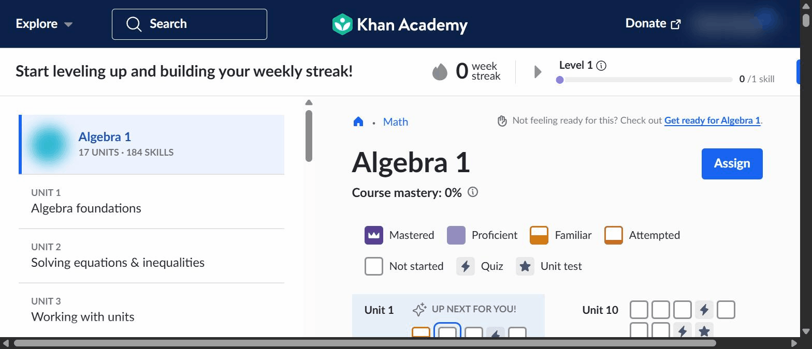
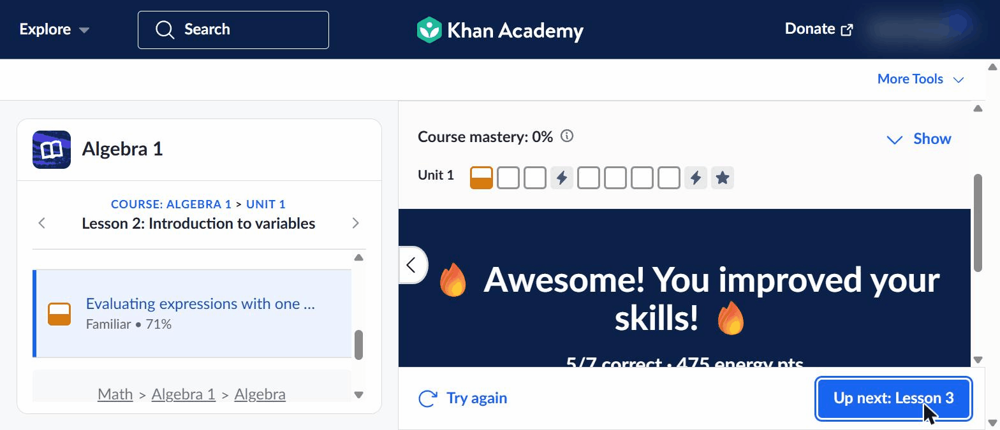
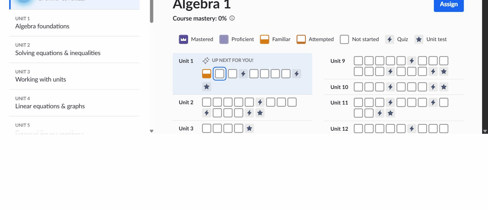
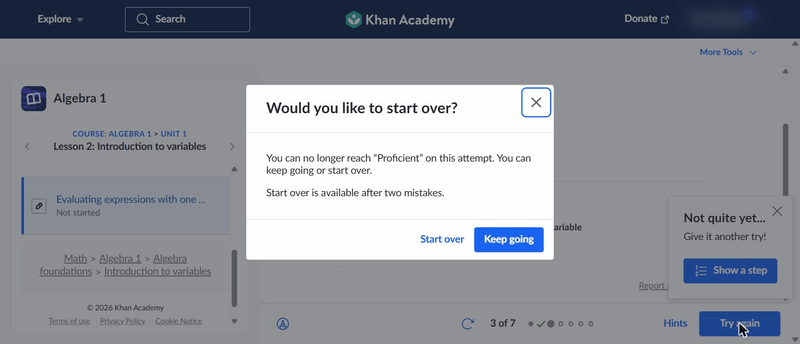
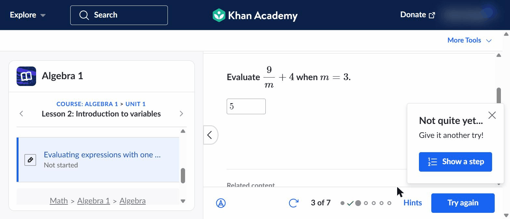
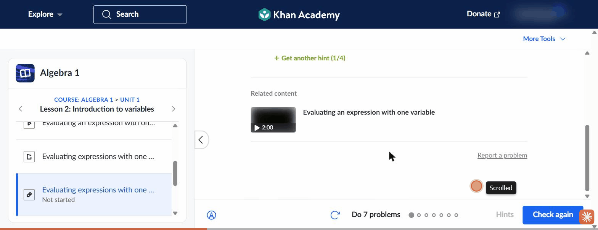
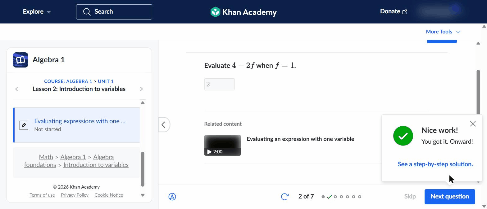
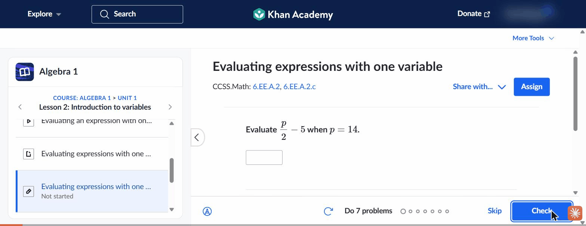

# Synthesis: Learning loop, engagement loop & measuring real upskilling

## Overview

**Goal.** Understand how established learning platforms build two interlocking loops,
the **learning loop** (present, practice, feedback, mastery) and the **engagement loop**
(streaks, points, goals, rewards), and critically how they **measure whether a user is
genuinely getting smarter**, so we can define our own core learning platform. This is
input to a build decision.

**Platforms studied (round 1).** Khan Academy only, traced deeply on one skill
(Algebra 1, "Evaluating expressions with one variable"). More platforms may be added in
later rounds; the features below are written so a second platform can be folded into the
same structure.

**Headline takeaways.**
1. Khan's most valuable move is that, **for its headline progression, learning and
   engagement are the same object**: the thing the learner collects (mastery levels, a
   colour-filling grid, mastery points) *is* the proficiency signal, not a reward bolted on
   top. (This holds for the mastery mechanic specifically; the streak and, partly, energy
   points remain activity-tied wrappers, see Feature 6.)
2. Its mastery level is **gated on accuracy, not completion**. Too many mistakes and you
   literally "can no longer reach Proficient" on that attempt, so the visible progress
   means something.
3. On a wrong answer it runs **productive struggle**: it withholds the answer and offers
   graduated hints plus an embedded teaching video, keeping the learner working the
   problem.
4. The efficacy gap worth exploiting: Khan measures learning as **mastery-state accrual
   from a zero baseline**, with **no forced pre/post diagnostic**, so it reports coverage
   and proficiency, not a normalized *learning gain*. That is a differentiation opening
   for us.

Evidence base for the rationale below is the captured Khan flow plus a cited
learning-science library in `references.md`.

---

## Feature 1: Mastery-state model (levels + points + colour grid)

**Short description.** Every skill carries a discrete mastery level (Not started →
Attempted → Familiar → Proficient → Mastered) shown as a colour in a unit grid and rolled
up into "mastery points" and a course-mastery %. It is simultaneously the system's
estimate of what you know and the progress UI you chase.

**Key findings.**
- The course page states the model up front: a legend, "possible mastery points", and a
  course-mastery %, over a per-skill grid.
  
- Completing one 7-problem set moved the traced skill from *Not started* to **Familiar
  71%**, visible both in the skill row and as the first Unit 1 grid cell turning orange.
  
  
- Levels behave like a latent-mastery estimate (accuracy-driven), not a completion counter.
  Feature 2 (the two-mistake gate) is the enforcement mechanism that demonstrates this, so
  read F1 and F2 as one dependent pair, not two independent findings. Khan's internal
  algorithm was not inspectable; the "accuracy-driven" reading is inferred from observed
  behaviour, and its public mastery system may be closer to a rules/points model than a
  formal knowledge-tracing model.

**Why this feature works (rationale).** Collapsing "what you've learned" and "your progress
bar" into one object removes the usual tension where engagement metrics drift away from
learning. The learner optimises the right thing because the reward *is* the proficiency
state. It also gives the learner an honest self-assessment surface (where am I, what's
left) rather than a vanity total. This maps to mastery-learning theory (reach a real
proficiency bar before moving on) and to knowledge-tracing, which estimates per-skill
mastery from the correct/incorrect stream. (Corbett & Anderson backs the *concept* of
per-skill mastery estimation, not a claim that Khan runs that specific model.) [ref: Bloom
1984; Corbett & Anderson 1995; see references.md]

**How to validate this feature in the future.**
- Prototype a per-skill mastery estimate (start with a simple Bayesian Knowledge Tracing
  model) and A/B it against a completion-based progress bar; primary metric = retention on
  a delayed re-test 1–2 weeks later, not in-session completion.
- Usability test the grid with 5–8 target learners: can they answer "what have I actually
  learned and what should I do next" in under 10 seconds using only the grid?

---

## Feature 2: Accuracy-gated leveling (the "two-mistake" gate)

**Short description.** The mastery level you can earn in an attempt is capped by your error
count. After two mistakes in a set, the platform tells you Proficient is no longer
reachable this attempt and offers to keep going or start over.

**Key findings.**
- A modal fired on the second wrong answer: "You can no longer reach 'Proficient' on this
  attempt… Start over is available after two mistakes."
  
- Consistent with the gate, finishing 5/7 awarded **Familiar**, not Proficient (Feature 1
  evidence). Accuracy, not completion, set the level.

**Why this feature works (rationale).** This is the mechanism that makes the mastery signal
trustworthy and stops "grinding to Proficient". It enforces that a high level reflects
low-error performance, which is what a proficiency claim should mean, and it nudges the
learner to restart and consolidate rather than limp to a hollow badge. It is the single
clearest example of engagement being subordinated to real learning. [ref: Corbett &
Anderson 1995 (mastery threshold on estimated knowledge); Bloom 1984; see references.md]

**How to validate this feature in the future.**
- Experiment: compare an accuracy-gated level vs an ungated one on a delayed transfer test;
  hypothesis = gated cohort shows higher retention/transfer per "Proficient" awarded.
- Instrument "start over" vs "keep going" choice rates and whether a restart after the gate
  improves the next-attempt accuracy (a productive-persistence signal).

---

## Feature 3: Productive-struggle remediation (graduated hints + embedded video)

**Short description.** On a wrong answer the platform withholds the correct answer and
instead offers a step-by-step worked solution revealed one step at a time, plus the
relevant teaching video embedded in the problem.

**Key findings.**
- A miss produces "Not quite yet… give it another try" with a "Show a step" affordance,
  not the answer; Check becomes "Try again".
  
- "Show a step" reveals a 4-step worked solution progressively ("1 / 4 — Let's substitute
  14 for p", then "+ Get another hint"), and a "Related content" 2:00 video sits right
  there as a fallback.
  
- Correct-answer feedback distinguishes effort: a corrected answer reads "You improved your
  answer", a first-try solve reads "Nice work! You got it. Onward!" with a green-check dot.
  
- The full loop is recorded end to end.
  

**Why this feature works (rationale).** Withholding the answer preserves the retrieval
attempt (the part that actually builds memory), while graduated hints keep cognitive load
manageable for a struggling learner and the video offers a re-teach without leaving the
task. It is also the main anti-quit mechanic: a stuck learner is kept moving inside the
session instead of bouncing. One caveat inside this same feature: the *correct-answer* copy
("Nice work! You got it. Onward!") is person-level praise, which Hattie & Timperley rate as
one of the *least* effective feedback types, so the citation below backs the hints and the
"where to next" remediation, not the praise line. The praise copy is a mild anti-pattern to
improve on (make the positive feedback point at the process or the mastery gained), not a
strength to copy. [ref: Roediger & Karpicke 2006 (testing/retrieval effect); Sweller 1988
(worked examples, cognitive load); Hattie & Timperley 2007 (task/process feedback that
answers "where to next" beats person praise); see references.md]

**How to validate this feature in the future.**
- A/B graduated hints vs immediate answer-reveal; primary metric = delayed retention and
  next-problem accuracy, guardrail metric = quit/abandon rate within the set.
- Moderated usability sessions: watch whether learners use hints as scaffolding or as an
  answer-shortcut (over-reliance is the failure mode to catch).

---

## Feature 4: End-of-set mastery summary + reward loop

**Short description.** Finishing a skill's set produces a summary that reports the mastery
result, celebrates the gain, awards energy points, and routes to the next step, all on one
screen.

**Key findings.**
- The summary shows the new level ("Familiar • 71%"), "5/7 correct • 475 energy pts", a
  "🔥 Awesome! You improved your skills! 🔥" banner, the updated grid, and "Up next:
  Lesson 3".
  

**Why this feature works (rationale), and the reward risk it must manage.** The summary
places the reward beat immediately after real effort and ties the affect ("you improved
your skills") to a concrete, earned result (the mastery level and the correct-count), and
the "Up next" nudge uses goal-gradient momentum to pull the learner into the next rep.
This is not a free win, though: energy points are an *expected, activity-contingent*
tangible reward, exactly the kind of reward the motivation literature shows can *crowd out*
intrinsic interest. Anchoring the celebration to a competence signal (the mastery level
rather than the point total) is a mitigation, not a guarantee, so the design risk to manage
is that the energy-point number becomes the headline instead of the level. [ref: Deci,
Koestner & Ryan 1999 (expected contingent rewards can undermine intrinsic motivation, so
this mechanic needs the competence anchor); Ryan & Deci 2000 (tie reward to the competence
need); Kivetz et al. 2006 (goal-gradient / next-step pull); see references.md]

**How to validate this feature in the future.**
- Multivariate test of the summary: does leading with the *mastery level* vs the *points*
  change what learners say they achieved (comprehension check) and their next-session
  return rate?
- Track whether the "Up next" nudge lifts same-session continuation without inflating
  low-quality rushed attempts.

---

## Feature 5: Single recommended next step ("UP NEXT FOR YOU")

**Short description.** The platform always surfaces one recommended next action, on the
course page ("UP NEXT FOR YOU!") and after each set ("Up next: Lesson 3"), reducing the
"what do I do now" decision. (Whether this is personalized or a fixed course-sequence
pointer could not be determined from a single account; it is described as a single
recommended step, not as confirmed adaptivity.)

**Key findings.**
- The course page highlights one recommended skill box; the end screen names the next
  lesson. *Evidence: `01-course-overview.png`, `07-skill-summary-mastery.png` (both above).*
- Within a skill the 7 problems were varied surface forms of the same skill; no within-set
  difficulty adaptation was observed, so the routing seen is *between* skills, driven by
  the mastery state, not *within* a set. (Described as observed; internal algorithm not
  inspectable.)

**Why this feature works (rationale).** When the next step is chosen from the mastery state,
it keeps practice targeted at the learner's edge rather than random, which is the part the
evidence base supports. We also expect a single clear next step to reduce the "what do I do
now" friction that stalls self-directed learners, though that decision-friction benefit is a
design hypothesis here, not something the cited sources measure, so it is called out for
testing rather than asserted. [ref: Ericsson 1993 (practice must be targeted/deliberate);
see references.md]

**How to validate this feature in the future.**
- Compare a single recommended next step vs an open menu; metric = session length and
  proportion of time on skills at the learner's edge (not too easy/hard).
- Log recommendation acceptance rate and whether accepted recommendations yield higher
  mastery gains than self-selected ones.

---

## Feature 6: Engagement wrappers, streak + energy points (with a caveat)

**Short description.** A weekly streak, energy points, and a "Level up" meter wrap the
learning loop as motivational layers.

**Key findings (each mechanic tagged learning- vs activity-tied).**
- **Learning-tied:** mastery level/points, the colour grid, and the "Level up" meter
  advance only on correct, mastery-advancing work.
- **Activity-tied:** the weekly **streak** is earned by showing up, independent of accuracy.
- **Mixed:** **energy points** accrue for working the set (amount reflects correctness).
  
- **Caveat / friction found:** finishing the skill to *Familiar* advanced mastery but did
  **not** move the weekly "Level up" meter ("0/1 skill" unchanged), a two-scale mismatch a
  learner could read as "I did the work but the game says 0".

**Why this feature works (rationale), and where it risks backfiring.** Streaks and points
add habit cues and a sense of momentum, and Khan wisely keeps its *headline* progression
(levels) learning-tied. The risk is the activity-tied pieces: if streaks/points become the
success metric, they reward presence over mastery, and research shows engagement/time can
even move opposite to learning. The two-scale mismatch also risks demotivation or gaming
toward the easier signal. [ref: Lally et al. 2010 (habit formation); Deci, Koestner & Ryan
1999 (extrinsic reward can crowd out intrinsic motivation); Champaign et al. 2014 (time-on-
task negatively correlated with learning in MOOCs); Sailer & Homner 2020 (gamification
effects are real but small); see references.md]

**How to validate this feature in the future.**
- Hold-out test: run cohorts with and without streaks/points; primary metric = learning
  gain and long-run retention, not DAU, to confirm the wrapper isn't inflating hollow
  engagement.
- Fix-and-test the two-scale mismatch: unify the engagement meter with the mastery scale
  and measure comprehension ("do you know how far you got?") and demotivation signals.

---

## Feature 7: Readiness pathway, and the missing baseline (efficacy)

**Short description.** How the platform decides "are you ready / are you improving". Khan
offers an optional prerequisite path and test-out surfaces, but no mandatory diagnostic.

**Key findings.**
- A "Not feeling ready? Check out **Get ready for Algebra 1**" pointer and Quiz / Unit-test
  / Course-Challenge nodes let a learner remediate or test out.
  *Evidence: `01-course-overview.png` (legend shows Quiz + Unit test; readiness pointer).*
- **No forced pre/post diagnostic** was encountered; every skill starts at "Not started"
  and improvement is shown as mastery accrued from zero. Khan therefore answers "are you
  improving" as **coverage + proficiency of the skill graph**, not as a normalized
  pre-to-post *gain score*.

**Why this feature works (rationale), and its limit.** Starting from zero and letting
learners optionally test out is low-friction and motivating for a broad audience. But
coverage/proficiency is not the same as a measured *learning gain*, which efficacy research
treats as the credible proof of upskilling, and platform mastery is near-transfer (doing
the platform's items), not demonstrated far transfer. This is the clearest **opening for
our product**: a lightweight pre/post diagnostic that reports a real gain would let us claim
efficacy Khan cannot. [ref: Hake 1998 (normalized gain needs a baseline); Murphy/SRI 2014
(the flagship Khan study is implementation/correlational); Barnett & Ceci 2002 (near vs far
transfer); see references.md]

**How to validate this feature in the future.**
- Prototype a short adaptive placement + a matched post-assessment and compute a normalized
  gain per unit; test whether learners find the pre-test worth the friction (completion
  rate of onboarding with vs without it).
- Add a delayed (2–4 week) retention check and a small far-transfer task to see whether
  mastery on our items predicts performance on novel, differently-framed problems.

---

## Gaps & caveats

- **Single platform, single skill, single session.** Only Khan Academy is in this round,
  traced on one Algebra 1 skill. Cross-platform patterns (Duolingo, Brilliant, Codecademy,
  etc.) are not yet captured; the feature structure above is built to absorb them.
- **Teacher account.** The provided login is a teacher account, so learner surfaces carried
  educator promos and "Assign/Share" controls that were ignored. A standalone learner
  account may differ (coach goals, class streaks). Energy-point exact formula was not
  reverse-engineered; totals are reported as observed.
- **Not observable in one sitting.** Mastery *decay* and spaced re-practice are time-delayed
  and were not seen; within-set difficulty adaptation was not observed (routing seen is
  between skills). Internal recommendation/mastery algorithms are inferred from behaviour,
  not read from source.
- **No paywall issues.** Khan Academy is free; nothing was gated or purchased. A Khanmigo AI
  layer exists but was not exercised (out of scope for the loops studied).
- **Efficacy evidence is external + observational.** Learning-science citations in
  `references.md` validate the *rationale*; they are not measurements of this platform. The
  one platform-specific efficacy study (SRI 2014) is implementation-focused and
  correlational, so no causal learning-gain claim is made for Khan here.

---

## Principal Researcher QA (2026-07-06)

- **Prose pass:** 0 AI-slop rewrites (prose was already clean; no slop tells found),
  42 em-dashes removed across SYNTHESIS.md + `platforms/khan-academy/notes.md` + `flow.md`
  (15 in SYNTHESIS.md, 26 in notes.md, 1 in flow.md).
  Two em-dashes were intentionally left because they sit inside verbatim Khan UI quotes
  ("1 / 4 — Let's substitute 14 for p" in SYNTHESIS.md and flow.md).
- **Structure:** all 7 features carry the five required fields in order (name, short
  description, key findings, rationale, how-to-validate); every embedded image path
  (`01`–`08`, `flow.gif`) resolves to a file on disk; all "how to validate" steps are real
  experiments/metrics, not platitudes. The synthesis answers the stated goal (learning loop:
  F1–F3, F5; engagement loop: F4, F6; efficacy measurement: F1, F7) and carries build value.
- **External validation (against `references.md`, 18 verified sources):** 6 of 7 feature
  rationales are correctly corroborated by their cited sources (Bloom 1984; Corbett & Anderson
  1995; Roediger & Karpicke 2006; Sweller 1988; Hattie & Timperley 2007; Kivetz et al. 2006;
  Lally 2010; Champaign et al. 2014; Sailer & Homner 2020; Hake 1998; Murphy/SRI 2014;
  Barnett & Ceci 2002). 1 citation is **contradicted by its own source** (Feature 4 cites Deci,
  Koestner & Ryan 1999 as endorsing the reward loop, but that meta-analysis finds expected
  contingent rewards *undermine* intrinsic motivation, and `references.md` files it under
  "Challenges"). 1 rationale half is **asserted without a citation** (Feature 5 "decision
  friction / choice paralysis," not covered by the cited Ericsson 1993). 1 captured detail is
  **challenged by a source the feature otherwise cites** (Feature 3 person-praise copy "Nice
  work!" vs Hattie & Timperley 2007's finding that person-praise is weak feedback).
- **Flagged for resolution:** 5 inline callouts covering 6 issues (Overview headline #1
  overclaim; Feature 1 BKT-inference + F1/F2 overlap; Feature 3 praise-copy vs H&T; Feature 4
  DKR 1999 misattribution [most material]; Feature 5 "Adaptive" naming overstates evidence +
  uncited decision-friction claim). No fabricated evidence or citations were introduced; the
  Feature 5 gap is flagged, not papered over with an invented source.
- **Overall:** Needs the flagged items resolved first. The Feature 4 DKR 1999 misattribution is
  material (it inverts a source's finding) and should be fixed before `/review-research`; the
  rest are tightening/attribution fixes.

### Resolution (2026-07-06, researcher)
All 6 flagged issues resolved directly (attribution/accuracy fixes, no new findings invented):
1. **Overview headline #1** narrowed to "for its headline progression", with an explicit note
   that streak/energy points stay activity-tied (per Feature 6).
2. **Feature 1** softened the mastery-estimate wording (inference, internal algorithm not
   inspectable, "concept" not "Khan runs BKT") and flagged the F1/F2 dependency in-text.
3. **Feature 3** now cites Hattie & Timperley for the hints/where-to-next mechanic only and
   calls the "Nice work!" person-praise copy a mild anti-pattern to improve, not a strength.
4. **Feature 4 (material)** reframed: Deci, Koestner & Ryan 1999 is now cited as the *caution*
   (expected contingent rewards can crowd out intrinsic motivation), with the competence anchor
   presented as a mitigation, not as DKR-endorsed safety; added Ryan & Deci 2000 for the
   competence framing.
5. **Feature 5** renamed "Single recommended next step" (was "Adaptive next-step routing") and
   the decision-friction rationale is marked a design hypothesis for testing, not asserted.
All inline `> [Principal Researcher]` callouts for these items were removed once addressed.
`notes.md` "BKT-style estimate" phrasing softened to match. Synthesis is now ready for
`/review-research`.

---

## Agent Review

### 2026-07-06, stakeholder review (build-decision lens)

Reviewed the 7-feature synthesis through three chained personas (PM, then Tech Lead, then
Head of Product) against the README build-decision goal. Reviewers judged only what is on
disk; no new evidence was gathered.

### Product Manager (soundness)
- **F1 Mastery-state model, Sound.** The spine; the progress UI *is* the proficiency
  estimate, grounded in the captured Not started to Familiar 71% change. Treat as one
  workstream with F2. Validation (A/B vs completion bar, primary metric = delayed
  retention) is real.
- **F2 Accuracy-gated leveling, Sound.** Best-evidenced (two-mistake modal, Familiar not
  Proficient). The mechanism that makes F1's signal mean anything. Slightly inflates the
  feature count (really F1's other half).
- **F3 Productive-struggle remediation, Sound.** Real dual problem (preserve retrieval +
  anti-quit); credits the honest flag of the "Nice work!" praise copy as an anti-pattern.
  Validation has the right guardrail (quit/abandon rate).
- **F4 Summary + reward loop, Needs refinement.** Thinnest evidence (one screenshot, one
  session); DKR citation now fixed; needs a stated guardrail against rushed low-quality
  completions.
- **F5 Single recommended next step, Needs refinement.** Weakest-justified: core rationale
  is an admitted un-evidenced hypothesis; personalized-vs-static mechanic is a material
  unknown; missing novice-vs-self-directed segmentation.
- **F6 Engagement wrappers, Sound.** Most product-mature; tags every mechanic learning- vs
  activity-tied (exactly the discrimination the goal needs); real two-scale-mismatch
  friction; validation measures learning gain, not DAU.
- **F7 Readiness & missing baseline, Sound; most strategically important.** Converts an
  absence (no forced pre/post diagnostic) into the differentiation opening. Elevate
  onboarding-friction to a first-class constraint.
- **Roll-up:** Build-useful, honestly hedged; F1/F2/F3/F6/F7 Sound, F4/F5 need tighter
  evidence; merge F1/F2; segmentation is the blind spot.

### Tech Lead (build effort + top risk)
- **F1, High.** UI is trivial; the honest version hides an ML/psychometrics mastery
  estimator + calibrated item bank. *Risk:* without a calibrated item bank, F1 is a
  completion bar in a proficiency costume.
- **F2, Low.** Error counter + configurable policy. "The cheap win that makes expensive F1
  defensible." *Risk:* threshold/restart are tuning params, ship configurable.
- **F3, High** (challenges the PM's Sound-as-build-signal). Cost is authored graduated
  hints plus a mapped video per item, forever, a content pipeline from zero. *Risk:*
  authoring cost scales linearly with the skill graph and never ends.
- **F4, Low.** Aggregation/render view; build after F1/F2. *Risk:* only as meaningful as
  the F1 signal feeding it; wire a quality guardrail metric in day one.
- **F5, Low as observed / High if adaptive.** A config pointer off mastery state (Low) vs a
  real recommender (High); evidence supports only Low. *Risk:* scope ambiguity, nail the
  definition before estimating.
- **F6, Low to build / Medium to build correctly.** Must read from the same mastery state
  as F1 or it recreates the two-scale demotivation bug. *Risk:* a parallel data path that
  disagrees with mastery.
- **F7, High, load-bearing.** Adaptive placement (IRT/CAT + calibrated pool) + equated
  pre/post forms + normalized-gain pipeline + delayed retention/far-transfer. *Risk:*
  prototype the pre-test friction before building any psychometrics.
- **Roll-up:** Cheap high-confidence wins (F2, F4) are the right phase-1; F1/F3/F7 are High
  systems, not UI; F5 needs a product decision; F6 must share F1's data path.

### Head of Product (Go / Conditional Go / No-Go)
- **F1, Conditional Go:** ship the cheap phase-1 state model (driven by F2); defer the full
  knowledge-tracing estimator.
- **F2, Go:** best-evidenced, cheap, load-bearing. Build first, wire to F1 state.
- **F3, Conditional Go:** only once a funded/staffed content-authoring (or
  generate-plus-review) pipeline with a defined per-item cost exists. Adopt the *mechanic*
  now; defer the at-scale content build.
- **F4, Conditional Go:** build after F1/F2; wire a quality guardrail into the summary event
  day one; lead the celebration with the mastery level, not the points.
- **F5, Conditional Go:** ship the Low pointer off mastery state now; treat an adaptive
  recommender as a separate, later, explicitly-scoped bet.
- **F6, Conditional Go:** must read from the same mastery state as F1 (no second scale);
  measure on learning gain/retention, not DAU.
- **F7, Conditional Go (most important condition):** prototype the pre-test onboarding
  friction *before* any psychometrics; if friction is fatal, pivot to an embedded/inferred
  baseline.
- **Overall:** A Go on the thesis, sequenced. Phase 1 = F2 + cheap-F1 + Low-F5 on one
  mastery-state data path, with F4/F6 as views over it bound to a learning-gain guardrail.
  F3 and the full F1 estimator are sound but deferred behind their real cost. F7 is the
  differentiator we're here to find, conditional on de-risking onboarding friction. The one
  research risk: single platform, do not finalize the F7 efficacy bet on Khan alone.
- **Single most important next step:** run a cheap onboarding-friction prototype for F7's
  pre-test (completion with vs without an upfront diagnostic) before committing engineering
  to the placement/psychometrics stack.

### Consolidated verdict

| Feature | PM | Tech Lead | Head of Product |
|---|---|---|---|
| F1 Mastery-state model | Sound | High | **Conditional Go** — cheap phase-1 form; defer estimator |
| F2 Accuracy-gated leveling | Sound | Low | **Go** |
| F3 Productive-struggle remediation | Sound | High | **Conditional Go** — funded content/video pipeline |
| F4 Summary + reward loop | Needs refinement | Low | **Conditional Go** — after F1/F2; quality guardrail; lead with level |
| F5 Single recommended next step | Needs refinement | Low / High | **Conditional Go** — ship Low pointer; adaptive is a separate bet |
| F6 Engagement wrappers | Sound | Low / Medium | **Conditional Go** — share F1 data path; measure learning gain not DAU |
| F7 Readiness & missing baseline | Sound | High | **Conditional Go** — prototype pre-test friction first |

### Legend
- **PM soundness** — *Sound* (right feature for the goal, well-scoped and coherent, ship/validate
  as-is) · *Needs refinement* (valuable but has scope, framing, or evidence gaps to resolve before
  committing) · *Reject* (not the right feature for the goal, or not worth pursuing).
- **Tech Lead build effort** — *Low* (authored content/config or standard components; no novel infra
  or ML) · *Medium* (non-trivial but well-trodden engineering: state, scheduling, aggregation; no
  major new risk surface) · *High* (a major workstream: novel infra, a security surface, or recurring
  ML/inference cost plus eval).
- **Head of Product call** — *Go* (build it; clear impact and fit) · *Conditional Go* (pursue only
  once a stated condition is met) · *No-Go* (do not build now).

### Outcome
No feature was Rejected or No-Go. The bet is sound and sequenced: phase 1 = F2 (Go) + cheap
F1 + Low-version F5 on one mastery-state spine; F3 and the full F1 estimator are deferred
behind real cost; F7 (the differentiator) is gated on a cheap onboarding-friction test
first. Flagged research risk: single platform (Khan only), so the F7 efficacy bet should not
be finalized on Khan alone.
