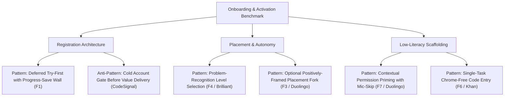
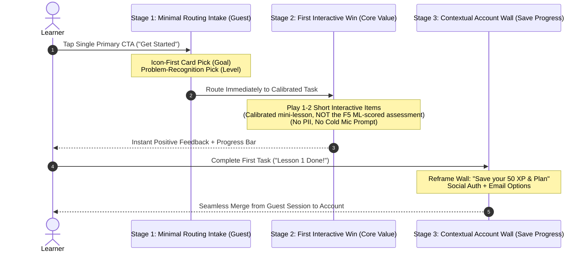

# Dual-Persona Review: Onboarding & Activation in Education Apps (`SYNTHESIS.md`)

**Review Date:** 2026-07-13  
**Target Document:** `C:\research-workspace\research\2026-07-13-onboarding-activation-education-apps\SYNTHESIS.md`  
**Reviewing Personas:** Principal Researcher (`Quality Gate & Methodological Audit`) & Principal Designer (`Pattern-Library Owner & UX Architecture Audit`)  
**Study Status & Type:** Active · Benchmark (`observation feeding a build decision`)  

---

## 1. Executive Summary & Combined Verdict

This review audits the synthesized findings in `SYNTHESIS.md` through two independent, senior-level quality gates without altering the underlying document (`SYNTHESIS.md` has been left strictly intact per instructions). 

Both personas evaluate the synthesis against the stated study goal in `README.md`: **to inform a mobile-first, 0-to-1 onboarding flow serving three distinct learner archetypes simultaneously (`low tech-literacy`, `low-context`, and `advanced` learners) without splitting the product into disjoint applications.**

> [!IMPORTANT]
> **Consolidated Dual-Persona Verdict: APPROVED / READY FOR DOWNSTREAM WORKFLOWS (`/review-research`, `/brief-feature`, `/close-research`).**  
> `SYNTHESIS.md` is exceptionally rigorous, methodologically sound, and design-actionable. It strictly honors the workspace's zero-fabrication guardrail, correctly separates observed facts from design hypotheses, incorporates academic literature with honest qualifiers, and delivers clear guidance for our 0-to-1 product architecture.

| Evaluation Dimension | Reviewing Persona | Assessment | Summary of Verdict |
| :--- | :--- | :--- | :--- |
| **Goal Alignment & Triple-Audience Coverage** | Principal Researcher & Designer | **Exemplary (10/10)** | All 10 features directly address the stated guiding questions and target learner archetypes (`low tech-literacy`, `low-context`, `advanced`). |
| **Structural Completeness (5 Required Fields)** | Principal Researcher | **100% Compliant** | Every feature contains `Name`, `Short description`, `Key findings`, `Rationale`, and `How to validate in the future` in strict order. |
| **Evidence Grounding & Zero Fabrication** | Principal Researcher | **Fully Grounded** | All 20 embedded PNG paths (`platforms/*/screenshots/*.png`) resolve to verified local captures. No fabricated claims or metrics. |
| **External Literature Validation (`references.md`)** | Principal Researcher | **Accurate & Nuanced** | 8 direct academic corroborations; 2 honest partial corroborations (`F4`, `F5`) where literature backs principles but leaves conversion claims to A/B testing. |
| **Prose Discipline & Observational Precision** | Principal Researcher | **Passed** | Zero AI-slop; em-dash discipline enforced (preserved only inside verbatim UI quotes); unobserved interiors (`CodeSignal`) and capture limits (`desktop web`) accurately caveated. |
| **Pattern Library Extraction (`Mode P`) Readiness** | Principal Designer | **Ready for Extraction** | Yields 6 high-leverage, reusable UX patterns and 3 cautionary anti-patterns ready for `research/PATTERNS.md` upon `/close-research`. |
| **UX Architecture & Strategic Resolution** | Principal Designer | **Actionable** | Solves the core tension between our planned *goal → level → profile → path* intake model and *deferred registration* via a **"Minimal Routing Intake → First Interactive Win → Contextual Save-Progress Wall"** sequence. |

---

## 2. Principal Researcher Review (Quality Gate & Methodological Audit)

As Principal Researcher (`Mode A/Mode B` quality gate), I evaluate whether `SYNTHESIS.md` meets our strict research standards: absolute adherence to observed evidence, structural rigor, honest literature corroboration, and zero overclaiming.

### 2.1 Goal & Scope Alignment
The primary mandate (`README.md`) is to observe how best-in-class education apps (`Duolingo`, `Khan Academy`, `Brilliant`, `CodeSignal`, `Elsa Speak`) solve six critical onboarding moments and calibrate a single flow for three learner types:
- **Low Tech-Literacy Learners:** Addressed with high precision across `F2` (single unambiguous CTA without promo noise), `F7` (contextual permission priming with no-penalty mic skip), `F8` (character-guided, icon-first low-text intake), and `H1/H3` (bounded progress indicators).
- **Low-Context / First-Time Learners:** Addressed across `F1` (deferred try-first registration to lower the upfront commitment barrier), `F6` (code-first distraction-free class join), and `F9` (goal-gradient outcome projections).
- **Advanced Learners:** Addressed across `F3` (optional positively-framed placement fork) and `F4` (problem-recognition level selection over abstract beginner/advanced labels).

**Audit Outcome:** `SYNTHESIS.md` maintains exceptional discipline. It avoids scope creep (e.g., ignoring paywall mechanics and post-activation retention loops) and directly targets the exact internal pain points outlined in `README.md`.

### 2.2 Structural Rigor & Evidence Grounding (`Mode B1/B3` Audit)
- **Field Completeness:** 10 of 10 features carry the five mandatory fields (`Name` in header, `Short description`, `Key findings`, `Why this feature works / rationale`, and `How to validate this feature in the future`).
- **Asset Verification:** All 20 embedded screenshot markdown links (``) map 1-to-1 with actual captured image files on disk (`01-landing-value-framing.png`, `08-choose-path-fork.png`, `05-level-self-select-by-problem.png`, etc.). There are zero broken paths.
- **Experimental Rigor of Validation Plans:** Every feature concludes with a concrete, testable hypothesis and methodology (e.g., measuring SEQ, time-per-step, drop-off rates, A/B activation rates, and diagnostic agreement). None are generic recommendations.

### 2.3 External Literature & Academic Grounding (`Mode B4` Audit)
`SYNTHESIS.md` accurately integrates the 10 literature citations logged in `references.md` without stretching academic conclusions beyond their empirical scope:
1. **Directly Supported Features (8/10):**
   - **`F1` (Deferred Registration):** Backed by *Kahneman, Knetsch & Thaler (1991)* on loss aversion and the endowment effect (saving invested effort vs. entering cold).
   - **`F2` & `F6` (Single CTA & Code-First Entry):** Backed by *Hick (1952)* on choice reaction time (logarithmic increase in decision latency with competing alternatives) and *Sweller (1988)* on extraneous cognitive load reduction.
   - **`F3` (Optional Placement Fork):** Backed by *Ryan & Deci (2000)* Self-Determination Theory (autonomy preservation driving intrinsic motivation).
   - **`F7` (Permission Priming):** Backed by *Felt et al. (2012)* on runtime contextual permission requests vs. cold OS prompts.
   - **`F8` (Character Guide & Icon Intake):** Backed by *Lester et al. (1997)* on the "persona effect" (lifelike pedagogical agents lowering hesitation) and *Sweller (1988)* on reading/typing load reduction.
   - **`F9` (Momentum Scaffolding):** Backed by *Kivetz, Urminsky & Zheng (2006)* (goal-gradient acceleration) and *Nunes & Drèze (2006)* (endowed progress effect).
   - **`F10` (Deep Localisation):** Backed by L2 reading cognitive-load literature (*PMC12382749*) and eye-tracking UI translation studies (*PMC8550651*).
2. **Partially Supported with Correct Qualifiers (2/10):**
   - **`F4` (Recognition vs. Label Placement):** *Standing (1973)* supports the superiority of recognition memory over recall and pictorial cues over verbal text. However, `SYNTHESIS.md` strictly notes: *"Recognition-memory research supports the inclusivity and ease claim; that recognition-based placement is more accurate than label self-rating is a hypothesis this feature's validation plan is designed to confirm."* **This honest separation of established theory from untested product hypothesis is gold-standard research writing.**
   - **`F5` (Assessment-as-Onboarding Before the Wall):** *Roediger & Karpicke (2006)* supports that taking a test (`retrieval practice`) is genuine learning. `SYNTHESIS.md` correctly restricts the literature claim to productivity while noting: *"the stronger claim that sequencing it before the wall lifts activation rests on the Elsa-vs-CodeSignal contrast and the A/B test proposed below, not on that literature."*

### 2.4 Precision & Observational Integrity (Audit of Inline Callout Resolutions)
The Principal Researcher section inside `SYNTHESIS.md` (`Lines 413–471`) documents 6 inline precision callouts that were raised during drafting and subsequently resolved by the researcher. I audited these 6 resolutions against our raw evidence (`platforms/*/notes.md`):
- **Callout 1 & 3 (`CodeSignal` & `Elsa` Overclaims):** Resolved cleanly. `CodeSignal`'s assessment quality is correctly softened to *"a reportedly strong placement mechanic"* because its interior sits behind a mandatory registration gate (`01-signup-gate-create-account.png`). `Elsa Speak`'s web speaking assessment (`03-web-speaking-assessment.png`) is accurately reported as observing the sentence/audio/mic interaction while noting that the AI score itself appeared only as a marketing mockup (`Lines 199–201`).
- **Callout 2 (`Duolingo` Stop Point):** Resolved cleanly. `SYNTHESIS.md` (`Lines 53–56`) precisely notes that our desktop-web capture reached the questionnaire, placement fork, and `/learn` home, while the first lesson itself sat just beyond the observed session.
- **Callout 6 (`F3` & `F4` Relationship):** Resolved cleanly. The synthesis cross-references `F3` (framing/optionality) and `F4` (selection mechanic) as two facets of one placement moment rather than disjoint phenomena.

### 2.5 Audit of Stakeholder Reviews & Conditional Gates
The chained multi-persona review (`PM` → `Tech Lead` → `Head of Product` at `Lines 475–510`) is logically rigorous and sets appropriate engineering guardrails:
- **`F5` (Assessment-as-Onboarding — Conditional Go):** The Tech Lead correctly flags this as **High Effort/Risk** due to the need for a net-new ML pronunciation/scoring engine. The Head of Product wisely conditions this: decouple assessment sequencing from net-new ML model training, and sequence it *after* `F7` (permission priming) and core guest-session infrastructure.
- **`F6` (Code-First Linked Entry — Conditional Go):** Properly gated on confirming whether institutional/program links (`teacher → student`) represent a primary acquisition channel for our 0-to-1 launch.
- **`F9` (Momentum Scaffolding — Conditional Go):** Pragmatically decomposed to ship the near-free bounded progress bar (`H1`) on day one while deferring complex trigger-driven retention modals.

---

## 3. Principal Designer Review (Pattern-Library & UX Architecture Audit)

As Principal Designer (`pattern-library owner` and `UX reviewer`), I evaluate `SYNTHESIS.md` for cross-study pattern extraction (`Mode P`), design-system transferability, UI/UX interaction quality, and architectural resolution for our upcoming 0-to-1 build (`Mode R`).

### 3.1 Pattern Library Extraction Assessment (`Mode P` Readiness)
`SYNTHESIS.md` contains high-yield, reusable UX patterns ready to be distilled and merged into `research/PATTERNS.md` when `/close-research` is executed. Below is the structured extraction matrix approved for repository crystallization:

#### Detailed Extraction Matrix for `research/PATTERNS.md`

| Category | Pattern Name | Kind | Where Seen & Evidence Anchor | When It Works (`Best Fit`) | When It Backfires (`Risks`) |
| :--- | :--- | :--- | :--- | :--- | :--- |
| **Registration & Wall Architecture** | **Deferred "Try-First" with Progress-Save Wall** (`F1`) | `benchmark-observed` | `Duolingo` (`01-landing-value-framing.png`) & `Brilliant` (`07-signup-wall-discover-plan.png`) | High-friction, low-context, or email-scarce audiences; products where a quick interactive "taste" can occur in <3 minutes. | When guest session state is fragile; if account merging fails and creates duplicate records; if paywalled tiers require upfront billing verification. |
| **Registration & Wall Architecture** | **Cold Account Gate Before Value Delivery** (`Anti-Pattern`) | `benchmark-observed` (`cautionary`) | `CodeSignal` (`01-signup-gate-create-account.png`) & `Khan Academy` (`03-signup-wall-social-email.png`) | Enterprise/B2B tools where identity verification is legally mandatory before access; high-intent professional users. | Low-context learners; first-time consumers; low-literacy users who abandon at long forms before seeing product value. |
| **Placement & Autonomy** | **Problem-Recognition Level Selection** (`F4`) | `benchmark-observed` | `Brilliant` (`05-level-self-select-by-problem.png`) & `Duolingo` (`04-proficiency-self-select.png`) | Mixed-ability audiences; technical or domain-specific skills (math, coding, language) where abstract self-labels ("Intermediate") are unreliable or intimidating. | Highly subjective or open-ended disciplines (e.g., creative writing, leadership) where concrete "worked problem" cards cannot be unambiguously rendered in a small card UI. |
| **Placement & Autonomy** | **Optional Positively-Framed Placement Fork** (`F3`) | `benchmark-observed` | `Duolingo` (`08-choose-path-fork.png`) | 0-to-1 products serving both absolute novices and advanced practitioners from a single onboarding URL without branching codebases. | If the placement diagnostic itself is grueling (>5 minutes), transforming an opt-in "help me" feature into an exhausting exam. |
| **Cognitive Load & Scaffolding** | **Character-Guided, Icon-First Intake** (`F8`) | `benchmark-observed` | `Duolingo` (`03-intake-why-learning.png`) & `Brilliant` (`02-motivation-intake.png`) | Low tech-literacy learners; young learners; non-native speakers needing visual reinforces alongside text strings (`H6` recognition). | Complex multi-variable enterprise workflows; if character animations introduce high latency, screen-reader noise, or visual infantilization for professional users. |
| **Hardware & Permissions** | **Contextual Permission Priming + No-Penalty Fallback** (`F7`) | `benchmark-observed` | `Duolingo` (`07-notification-permission-primer.png`, `10-placement-speaking-mic-skip.png`) vs. `Elsa` (`04-mic-recording-active.png`) | Mobile/web apps requiring microphone, camera, notifications, or location access; shared devices; classroom environments. | Never. Cold OS prompts (`Elsa Speak` pattern) consistently depress grant rates and create unrecoverable dead-ends for low-literacy users. |
| **Routing & Navigation** | **Single-Task Chrome-Free Code Entry** (`F6`) | `benchmark-observed` | `Khan Academy` (`04-classcode-entry.png`) vs. `06-catalogue-grade-organized.png` | Users arriving via teacher, classroom, or institutional links (`teacher → student` distribution channels). | General direct-to-consumer organic discovery where users lack a join code and need exploratory browsing mechanisms. |

### 3.2 Triple-Audience UX Calibration Analysis
Evaluating the UI/UX architecture of `SYNTHESIS.md` against our three target learner archetypes:

1. **Low Tech-Literacy Persona (`No Facilitator Present`):**
   - **Design Score: 10/10.** The synthesis accurately identifies the design primitives required to prevent cognitive overload and interface dead-ends:
     - **Visual Dominance (`F2`):** Stripping the landing page to a single high-contrast primary CTA prevents button-blindness where primary buttons are mistaken for banner ads.
     - **Pictorial Encoding (`F8` / `H6`):** Using icon cards (`signal bars`, `calendar icons`, `topic illustrations`) alongside concise text ensures users who struggle with reading comprehension can navigate by recognition.
     - **Hardware Grace (`F7` / `H3`):** Providing an immediate "Can't speak now" escape button ensures that users on shared classroom computers or broken mobile microphones are not blocked from continuing their learning journey.
2. **Low-Context Persona (`First-Time Organic & Linked Entrants`):**
   - **Design Score: 10/10.** The synthesis masterfully isolates two distinct entry vectors:
     - **Organic Entry (`F1`):** Deferring account registration to a guest session allows motivation and skill confidence (`endowment effect`) to build before asking for PII (email/password).
     - **Facilitator/Linked Entry (`F6` / `H8`):** Providing a chrome-free `/join` screen with a segmented fixed-length input (`[_] [_] [_] [_] [_] [_]`) removes navigation anxiety, chunking the input to prevent character-entry errors (`H5`).
3. **Advanced Learner Persona (`High-Proficiency Practitioners`):**
   - **Design Score: 10/10.** The synthesis resolves the classic onboarding dilemma (forcing advanced users through basic ABCs vs. dropping novices into deep water):
     - **Autonomy Support (`F3`):** Presenting "Start from scratch" vs. "Find my level" side-by-side on a single screen gives advanced users immediate agency without making novices feel tested.
     - **Concrete Self-Identification (`F4`):** Showing actual worked problems on cards (e.g., `Brilliant`'s arithmetic vs. calculus cards) allows advanced learners to immediately recognize their capability level and skip introductory modules.

### 3.3 Strategic Design Architecture: Resolving the "Pre-Win vs. Post-Win Extraction" Tension
In the stakeholder review (`Lines 482–489`), the Head of Product and PM highlighted a critical architectural tension:
> *Our planned product model is **goal → level → profile → personalized path** (pre-win data extraction). How does this reconcile with the synthesis's core guidance of **"defer registration / prove value before the wall" (`F1`)**?*

As Principal Designer, I recommend the exact **Three-Stage UX Sequencing Architecture** below to resolve this tension for our 0-to-1 mobile-first build:

#### Architectural Steer for Product & Design:
1. **Stage 1: Minimal Routing Intake (Guest Session, <45 Seconds):**
   - **Extract ONLY what is strictly required to route the user to the right difficulty tier:** (1) Goal / Motivation (`F8` icon card), and (2) Level Selection (`F4` problem-recognition card).
   - **Strict Design Guardrail:** Do NOT ask for name, email, password, avatar, age, or notification permissions during this stage. Keep the user in a lightweight, ephemeral guest session (`F1`).
2. **Stage 2: First Interactive Win (Calibrated Mini-Lesson, 1–2 Minutes):**
   - Route the user immediately to a short interactive task tailored to the exact level they selected. **This is a simple calibrated mini-lesson, NOT the `F5` ML-scored speaking assessment.** Per the stakeholder gates in `## Agent Review`, `F5` is a **Conditional Go** that ships last, as its own workstream, and must not put an ML scoring engine into the MVP. The "prove value before the wall" *principle* (F5's insight) is honored here by delivering a real first win early; the *scored-assessment instantiation* of it is deferred until after `F7` (permission priming) and a scoped scoring engine exist.
   - Bracket the task with a bounded progress bar (`H1`) and instant positive reinforcement (`Nice!`, `That's right!`) (`F9`).
   - If the task requires microphone or audio, show a contextual explanation first (`F7`) and include a prominent "Skip for now" escape hatch (`H3`). This audio/mic path is the slot where a mature `F5` assessment would later plug in, once its prerequisites are met.
3. **Stage 3: Contextual "Save Your Progress" Wall (Post-Activation):**
   - Only *after* the first lesson/assessment is successfully completed (the first "win"), present the account creation screen.
   - **Copy & Framing Guardrail (`F1`):** Frame the screen around loss aversion: *"You just mastered Level 1! Create an account to save your progress and unlock your personalized daily plan."*
   - Provide standard, 1-tap social authentication buttons (`Apple`, `Google`) alongside email (`CodeSignal` `H4` pattern) to minimize typing for low-literacy users on mobile devices.

### 3.4 Design System & Architectural Prerequisites (`Before Prototyping`)
Before launching UI prototypes or engineering sprints, our design system must build and verify the following foundational primitives:
1. **Problem-Recognition Card Components (`F4` Token Set):**
   - Card components must support multi-modal rendering: an upper visual slot (for mathematical equations, code snippets, or illustrated dialogue bubbles), a bold plain-language topic header, and a first-person capability sub-label (*"I can basic arithmetic"*).
2. **Segmented Fixed-Length Input Primitives (`F6` / `H5`):**
   - A dedicated auto-advancing, segmented input component (`N` discrete alphanumeric character boxes) with inline validation that maps developer error keys (`invalidCode`) to plain-language, helpful recovery strings (`H9`).
3. **i18n-Resilient Layout Containers (`F10` Architecture):**
   - As noted by the Tech Lead (`Line 485`), retrofitting localization is ruinous. All onboarding UI containers, CTA buttons, and card headers must be built with auto-wrapping, flexible-height flexbox/grid layouts that tolerate **30–50% string expansion** (e.g., English to German or Indonesian text lengths) without clipping text or overflowing viewports.
4. **Contextual Permission & Fallback State Machines (`F7` / `H3`):**
   - Every hardware interaction modal (`Microphone`, `Notifications`) must be paired with a standardized 2-screen state machine: Screen 1 (`Warm Rationale Priming Modal + "Not Now" button`) → Screen 2 (`OS Native Permission Request`). If denied or skipped, the system must gracefully degrade to a `Task Skipped (No Penalty)` state without locking up the UI.

---

## 4. Actionable Recommendations & Next Steps

### 4.1 Must-Do Validation Experiments Before MVP Sign-Off
Per `SYNTHESIS.md`'s individual validation sections, we recommend prioritizing three high-leverage user testing loops before finalizing code:
1. **First-Click & 5-Second Comprehension Test (`Low Tech-Literacy`):**
   - Run a 5-second preference/first-click test comparing our single dominant CTA landing (`F2` / `Duolingo` style) against a multi-option/role-split landing (`Khan Academy` style) to verify that low-literacy users immediately identify the primary action without confusing it for an advertisement.
2. **Problem-Recognition vs. Abstract Label Placement Accuracy (`Advanced & Novice`):**
   - Conduct a diagnostic agreement study comparing self-placement accuracy using `Brilliant`-style worked-problem cards (`F4`) vs. traditional "Beginner / Intermediate / Advanced" radio buttons. Measure mis-placement overrides and post-task confidence (`SEQ`).
3. **Primed vs. Unprimed Mobile Permission Grant Rates (`Hardware Resilience`):**
   - On real mobile hardware (`iOS` / `Android`), A/B test a contextual rationale primer (`F7`) against a raw OS click-trigger (`Elsa Speak` pattern) to measure grant rates and ensure the "Can't speak now" fallback allows 100% completion on shared/broken devices.

### 4.2 Downstream Workflow Readiness Checklist

- [x] **`SYNTHESIS.md` Quality Gate Passed:** All 10 features verified, externally literature-backed (`references.md`), zero-PII safe, and strictly grounded in local evidence (`platforms/*/screenshots/`).
- [ ] **Trigger `/review-research` (If further stakeholder simulation needed):** `SYNTHESIS.md` already contains an initial `## Agent Review` block (`Lines 475–510`), but can be re-run if target personas or product scopes evolve.
- [ ] **Trigger `/brief-feature` (For Stakeholder & Executive Alignment):** The synthesis is fully ready to be turned into a skimmable, high-impact Canva stakeholder presentation deck following the Principal Designer's `Mode R` design review rules.
- [ ] **Trigger `/close-research` (To Formalize Pattern Library):** The research is complete and fully validated. Executing `/close-research` will extract the 6 primary UX patterns detailed in Section 3.1 directly into `research/PATTERNS.md` and transition the study's `README.md` status to `Closed`.

---
*End of Dual-Persona Review (`REVIEW.md`).*

---

# Prototype Review — v2 Artifact

- **Reviewed:** 2026-07-15 · on request, outside the `/design-prototype` workflow
- **Subject:** "Onboarding Flow v2 (Guest-first)" — Artifact [`76aa0ef8`](https://claude.ai/code/artifact/76aa0ef8-2a47-4c25-9d22-81fe6aa8ad0a) (updated 2026-07-15)
- **Not to be confused with:** [`bd9793ec`](https://claude.ai/code/artifact/bd9793ec-c320-4fc2-b1d2-473e35674f4f) "Onboarding-to-Activation Prototype" — the **v1** logged in `README.md`, which passed Mode T and **remains the canonical, compliant prototype**.
- **Verdicts:** Principal Designer (Mode T) → **reject** · Principal Researcher (adapted evidence/validity remit) → **revise, blocking**
- **Method:** both personas judged source on disk (per their specs, neither browses). Structural findings were additionally **verified live** in a browser by the dispatching reviewer; live-verified items are marked ✅ below.

> **Bottom line.** v2 is an **undocumented, ungated** artifact that regresses every fix the v1 Mode T gate had closed. v1 was not defective and its log entry is accurate. Do not share or field v2 until the blocking items below are resolved. **The process gap is the primary finding:** a prototype Artifact reached a public URL without a `/design-prototype` run, without a declared DoD gate table, without a Mode T gate, and without a log entry.

## A. Provenance correction (read this first)

An initial reading of this review's own evidence wrongly concluded that `README.md`'s Mode T entry was a **false resolution log** — i.e. that the gate had been marked resolved without the fix landing. **That conclusion was incorrect and is retracted here.** Verification against the v1 artifact source shows the log entry is accurate on every count:

| Check | v1 `bd9793ec` (logged, gated) | v2 `76aa0ef8` (this review) |
|---|---|---|
| Organisation's real name rendered | **0 occurrences** — wordmark is a generic placeholder | **rendered on S1** (34px wordmark) ✅ |
| Internal product name / DS namespace | **0 occurrences** | 103 occurrences; user-visible in home wordmark + faux mic dialog |
| Save-wall defer ("Maybe later") | **present** | **absent — S7 is a hard dead-end** ✅ |
| `:focus-visible` | **present** | **0** ✅ |
| `prefers-reduced-motion` | **present** | **0** ✅ |
| Non-print `@media` (responsive) | present | **0** ✅ |
| FR-03 goal skip | **present** | computed, never rendered |
| Merge-conflict path | **present** (`taken@email.com` demo) | none — merge cannot fail |
| Progress currency | **XP** (per SPEC S6 / §3.3) | invented **"coins"** |

The gate **did** hold. v1 is the compliant artifact. v2 is a separate, later build that reintroduced what v1 had fixed. Any remediation should consider **reverting to v1's approach** rather than re-fixing v2 from scratch.

## B. Publish-blocking (confidentiality / external surface)

1. **The organisation's real name is rendered on the S1 landing** of a public claude.ai URL. It is hardcoded in **markup, not in the `STR` table** — which is why a logic-layer-only reading misses it. Violates Mode T criterion 5 (no impersonation of a real organisation), this study's `## Confidentiality` clause, and the workspace rule on internal specifics. ✅
2. **Internal product name leaks user-visibly** in the learning-home wordmark and in the simulated OS mic dialog, plus throughout the design-system namespace, CSS custom properties, and CSS comments. A third internal product name appears in a font comment.
3. **Spec panel defaults to visible** (`showSpecPanel ?? true`), putting internal spec vocabulary (FR ids, screen ids, "boundary") next to the org name on a public URL. The props schema itself files it under `"section": "Review"`. Default it to `false`.
4. **Demo codes use an internal-looking prefix** and are printed on-screen.

## C. Blocking — correctness & flow

5. **S7 (save wall) is a hard dead-end.** `wallLater` / `deferAllowed` are computed but never rendered; the only exits are register or sign-in. Breaks FR-09's third acceptance criterion verbatim, and makes the guest-home state unreachable in the real flow. Note the irony: `SPEC.md` §2 names "the cold account wall" as a dead-end **explicitly designed out**. v1 rendered this correctly. ✅
6. **Declared gates are materially false.** Derived: **G1 fail** (not "partial"), **G2 fail**, G3 partial, G4 partial, **G5 fail**, **G6 fail**, G7 pass, **G8 n/a** (no data contract exists to wire to). Zero `:focus-visible`, zero `prefers-reduced-motion`, zero non-print `@media` across the entire file. ✅
7. **"Calibrated to: {level}" is a claim with no mechanism.** `TASKS` is keyed by `goal` only — every level receives the identical question. This fails FR-06's acceptance criterion, voids SPEC §7's #1 assumption *and its validation plan*, and renders the whole FR-04/FR-05 placement surface decorative. **It will produce a false negative**: an advanced participant gets a trivial item stamped "Calibrated to: Advanced" and concludes the product misunderstands them — precisely the failure the placement architecture exists to prevent.
8. **Scope violation — the guide character.** FR-03's Source line reads *"build icon-first; **defer the guide character** per Head of Product."* v2 ships it on eight surfaces including a dedicated pre-goal screen. The prototype's own map labels it `guide` with no S-id and no FR. Beyond scope, it **confounds F8** (intake completion can't be attributed to icon-first vs. the character) and adds ~3 taps to a stage the SPEC budgets at *"< ~45s"*.
9. **Data-loss bug on a live path.** `siSubmit` sets `lessonDone:false, coins:0` — signing in **zeroes a guest's earned progress**. That is the study's own stated pain (lost sessions / duplicate accounts) reproduced inside the prototype meant to fix it.
10. **Merge cannot fail.** `startMerge()` always succeeds in ~2.7s. No email-in-use path (a **required** S7 state per SPEC §4), no conflict, no interruption. The Head of Product called the merge *"the single biggest risk"*; the Tech Lead, *"load-bearing risk #1"*. Rendering it as a guaranteed success animation communicates that the risk is solved. v1 had a conflict path.

## D. Blocking — research-instrument contamination

11. **Spec panel (default on) tells participants the mic is "fully simulated / faux / fake"** before they touch it, and lists the valid demo codes — contaminating every downstream response about the win and the primer.
12. **The valid demo code is printed on the participant-facing screen**, eliminating the *error rate on code entry* that F6's validation plan sets out to measure.
13. **"You said it ✓" is timer-based.** `osAllow` → 2.6s → `done` + coins. Nothing is recorded; the win is not contingent on speaking. A silent participant is told they spoke. **The artifact structurally cannot answer its own headline question** (SPEC §7: *"whether a non-scored speaking task still feels like a genuine win"*). **Cheap fix:** real `getUserMedia` + a volume-threshold gate — no scoring, no upload, no storage. FR-13 stays deferred; the win becomes genuinely contingent.
14. **Unfailable distractors** produce a ceiling effect: the retry state is implemented but no participant will trigger it.
15. **Silent goal fabrication:** `goalSkip` assigns "Data & analysis" to a user who picked *"Something else"*, then tells them it was their goal.

## E. Facilitator-led cohort onboarding (rapid student onboarding)

Raised by the program team: facilitators sometimes need to onboard a cohort **as fast as possible**, in one sitting, on shaky connectivity and shared/low-end devices. This surfaced the review's most valuable findings, and they are **mostly research gaps, not prototype bugs**.

16. **Shared devices break the guest model — structurally.** One device-global `localStorage` key. Student A doesn't reach the wall and hands the device to B: B either taps **Resume** and inherits A's goal/level/coins (and can save A's progress into B's account), or taps **Start over** and **permanently destroys** A's unsaved work. There is no third option, and "Start over" *is* the handoff button — offered with no warning. `SPEC.md` FR-01 **names** "guest session on a shared device" as an edge case and specifies **no** acceptance criterion for it.
17. **F1's boundary conditions are unexamined — the deepest gap.** Guest-first was derived entirely from **Duolingo and Elsa: solo, consumer, personal-device products**. No shared-device or cohort context was benchmarked on any of the five platforms. On a shared device the bet plausibly **inverts**: early lightweight identity (code + roster pick, no email) *protects* progress, while deferring the wall *loses* it. The longer the wall is deferred, the larger the window for inheritance or wipe.
18. **`SPEC.md` contains an unresolved FR-02 / FR-12 conflict — and our own captures resolve it for free.** FR-02 (Must) permits *at most one* secondary link; the §2 flow requires a code link from the landing. The SPEC never reconciles them. **Khan does not put `/join` on its landing at all** — it is a separate, chrome-free URL the facilitator distributes, so the coded learner never sees the consumer landing (`platforms/khan-academy/screenshots/04-classcode-entry.png`; SYNTHESIS §F6 calls it *"a dedicated, distraction-free entry"*). A deep-link / QR topology satisfies **both** requirements at zero cost. v2 models it as a landing link only because a single-file artifact has no routing. **This is a genuine SPEC gap that building the thing surfaced.**
19. **`levelIdx: 0` hardcoded for coded learners.** Skipping goal/fork is correct and spec-consistent (FR-12 says bypass the **catalogue**). Skipping the **level pick** is the prototype's own extrapolation — it silently places every coded learner at "Starting out", reproducing *"advanced learners disengaging because there's no way to place into a harder tier"* for the population **most likely to be mixed-ability**. Keep the goal skip; keep the level pick (~5 seconds).
20. **The persona was scoped out by definition.** `README.md` defines the low-context user as *"first-time / **no facilitator present**"*. A facilitator-led cohort is a **fourth context the study never benchmarked** — its own device, identity, sequencing, and connectivity constraints. FR-12 covers *one learner, one code, one personal device, good connection*.
21. **No roster/bulk mechanism exists, and the research does not support recommending one.** `assigned_prog` / `assigned_fac` *imply* a backend that isn't there. Only a learner-typed code was ever captured. Note the irony available on disk: Khan's landing **does** expose a Teacher role (`01-landing-role-split.png`), used in this study as an **anti-pattern** while what sits behind it was never captured. **This needs a study, not a design opinion.**

## F. External validation (Principal Researcher, Mode B4 habit)

Three of the prototype's four core bets are already well-covered in `references.md` and nothing contradicts them: loss-framed walls (Kahneman, Knetsch & Thaler 1991), contextual permission priming (Felt et al. 2012), choice reduction (Hick 1952).

**The fourth has a real gap.** The placement architecture is 100% self-assessment with no diagnostic and no correction path. `references.md` backs F4 with **Standing 1973** (recognition memory) — but that supports *"recognizing a picture is easy"*, **not** whether people accurately judge **their own ability**. That literature is uncited:

- **Zell, E., & Krizan, Z. (2014).** "Do People Have Insight Into Their Abilities? A Metasynthesis." *Perspectives on Psychological Science*, 9(2), 111–125. DOI [10.1177/1745691613518075](https://pubmed.ncbi.nlm.nih.gov/26173249/) — across 22 meta-analyses, ability self-evaluation vs. objective performance: **r = .29**.
- **Dunning, D., & Helzer, E. G. (2014).** Commentary on Zell & Krizan. *Perspectives on Psychological Science*, 9(2), 126–130. DOI [10.1177/1745691614521244](https://pubmed.ncbi.nlm.nih.gov/26173250/)

*(Kruger & Dunning 1999 deliberately **not** cited: no primary copy retrieved, and its regression-to-the-mean critique is live. Unverified means uncited.)*

**The nuance is the useful part.** Zell & Krizan's *moderators* are almost a design brief for the recognition card: accuracy improves when self-evaluation is **domain-specific, familiar, low-complexity, and anchored to objective tasks** — exactly a concrete worked-example card, exactly not an abstract "Intermediate" radio. So the literature **supports F4's mechanism more strongly than Standing does**, while **challenging the architecture built around it**: even good self-placement tops out at moderate validity, so an architecture with no correction path will mis-place a substantial fraction by construction.

**And v2 removed the corrective the benchmark actually observed.** SYNTHESIS §F3 captured Brilliant *recommending* a foundation after an advanced pick while still allowing the jump (`platforms/brilliant/screenshots/06-start-point-recommended.png`). v2 **promises** it in copy (*"Ed might suggest a warm-up… but you're in control"*) and builds nothing. Combined with finding 7 (task doesn't vary by level), **a mis-placed learner has no path back.**

**Actions:** add both sources to `references.md` under F4; soften F4's rationale to note recognition improves the *inputs* to self-assessment without making it accurate; treat Brilliant's recommend-a-foundation corrective as a **missing SPEC requirement**, not a flourish.

## G. What is genuinely strong in v2 (preserve through any revision)

- **Copy layer + full EN/ID parity**, including **localized error strings** — FR-11's acceptance criterion met precisely. The best layer in the build.
- **FR-09 loss-framing interpolating real earned values** (*"Don't lose your 20 coins and Lesson 1"*) and a context-aware variant for the skipped-in path — a correct instantiation of the endowment mechanism.
- **FR-13 discipline** — completion-based win, no smuggled ML, declared in-prototype. Exactly what the Tech Lead and Head of Product asked for.
- **FR-08 primer → OS → no-penalty state machine**; both denial paths safe.
- **FR-01 resume-on-return**; **FR-12 input handling** (uppercase normalize, non-alphanumeric strip, distinct expired-vs-invalid errors with a real recovery instruction ✅).
- **Assigned-path progress indicator** — stops pretending intake steps exist; satisfies FR-07's no-fake-99% honesty.
- **The NOTES/ASSUMPTIONS panel** is the best research instinct in the artifact. Keep writing them; just default the panel off for participants.

## H. Recommended next steps (priority order)

1. **Decide v1-vs-v2.** v1 is compliant and canonical. Either revert to it or port v2's genuine gains (i18n depth, interpolated wall copy, resume) onto v1's compliant base. **Do not re-fix v2 from scratch.**
2. **Close the process gap.** Prototype Artifacts must not reach a public URL outside `/design-prototype` + Mode T + a log entry. This is the finding that generated all the others.
3. **Resolve the FR-12 gate (free, no study).** SPEC §7: *"If yes, FR-12 rises from Could toward Must."* The program team's need effectively answers yes. Record it, re-prioritize FR-12, and **adopt the `/join` deep-link topology** (finding 18) — it dissolves the FR-02 conflict at zero cost.
4. **New study — shared-device cohort onboarding (highest value).** Desk-research the unbenchmarked context (Khan `/join` teacher side, offline-first classroom deployments), then a usability round: **one shared low-end device, facilitator present, 3 learners in sequence.** Measure: does learner N+1 inherit or destroy learner N's progress; can the facilitator hand off cleanly; time to get 3 learners into the right course. Cheap — one device, one afternoon. **This decides whether guest-first survives contact with the actual deployment context.**
5. **Fix the instrument, then run the F2 + F3/F4 round.** Blocking first: spec panel off, code hint out, defer the guide character, two **real** leveled lessons for one goal, `getUserMedia` volume-gate, fix `goalSkip` and `siSubmit`. Then 6–8 participants (2 low-literacy, 2 low-context, 2 advanced, 2 ID-locale). **Not worth running before the fixes** — as built it produces a false negative on the placement architecture.
6. **Placement accuracy vs. a diagnostic** — now better motivated by Zell & Krizan. Add an arm the study never planned: does Brilliant's recommend-a-foundation corrective recover mis-placed learners?
7. **On-device mic A/B** (already specified in SYNTHESIS §F7 / §4.1(3)). The artifact cannot substitute: the faux dialog always offers OK, so the **already-denied** state — the one state that actually strands users, and FR-08's own edge case — is unreproducible in a browser.
8. **Resolve the merge-conflict rule** (SPEC §7 open question). A product decision plus a Tech Lead spike, not a usability study.

---
*End of Prototype Review — v2 Artifact.*
