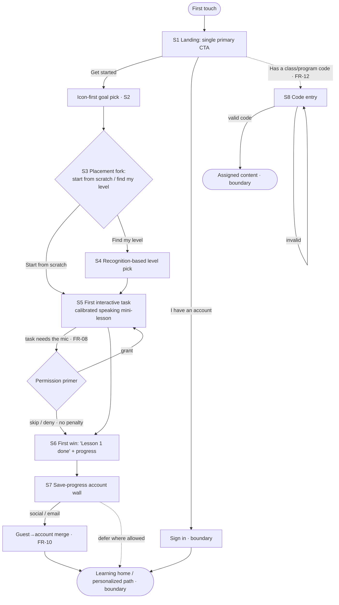
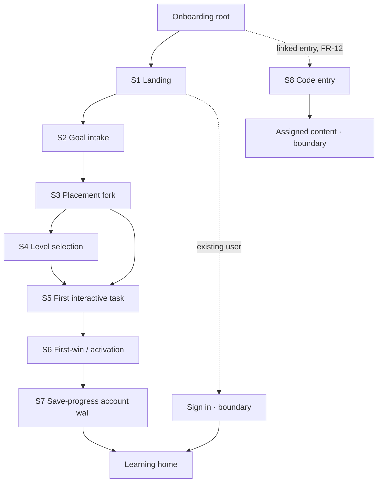

# Spec: Guest-First Onboarding-to-Activation Flow (0-to-1 Learning Product)

- **Source study:** research/2026-07-13-onboarding-activation-education-apps (Type: benchmark)
- **Derived from:** SYNTHESIS.md (reviewed 2026-07-13, `## Agent Review`: 7 Go, 3 Conditional Go, 0 No-Go)
- **Audience:** design (Figma pickup) + engineering (scoping)
- **Status:** Reviewed (Principal Designer Mode S: revise → all items resolved 2026-07-14)

## Overview

A **guest-first, mobile-first onboarding-to-activation flow** for a new 0-to-1 learning
product, designed to serve three learner types from **one** flow without branching the
product: **low tech-literacy**, **low-context** (first-time, no facilitator), and
**advanced** learners.

The benchmark synthesis points to one calibrated answer: open with a single unambiguous
CTA, extract only the minimum needed to *route* the learner (goal + level) inside a guest
session, deliver a real first "win," and only then wall registration behind "save your
progress," fully localized. This spec turns that answer into build-ready requirements,
organized around the reviewed three-stage architecture:

- **Stage 1 — Minimal Routing Intake (guest, < ~45s):** landing CTA → icon-first goal pick
  → optional recognition-based level pick. No PII, no permissions.
- **Stage 2 — First Interactive Win (1–2 min):** a short *calibrated mini-lesson* tailored
  to the chosen level, with a bounded progress bar and instant positive feedback.
- **Stage 3 — Contextual Save-Progress Wall (post-activation):** account creation framed as
  saving the win the learner just earned, with 1-tap social auth and a guest→account merge.

The strategic decision the Head of Product flagged — *how much personalization to extract
before the first win* — is resolved here in favor of **extract the minimum to route, defer
the rest post-activation**, which the guest-session infrastructure makes cheap.

**Grounded in prior internal research.** Prior internal onboarding research indicates two
drop-off points this spec targets directly: the **largest drop occurs after the account is
created but before the learner reaches any value** (an account-first architecture), and a
**second drop occurs between starting the first task and receiving the first reward**. The
intake steps themselves converted well. That signal is why the top-priority requirements are
the ones that *move the wall past the win* (FR-01, FR-02, FR-09) and *sustain momentum
through the first task* (FR-06, FR-07), rather than the intake mechanics.

---

## 1. Functional Requirements

MoSCoW priority tracks the synthesis recommendation and the `## Agent Review` verdicts.
Conditional-Go features are scoped down (F6) or deferred as their own workstream (F5); no
feature was a No-Go.

### FR-01 — Guest-first session  ·  Priority: Must
- **Requirement:** The system must let a first-time user complete goal selection, level
  selection, and a first interactive task in an ephemeral **guest session**, with no
  account, email, or password required until after the first win.
- **Source:** SYNTHESIS §F1 "Deferred, try-first registration" [Duolingo `01-landing-value-framing.png`; Brilliant `07-signup-wall-discover-plan.png`]; Agent Review — **Go** (the spine).
- **Acceptance criteria:**
  - Given a brand-new visitor, when they tap the primary CTA, then they enter Stage 1 with
    no account prompt.
  - Given a guest, when they progress through Stages 1–2, then no name/email/password/avatar/
    age is requested before the Stage-3 wall.
  - Given a guest session, when the user reaches the first win, then all selections and
    progress are held server-side (or resumable client-side) ready to attach to an account.
- **Edge cases:** session expiry mid-flow (offer resume, don't silently reset); the same
  device starting a second guest session; guest session on a shared device.

### FR-02 — Single-CTA landing  ·  Priority: Must
- **Requirement:** The landing screen must present exactly one dominant primary CTA plus
  one de-emphasized "I already have an account" link, and must not compete with promos,
  role choosers, or banners.
- **Source:** SYNTHESIS §F2 "Landing value-framing with a single unambiguous CTA" [Duolingo
  `01-landing-value-framing.png`; contrast Khan `01-landing-role-split.png`]; Agent Review — **Go** (addresses the "CTA-mistaken-for-an-ad" pain).
- **Acceptance criteria:**
  - Given the landing screen, when it renders, then there is one visually dominant CTA and
    at most one secondary (sign-in) link above the fold.
  - Given a low-context user, when shown the screen for 5 seconds, then they can identify the
    primary action (validated via the F2 first-click test).
- **Edge cases:** returning user who actually has an account (secondary link must be
  discoverable but not competing); very small viewports (CTA stays above the fold).

### FR-03 — Icon-first goal / motivation intake  ·  Priority: Must
- **Requirement:** The system must capture the learner's goal/motivation via **icon-first
  cards** (short prompt + pictorial choices), not free-text or long reading.
- **Source:** SYNTHESIS §F8 "Character-guided, icon-first, low-text intake" [Duolingo
  `03-intake-why-learning.png`; Brilliant `02-motivation-intake.png`]; Agent Review — **Go**
  (build icon-first; **defer the guide character** per Head of Product).
- **Acceptance criteria:**
  - Given the intake step, when it renders, then each option is an icon card with a short
    label, tappable without typing.
  - Given a low-literacy learner, when they answer, then no free-text entry is required to
    proceed.
- **Edge cases:** "other/skip" option so a user whose goal isn't listed isn't stuck; long
  localized labels (see FR-11 string expansion).

### FR-04 — Optional, positively-framed placement fork  ·  Priority: Must
- **Requirement:** The system must offer placement as an **optional, positively-framed
  choice** ("start from scratch" vs. "find my level"), never as a forced test, serving
  novice and advanced from one screen.
- **Source:** SYNTHESIS §F3 "Optional, positively-framed placement fork" [Duolingo
  `08-choose-path-fork.png`; Brilliant `06-start-point-recommended.png`]; Agent Review — **Go**.
- **Acceptance criteria:**
  - Given the placement step, when it renders, then both a "start from the beginning" path
    and a "find my level" path are offered side by side, with neutral/positive framing.
  - Given an advanced learner who picks a high level, when a foundation is recommended, then
    they may still proceed directly to the harder content (recommendation, not a gate).
- **Edge cases:** user skips placement entirely (route to a safe default level); user picks
  the hardest level then struggles (Stage 2 must degrade gracefully, not trap them).

### FR-05 — Recognition-based level selection  ·  Priority: Must
- **Requirement:** When a learner chooses "find my level," the system must let them select
  by **recognizing a concrete example** (a worked problem / sample task) rather than
  self-rating an abstract "beginner/intermediate/advanced" label.
- **Source:** SYNTHESIS §F4 "Level selection by recognition, not by label" [Brilliant
  `05-level-self-select-by-problem.png`; Duolingo `04-proficiency-self-select.png`]; Agent
  Review — **Go**.
- **Acceptance criteria:**
  - Given the level step, when it renders, then each level is shown as a concrete example
    (problem/sample) plus a plain-language "I can…" statement, escalating in difficulty.
  - Given a non-native or low-literacy learner, when selecting, then the choice is legible
    without parsing level vocabulary (triple-encoded: example + name + statement).
- **Edge cases:** domains where a "worked problem" card can't be rendered unambiguously
  (flag as assumption — see §7); more levels than fit one screen (scroll/paginate).

### FR-06 — First interactive win (calibrated mini-lesson)  ·  Priority: Must
- **Requirement:** Immediately after routing, the system must deliver a short interactive
  task calibrated to the chosen level that reaches a genuine "win" (a completed first
  item), **before** any account wall. This is a lightweight authored mini-lesson — **not** an
  ML-scored assessment.
- **Source:** SYNTHESIS calibrated answer (Overview) + §F5 "Assessment-as-onboarding,
  delivered before the wall" *(principle only — prove value before the wall)* [Elsa
  `03-web-speaking-assessment.png`]; REVIEW.md Stage 2. Agent Review — F5 is **Conditional
  Go / ships last**, so the *scored-assessment* instantiation is deferred (see FR-13); the
  *win-before-wall principle* is honored here.
- **Acceptance criteria:**
  - Given a routed guest, when Stage 2 begins, then a first interactive item appropriate to
    their level is presented within one screen transition.
  - Given the user completes the item, when it resolves, then a clear "win" state is shown
    (e.g., "Lesson 1 done"), still inside the guest session.
- **Edge cases:** user fails/abandons the item (still allow a graceful path to the win or a
  retry, never a dead-end); very low or very high level picked (content must exist at both
  ends); the first task is a **speaking item**, so the mic-permission path (FR-08) and its
  no-penalty fallback are on the critical path and must never trap a mic-less user short of
  the win.

### FR-07 — Bounded progress + instant positive feedback  ·  Priority: Must
- **Requirement:** The multi-step flow must show a **bounded, reversible progress
  indicator** and give instant positive feedback on task actions. (Trigger-driven retention
  modals and exit-intent popups are explicitly **out of MVP scope**.)
- **Source:** SYNTHESIS §F9 "Momentum and motivation scaffolding" [Duolingo
  `06-habit-projection-50-words.png`]; Agent Review — **Conditional Go**: build the bounded
  progress bar now, defer the trigger-driven pieces. **Prioritized to Must**, reinforced by
  prior internal research showing a drop-off between task-start and the first reward — exactly
  the abandonment this scaffolding is designed to prevent. (The Must stands on F9's "build the
  bar now" verdict alone.)
- **Acceptance criteria:**
  - Given any multi-step stage, when it renders, then a bounded progress indicator (finite,
    with a back affordance) is visible.
  - Given a correct/complete action, when it resolves, then immediate positive feedback is
    shown.
- **Edge cases:** back navigation must not lose prior answers; progress bar must reflect the
  real remaining steps (no fake 99%).

### FR-08 — Contextual permission priming + no-penalty fallback  ·  Priority: Must
- **Requirement:** Because the Stage-2 first task is a **speaking task requiring the
  microphone**, the system must show a plain-language rationale immediately before the OS
  mic prompt, and must provide a no-penalty "skip / can't do this now" fallback that marks
  the item done and lets the user continue.
- **Source:** SYNTHESIS §F7 "Permission priming with a graceful fallback" [Duolingo
  `07-notification-permission-primer.png`, `10-placement-speaking-mic-skip.png`; contrast
  Elsa `04-mic-recording-active.png`]; Agent Review — **Go**. **Prioritized to Must** because
  the product's first-win task uses the mic (the practice loop includes a speaking mode), so
  a cold OS prompt would be a dead-end on the critical activation path rather than an
  optional step.
- **Acceptance criteria:**
  - Given a task that needs a permission, when it is about to request it, then a rationale
    screen appears *before* the OS prompt, with a "Not now" option.
  - Given the user denies or skips, when they continue, then the flow proceeds with no
    penalty and the permission-gated task is bypassed gracefully.
- **Edge cases:** permission previously denied at OS level (can't re-prompt — must fall back
  cleanly); no hardware present (shared/mic-less device); notification vs. mic vs. camera all
  use the same 2-screen state machine.

### FR-09 — Contextual "save your progress" account wall  ·  Priority: Must
- **Requirement:** The account-creation wall must appear **only after** the first win and be
  framed around saving the earned progress, offering 1-tap social auth (Apple/Google)
  alongside email.
- **Source:** SYNTHESIS §F1 (wall placement + loss-aversion framing) [Brilliant
  `07-signup-wall-discover-plan.png`]; REVIEW.md Stage 3; Agent Review — **Go**.
- **Acceptance criteria:**
  - Given a guest who has reached the first win, when the wall appears, then its copy
    references the specific progress just earned ("save your XP / your plan").
  - Given the wall, when it renders, then 1-tap social auth options are presented alongside
    email, minimizing typing.
  - Given a low-context user, when they choose to defer, then (where product policy allows)
    they can continue briefly and be re-prompted, rather than being hard-blocked mid-win.
- **Edge cases:** social-auth cancel/return; email already in use (route to sign-in +
  merge); user abandons at the wall (guest progress must survive for a later return).

### FR-10 — Guest-to-registered account merge  ·  Priority: Must
- **Requirement:** On registration, the system must **merge** the guest session's goal,
  level, and progress into the new (or existing) account, with no duplicate-account creation
  and no lost progress.
- **Source:** SYNTHESIS §F1 (duplicate-account pain from lost sessions); Agent Review — Tech
  Lead **load-bearing risk #1** and Head of Product "single biggest risk," to be resourced as
  a first-class workstream inside F1.
- **Acceptance criteria:**
  - Given a guest with progress, when they create an account, then that progress appears in
    the account with nothing lost.
  - Given a guest whose email matches an existing account, when they authenticate, then they
    are merged into the existing account (no duplicate created).
  - Given a merge conflict (existing account has its own progress), when merging, then the
    system resolves deterministically per a defined rule (see §7 open question).
- **Edge cases:** interrupted merge (network drop mid-write); same guest merging on two
  devices; social auth returning an email that differs from any typed email.

### FR-11 — Day-one internationalization (deep localization)  ·  Priority: Must
- **Requirement:** The entire onboarding **chrome** (value framing, intake prompts, CTAs,
  errors), not just lesson content, must be localizable from day one, with auto-detected
  locale and layouts that tolerate 30–50% string expansion.
- **Source:** SYNTHESIS §F10 "Deep localization of the onboarding" [Elsa
  `01-landing-localized-value-framing-paywall.png`]; Agent Review — **Go** as a day-one i18n
  architecture decision; Tech Lead: "ruinous to retrofit."
- **Acceptance criteria:**
  - Given a locale, when any onboarding screen renders, then all interface strings (not only
    content) are localized, including error messages.
  - Given a language ~30–50% longer than English, when screens render, then layouts wrap/grow
    without clipping or horizontal overflow.
- **Edge cases:** RTL languages (flag if in scope — see §7); locale detected wrong (allow
  manual switch); partially translated locale (graceful fallback string, not a blank).

### FR-12 — Code-first linked entry  ·  Priority: Could (Conditional)
- **Requirement:** *If* program/facilitator links are confirmed as a primary acquisition
  channel, the system must provide a single-task, chrome-free "enter your code" screen that
  routes a learner straight to assigned content, with a segmented fixed-length input and
  inline validation.
- **Source:** SYNTHESIS §F6 "Code-first linked entry that routes to assigned content" [Khan
  `04-classcode-entry.png`; contrast `06-catalogue-grade-organized.png`]; Agent Review —
  **Conditional Go** (gated on links being a primary channel).
- **Acceptance criteria:**
  - Given a learner with a valid code, when they enter it on the join screen, then they are
    routed to their assigned content, bypassing the catalogue.
  - Given an invalid code, when submitted, then it is rejected inline with a plain-language
    recovery message.
  - Given the join screen, when it renders, then it shows only the code task (no nav/
    catalogue).
- **Edge cases:** expired/used code; code typed with wrong casing/spacing (segmented input
  normalizes); learner has no code (route to the standard guest flow, FR-01).

### FR-13 — ML-scored speaking/skill assessment  ·  Priority: Won't (this MVP)
- **Requirement:** A net-new ML-scored assessment (e.g. pronunciation scoring) is **out of
  scope for the MVP** and must not be built into the initial onboarding. The Stage-2 audio/
  mic slot (FR-08) is the future insertion point once its prerequisites exist.
- **Source:** SYNTHESIS §F5; Agent Review — **Conditional Go**, Tech Lead **High effort/risk**
  (net-new ML engine, no observed reference), Head of Product: decouple from ML scoring, ship
  last as its own workstream.
- **Acceptance criteria:**
  - Given the MVP, when Stage 2 runs, then it uses an authored calibrated mini-lesson
    (FR-06), not an ML-scored assessment.
  - Given the product roadmap, when F5 is later pursued, then it plugs into the FR-08
    primed-permission slot as a separate workstream.
- **Edge cases:** n/a (explicitly deferred).

---

## 2. User Flow

One-line summary: **Landing CTA → minimal routing intake (guest) → first interactive win →
save-progress account wall (merge) → learning home.** (Alternate entry: code-first join.)

### Written step-by-step

1. **Arrive at the landing screen (S1).** The user sees one benefit line and one dominant
   CTA; nothing competes. A quiet "I already have an account" link sits below. *(FR-02)*
2. **Tap the primary CTA.** The user enters a **guest session** — no account asked. *(FR-01)*
3. **Pick a goal (S2).** The user taps an icon card for why they're here; no typing. *(FR-03)*
4. **Choose how to start (S3).** The user is offered "start from scratch" or "find my level,"
   side by side, positively framed. Picking scratch skips straight to the task. *(FR-04)*
5. **(If "find my level") Recognize your level (S4).** The user picks the card whose worked
   example / "I can…" statement matches them; no abstract labels. *(FR-05)*
6. **Start the first task (S5).** The user is routed to a short mini-lesson calibrated to the
   chosen level, bracketed by a bounded progress bar. *(FR-06, FR-07)*
7. **(If the task needs a permission) See a rationale first.** A plain-language primer
   explains why (e.g. mic), *then* the OS prompt fires; a "skip for now" fallback keeps a
   mic-less or hesitant user moving with no penalty. *(FR-08)*
8. **Reach the first win (S6).** The user completes the item and sees a clear success state
   ("Lesson 1 done") with earned progress — still a guest. *(FR-06)*
9. **Hit the save-progress wall (S7).** Only now does account creation appear, framed as
   saving the win just earned, with 1-tap social auth beside email. *(FR-09)*
10. **Register and merge.** The guest's goal/level/progress merges into the account with no
    duplicate and nothing lost; the user lands on their personalized home. *(FR-10)*

- **Alternate entry (FR-12, conditional):** a learner with a class/program code goes to the
  chrome-free **code-entry** screen (S8), enters a segmented code, and is routed straight to
  assigned content, skipping the catalogue. Invalid codes are rejected inline.
- **Friction/dead-end watch:** the two historical dead-ends — the cold account wall (moved to
  step 9) and the un-primed mic prompt (wrapped by step 7's primer + fallback) — are
  explicitly designed out. Localization (FR-11) is cross-cutting across every step.

---

## 3. Information Architecture

**Boundary nodes (out of this spec's scope):** `Sign in`, `Learning home`, and `Assigned
content` are entry/exit boundaries of the onboarding arc, shown for context but not specified
here (sign-in is an existing-account path; home and assigned content are downstream product
surfaces). They intentionally have no FR or §4 screen entry.

| Screen | Purpose | Parent | Satisfies FRs |
|---|---|---|---|
| S1 Landing | Frame value, offer one action | Root | FR-02, FR-01, FR-11 |
| S2 Goal intake | Capture goal via icon cards | S1 | FR-03, FR-11 |
| S3 Placement fork | Offer optional placement, novice/advanced from one screen | S2 | FR-04 |
| S4 Level selection | Recognize level by concrete example | S3 | FR-05 |
| S5 First interactive task | Deliver calibrated mini-lesson (the "win") | S3/S4 | FR-06, FR-07, FR-08 |
| S6 First-win / activation | Confirm the win, still guest | S5 / S8 | FR-06, FR-07 |
| S7 Save-progress wall | Contextual account creation + merge | S6 | FR-09, FR-10, FR-11 |
| S8 Code entry (conditional) | Chrome-free linked entry to assigned content | Root | FR-12, FR-11 |

---

## 4. Screen list (wireframe-level)

### S1 — Landing
- **Purpose:** make one action obvious; ask for nothing.
- **Key content blocks:** benefit headline; single dominant primary CTA; de-emphasized
  "I already have an account" link.
- **Primary action(s):** "Get started" (→ guest session).
- **Satisfies:** FR-02, FR-01, FR-11.
- **States:** default; loading (CTA busy); error (network — retry, no dead-end); returning
  user (sign-in link discoverable).

### S2 — Goal / motivation intake
- **Purpose:** capture the routing signal "why are you here" with no reading/typing burden.
- **Key content blocks:** short prompt; grid of icon cards; optional "other/skip."
- **Primary action(s):** tap a card (auto-advance or Continue).
- **Satisfies:** FR-03, FR-11.
- **States:** default; selected; empty (nothing picked — Continue disabled or skip offered);
  long-label localization.

### S3 — Placement fork
- **Purpose:** offer placement as an opt-in, serving novice and advanced from one screen.
- **Key content blocks:** two positively-framed choices ("start from scratch" / "find my
  level") side by side; brief helper text.
- **Primary action(s):** pick a path.
- **Satisfies:** FR-04.
- **States:** default; selected; skip → safe default level.

### S4 — Level selection (recognition)
- **Purpose:** let the user recognize their level from concrete examples.
- **Key content blocks:** escalating cards, each = worked example/sample + topic name +
  first-person "I can…" statement.
- **Primary action(s):** pick the matching card.
- **Satisfies:** FR-05.
- **States:** default; selected; scroll/paginate when levels exceed one screen; domain with
  no renderable example (fallback — see §7).

### S5 — First interactive task (calibrated mini-lesson)
- **Purpose:** deliver a real first "win" calibrated to the chosen level, before any wall.
- **Key content blocks:** the task item; bounded progress bar + back affordance; instant
  feedback; (if needed) permission primer + "skip for now."
- **Primary action(s):** answer/complete the item.
- **Satisfies:** FR-06, FR-07, FR-08.
- **States:** loading; active; correct (positive feedback); incorrect (retry, no dead-end);
  permission-needed (primer); permission-skipped (graceful bypass).

### S6 — First-win / activation
- **Purpose:** confirm the win and the earned progress, still as a guest.
- **Key content blocks:** success moment ("Lesson 1 done"); earned progress/XP; continue CTA.
- **Primary action(s):** continue (→ wall).
- **Satisfies:** FR-06, FR-07.
- **States:** success (default); minimal (if task was skipped, still acknowledge progress).

### S7 — Save-progress account wall
- **Purpose:** convert the win into a saved account via loss-aversion framing.
- **Key content blocks:** headline referencing the just-earned progress; 1-tap social auth
  (Apple/Google); email option; (where allowed) "maybe later."
- **Primary action(s):** create account / continue with social.
- **Satisfies:** FR-09, FR-10, FR-11.
- **States:** default; social-auth in progress; email-in-use (→ sign-in + merge); error
  (retry); deferred (guest progress preserved).

### S8 — Code entry (conditional, FR-12)
- **Purpose:** route a linked learner straight to assigned content.
- **Key content blocks:** single title; segmented fixed-length input; inline validation;
  nothing else (no nav/catalogue).
- **Primary action(s):** submit code.
- **Satisfies:** FR-12, FR-11.
- **States:** empty; partially entered (auto-advance); valid (→ assigned content); invalid
  (inline plain-language error); expired/used code.

---

## 5. Edge cases & error states (cross-cutting)

- **Offline / network drop:** every step retries without losing prior answers; the guest→
  account **merge** (FR-10) must be atomic or resumable so an interrupted write never creates
  a duplicate or loses progress.
- **Permission denied at OS level (already-denied state):** can't re-prompt; fall back to the
  no-penalty skip path (FR-08).
- **No hardware present (mic-less / shared device):** the speaking/permission task must be
  fully bypassable (FR-08).
- **Empty / missing content at a chosen level:** Stage 2 must have content at both the lowest
  and highest selectable levels, or route to the nearest available (FR-06).
- **Validation failure (code, email):** plain-language, recovery-oriented messages, localized
  (FR-11); never a raw error key.
- **Guest session expiry / resumption:** offer resume rather than silent reset (FR-01).
- **Duplicate-identity at the wall:** email/social already in use → sign in and merge, never
  create a second account (FR-09, FR-10).

---

## 6. Traceability matrix

| FR | Synthesis source | Agent Review | Screen(s) |
|---|---|---|---|
| FR-01 Guest-first session | §F1 | Go | S1, all guest screens |
| FR-02 Single-CTA landing | §F2 | Go | S1 |
| FR-03 Icon-first goal intake | §F8 (icon-first) | Go (defer guide char) | S2 |
| FR-04 Optional placement fork | §F3 | Go | S3 |
| FR-05 Recognition level selection | §F4 | Go | S4 |
| FR-06 First interactive win | Overview + §F5 (principle) | F5 Cond. Go → win-before-wall only | S5, S6 |
| FR-07 Bounded progress + feedback | §F9 (+ prior internal research) | Cond. Go → **Must** | S5, S6 |
| FR-08 Permission priming + fallback | §F7 (first task uses mic) | Go → **Must** | S5 |
| FR-09 Save-progress wall | §F1 | Go | S7 |
| FR-10 Guest→account merge | §F1 + Tech Lead risk #1 | Go (first-class) | S7 |
| FR-11 Day-one i18n | §F10 | Go | all screens |
| FR-12 Code-first entry | §F6 | Conditional Go | S8 |
| FR-13 ML-scored assessment | §F5 | Conditional Go → deferred | (none — out of MVP) |

---

## 7. Assumptions & open questions

- **Assumption — "calibrated mini-lesson" content exists (FR-06).** The synthesis observed
  the *win-before-wall principle*, not our specific first task; we assume an authored,
  non-ML mini-lesson can deliver a real win at every selectable level. *Validate by* building
  one level's mini-lesson and usability-testing time-to-first-win with novice + advanced users.
- **Assumption — the first-win task is a speaking / mic task (FR-06, FR-08).** This is a
  **product decision** (the practice model includes a speaking mode), not a benchmark finding;
  it is what promotes FR-08 to Must. If the first task were tap/text instead, FR-08 would fall
  back to a conditional Should. *Validate by* confirming the Stage-2 task modality with product
  before building the mic-permission path as critical.
- **Reconciliation — a speaking first task without ML scoring (FR-06 + FR-08 + FR-13).** The
  first-win task is a **speaking** item, yet ML pronunciation scoring is deferred (FR-13). The
  MVP "win" must therefore come from **completion/participation** ("you said it ✓"), not a
  graded score, so the speaking mini-lesson lands a real win without the deferred scoring
  engine. *Validate by* usability-testing whether a non-scored speaking task still feels like
  a genuine win, and confirm the mic-permission + fallback (FR-08) keeps mic-less users on a
  path to that win.
- **Assumption — recognition cards render in our domain (FR-05).** Brilliant's worked-problem
  cards suit math/coding; whether our subject can be shown as an unambiguous "worked example"
  card is untested. *Validate by* prototyping level cards for our actual content and testing
  placement accuracy vs. a label selector (the F4 diagnostic-agreement study).
- **Open question — is program/facilitator link a primary acquisition channel? (FR-12).** The
  Head of Product gated F6 on this. If yes, FR-12 rises from Could toward Must; if no, it
  stays deferred. *Resolve before* committing S8 to a sprint.
- **Open question — merge conflict resolution rule (FR-10).** When a guest with progress
  authenticates into an *existing* account that already has progress, which wins? Needs a
  product-defined deterministic rule. *Resolve before* building the merge workstream.
- **Open question — locale/RTL scope (FR-11).** Which locales at launch, and is RTL in scope?
  Affects layout primitives. *Resolve before* finalizing the i18n layout containers.
- **Standing caveat (from SYNTHESIS Gaps).** All benchmark evidence is **desktop-web,
  single-variant**; our product is mobile-first. This spec sets direction; it does not replace
  a first mobile usability round. F5's scoring interior and CodeSignal's placement interior
  were never observed, so no requirement here depends on them.
