# Synthesis: Onboarding & Activation in Education Apps

## Overview

**Goal.** Benchmark how best-in-class education apps design their onboarding-to-activation
flow, to inform the onboarding for a new 0-to-1 learning product serving three user types
at once: **low tech-literacy**, **low-context** (first-time, no facilitator present), and
**advanced** learners. Guiding question: *how do the best apps calibrate one flow so a
low-context novice feels guided while an advanced user is not patronized, and how much
personalization do they extract before the user reaches their first "win"?*

**Platforms studied (desktop web, logged-out, 2026-07-13).** Duolingo, Khan Academy,
Brilliant, CodeSignal, Elsa Speak. Each was torn down across six onboarding moments
(value framing, account creation, personalization intake, placement/advanced routing,
path assignment, first-task guidance) plus a defined activation endpoint. Captures are
desktop web; per-platform notes flag where the mobile/native-app experience diverges.

**Headline takeaways.**

1. **Registration timing is the biggest differentiator, and it is a spectrum.** From
   *try-first* (Duolingo lets you finish a lesson before any account) to *wall-first*
   (CodeSignal demands a full name/email/password form before anything). For low-context,
   often email-less learners, earlier value and later walls win.
2. **The novice-vs-advanced tension is solved the same way everywhere: never force a
   test.** Placement is offered as an *optional, positively-framed choice* or as
   *recognition* (pick the problem you can do), so a novice never feels examined and an
   advanced user never starts at zero.
3. **Low-literacy support is a consistent toolkit:** a guide character, icon-first
   low-text choices, progress bars, and permission priming. The best apps use all of it;
   the weakest skip priming and strand users at a system prompt.
4. **The strongest single pattern for *our* audience is "prove the value before the wall,"**
   whether that is Duolingo's guest-first flow (a real lesson is reachable before any
   account) or Elsa's embedded, un-gated speaking test. The corollary anti-pattern
   (CodeSignal) shows that even a reportedly strong placement mechanic is wasted when it
   sits behind a cold registration form.

**The calibrated answer this synthesis points to:** a guest-first flow that opens with a
single clear CTA, runs a short icon-first intake, offers an *optional* recognition-based
placement (novice and advanced from one screen), routes the user to a concrete first task
with a guide character and primed permissions, lets a real win land, and only then walls
registration behind "save your progress," fully localized.

---

## Feature 1: Deferred, "try-first" registration

**Short description.** Where the account wall sits relative to the first taste of value.
The five platforms span a full spectrum, and the placement strongly predicts fit for a
low-context, email-scarce audience.

**Key findings.** Duolingo defers registration entirely: the whole language pick,
questionnaire, and placement run in a guest session, and the account ask appears only
*after* the user reaches the product home, framed as saving progress. (In our capture the
guest session reached personalization, placement, and the `/learn` home; the first lesson
itself sits just beyond where we stopped, see Gaps.)

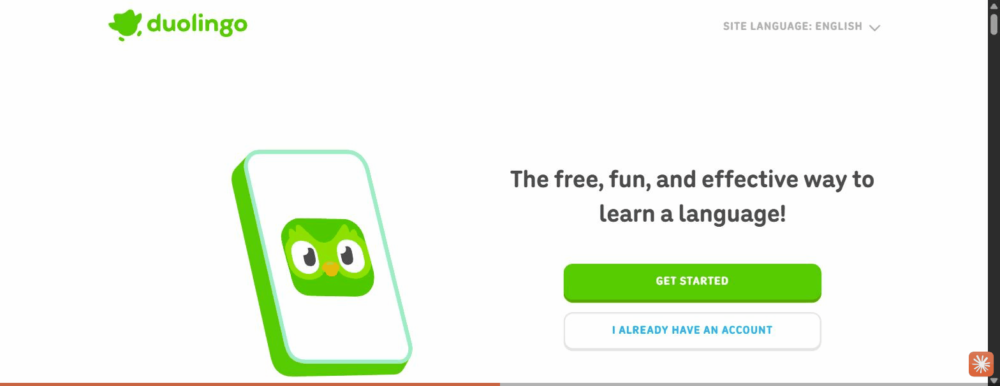

Brilliant sits in the middle: it runs its full personalization questionnaire first, then
walls registration to "discover your learning plan" (loss-aversion on invested effort).

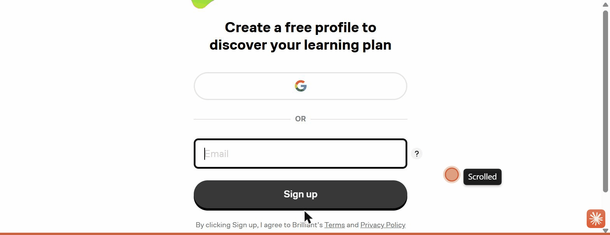

Khan is wall-first with a lighter pre-step (role then age gate), and CodeSignal is the
extreme: clicking "Start learning" jumps straight to a full name/email/password form with
no value shown first.

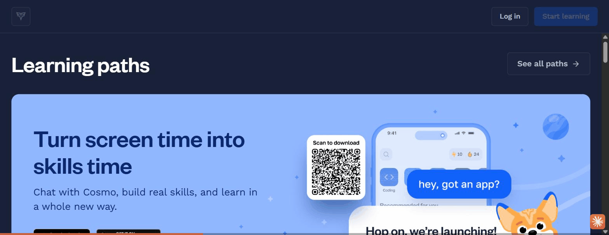

**Why this feature works (rationale).** Every field asked before value is delivered is a
drop-off point. A guest session lets motivation build before commitment is required, and
reframing the eventual signup as "save what you already made" converts loss-aversion into
a reason to register rather than a barrier to entry. This directly addresses email-less
and low-context learners who stall at a cold account wall and who accumulate duplicate or
abandoned accounts when forced to register up front. [ref: Kahneman, Knetsch & Thaler 1991
on loss aversion / the endowment effect; see references.md]

**How to validate this feature in the future.** Prototype two entry variants (guest-first
vs. account-first) and A/B test **activation rate** (reached first task) and **account-
creation rate** among first-time, low-context users. Instrument time-to-first-task and
drop-off per screen. Target metric: guest-first should lift activation without materially
lowering eventual registration.

---

## Feature 2: Landing value-framing with a single unambiguous CTA

**Short description.** The first screen's job is to make one action obvious and ask for
nothing. This is the moment where a primary CTA can be mistaken for an ad if it competes
with other elements.

**Key findings.** Duolingo's landing is near-empty: one benefit headline, one dominant
primary CTA ("Get started"), and a de-emphasized "I already have an account." Nothing else
competes for the tap.

Khan instead leads with a role chooser as the primary action (Student / Family / Teacher),
which front-loads an identity decision before any value.

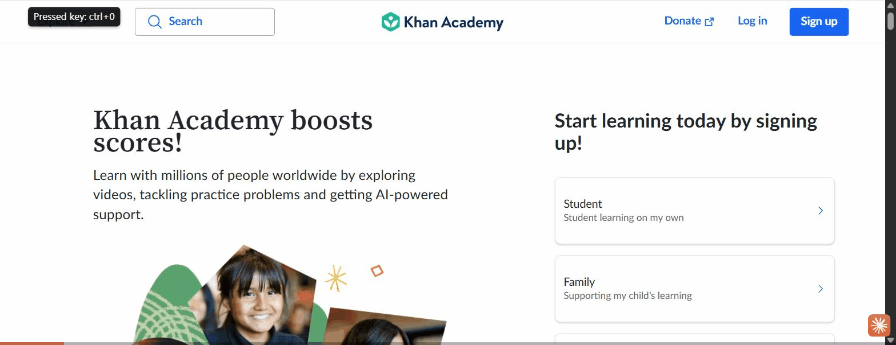

Elsa proves value on the page itself, embedding a working "speak this sentence" test (see
Feature 5), and Brilliant pairs a credibility line ("built by experts from MIT and
Harvard") with a live interactive product visual.

**Why this feature works (rationale).** A single high-contrast CTA with no competing
elements removes ambiguity about what to do next, which is critical for low-context and
low-tech-literacy users who will not hunt for the right control. When the first screen
asks for a decision (role) or competes with promos, the intended action loses salience and
can read as marketing rather than a button to press. [ref: Hick 1952 on choice reaction
time; see references.md]

**How to validate this feature in the future.** First-click / five-second test with
low-context users on candidate landing designs: can users state what the app is and
identify the primary action within five seconds, and where do they click first? Compare a
single-CTA layout against a role-split layout for first-action success rate.

---

## Feature 3: Optional, positively-framed placement fork

**Short description.** A single screen that lets a novice and an advanced user each choose
their path, with placement offered as an opt-in help rather than an imposed test. This
feature and Feature 4 are two facets of one placement moment: Feature 3 is the *framing and
optionality*, Feature 4 is the *selection mechanic*.

**Key findings.** Duolingo presents two choices side by side: "Start from scratch — take
the easiest lesson" and "Find my level — let Duo recommend where you should start." The
placement test is an optional, positively-framed fork, not a gate.

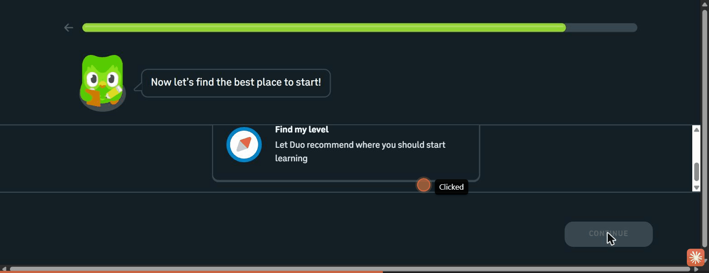

Brilliant goes further with adaptive respect for autonomy: after an advanced self-pick
(Calculus) it *recommends* a foundation course but still lets the user jump straight to the
hard content.

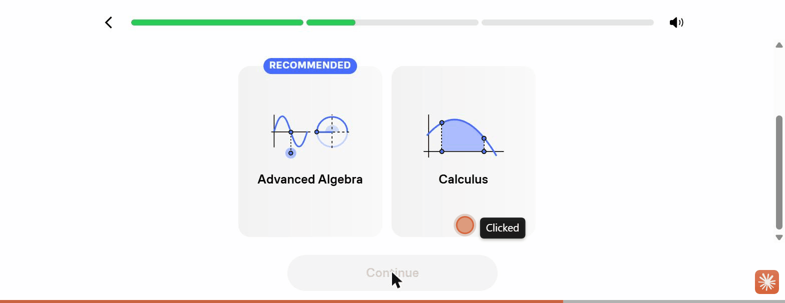

**Why this feature works (rationale).** Framing placement as "let me help you find the
right start" removes the social threat of a test, so a novice is not intimidated and an
advanced user is not forced to sit through basics. Offering both paths on one screen means
a single flow serves the full ability range without branching the UI. Recommending
foundations while permitting the jump nudges mastery without removing control. [ref: Ryan &
Deci 2000, self-determination theory / autonomy support; see references.md]

**How to validate this feature in the future.** Usability test with both a self-identified
beginner and an advanced learner: does each reach an appropriately-leveled first task
without confusion or a feeling of being tested? Measure mis-placement (user overrides the
suggested start) and post-task confidence (SEQ).

---

## Feature 4: Level selection by recognition, not by label

**Short description.** Instead of asking users to self-rate as "beginner/intermediate/
advanced," the best placement screens ask users to *recognize* their level from concrete
examples. (This is the *mechanic* that pairs with Feature 3's *framing*.)

**Key findings.** Brilliant's level selector shows an actual worked problem on each card,
escalating in difficulty, with a topic name and a first-person capability statement:
"Arithmetic — I want to start from the basics" (`5 × ½`) up to "Calculus — I understand
derivatives and integrals" (a shaded integral). The user recognizes the math they can do.

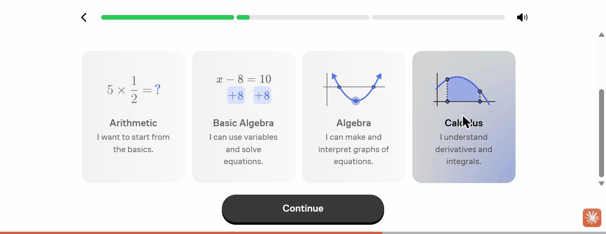

Duolingo achieves a lighter version with a self-rated ladder rendered as signal-strength
bars, from "I'm new" (one bar) to "I can discuss most topics in detail" (four bars). The
icon encodes level independently of the words.

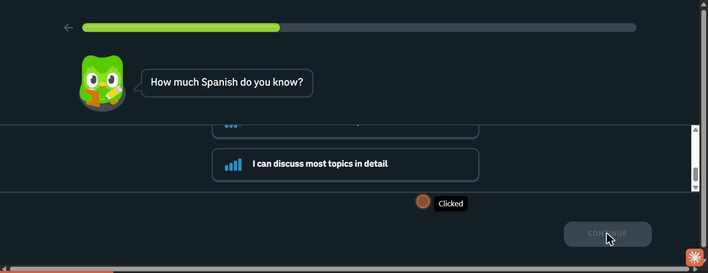

**Why this feature works (rationale).** Recognition is more inclusive than abstract
self-assessment, and likely more accurate: a low-literacy or non-native learner can
identify a math problem or a signal-bar level without parsing level vocabulary, an advanced
learner instantly spots their tier, and a novice is not shamed by jargon. It triple-encodes
the choice (example + name + statement) so at least one cue lands for every user type.
Recognition-memory research supports the inclusivity and ease claim; that recognition-based
*placement* is more accurate than label self-rating is a hypothesis this feature's
validation plan is designed to confirm. [ref: Standing 1973, recognition-memory
superiority; see references.md]

**How to validate this feature in the future.** Compare placement accuracy of a
problem-recognition selector vs. an abstract label selector: have users self-place, then
administer a short diagnostic, and measure agreement between chosen level and diagnostic
result across literacy and language backgrounds.

---

## Feature 5: Assessment-as-onboarding, delivered before the wall

**Short description.** Using a real skill assessment as the onboarding itself, so the
placement mechanic doubles as a "playable demo" of the product's core value, and crucially,
delivering it *before* any signup.

**Key findings.** Elsa embeds a genuinely working speaking test on its marketing page: a
sentence to pronounce, an audio model to hear, and a mic to record. The user reaches the
core interaction (speaking into a real assessment) with no signup or download. Pronunciation
scoring is what Elsa advertises the test performs; in our capture the mic fired on a silent
clip and the AI score itself appeared only as a marketing mockup, so the scoring was
observed as claimed, not as a returned result.

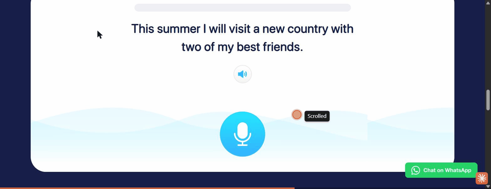

CodeSignal is the cautionary inverse: its signature AI skill-assessment placement is
identical in spirit but sits entirely behind a mandatory account form, so a prospective
learner never reaches it.

**Why this feature works (rationale).** An assessment that is also a demo lets users feel
competence and see the product's value in the first minute, which is a powerful activation
and acquisition hook, and it produces the placement signal for free. Sequencing it before
the wall (Elsa) versus behind it (CodeSignal) is the difference between "try then commit"
and "commit to try": the former fits a hesitant, low-commitment audience far better. The
testing-effect literature supports only that a real assessment is genuine learning rather
than dead time; the stronger claim that sequencing it *before* the wall lifts activation
rests on the Elsa-vs-CodeSignal contrast and the A/B test proposed below, not on that
literature. [ref: Roediger & Karpicke 2006, the testing effect; see references.md]

**How to validate this feature in the future.** Prototype an un-gated first-task
assessment and measure completion rate and downstream signup among users who complete it
vs. those shown a signup wall first. For speaking specifically, pair with permission
priming (Feature 7) before testing on real devices.

---

## Feature 6: Code-first linked entry that routes to assigned content

**Short description.** A dedicated, distraction-free entry where a learner who arrives via
a class or program link enters a code and is routed straight to their assigned content,
bypassing the full catalogue.

**Key findings.** Khan's `/join` page is a single-task screen: "Join your class on Khan
Academy" with a segmented, fixed-length code input and nothing else: no nav, no catalogue.
A valid code routes the learner to their assigned class; an invalid code is rejected inline.

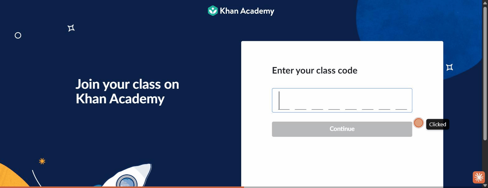

By contrast, an un-routed learner faces the full catalogue organized by grade and must
self-locate, the exact "which course is mine?" burden the code path removes.

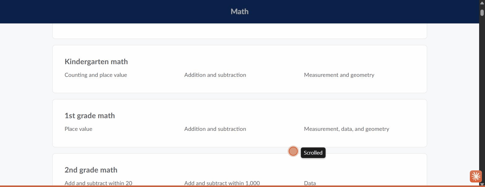

**Why this feature works (rationale).** For learners who join through a facilitator, teacher,
or program link, a code-first entry collapses the hardest navigation problem (finding the
right course among many) into a single deterministic step. Stripping the page of all other
UI keeps a low-context user focused on the one action, and a segmented input makes the code
format self-evident and reduces entry errors. [ref: Hick 1952 on choice reduction and
Sweller 1988 on cognitive load; see references.md]

**How to validate this feature in the future.** Usability test the code-entry flow with
first-time learners handed a link/code: task success (reached assigned content) and error
rate on code entry. Compare against the current experience where linked learners land in a
general catalogue, measuring how many reach the correct course unaided.

---

## Feature 7: Permission priming with a graceful fallback

**Short description.** Explaining *why* a device permission is needed immediately before
the system prompt fires, and always providing an escape hatch when the permission or
hardware is unavailable.

**Key findings.** Duolingo is the gold standard: the mascot says "I'll remind you to
practice so it becomes a habit" and *then* the browser notification prompt appears in
context, right after the rationale.

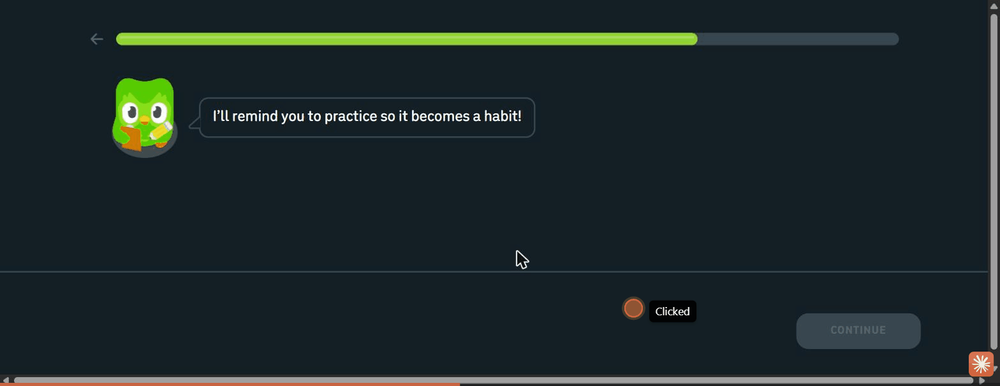

Its speaking tasks also degrade gracefully: a "can't speak now" escape hatch marks the item
done with no penalty and temporarily disables speaking tasks, so a mic-less user is never
blocked.

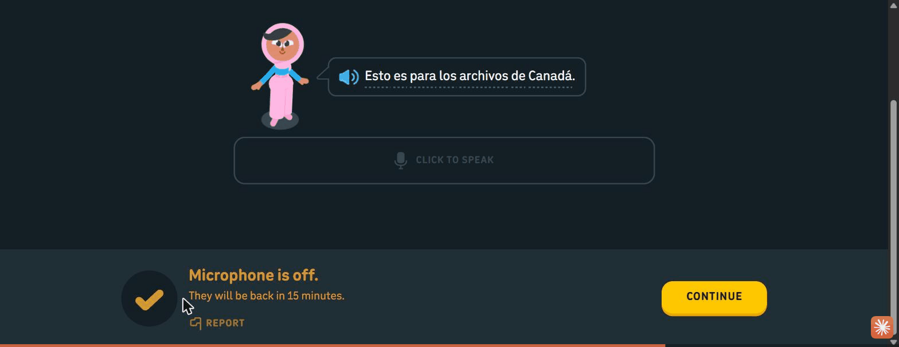

Elsa is the cautionary opposite: its web speaking test fires the mic capture on click with
no rationale-first screen. (On this pre-granted browser profile no prompt appeared, but on
a first-time device this is the cold OS prompt that strands users.)

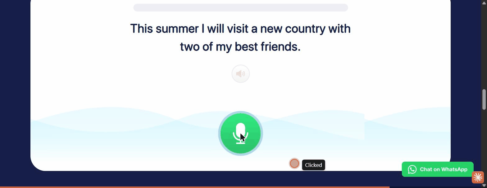

**Why this feature works (rationale).** Users deny permissions they do not understand, and
a cold system prompt (especially the OS-level mic prompt on mobile) is a common dead-end for
low-tech-literacy learners who cannot recover a blocked-permission state on their own.
Priming raises grant rates by supplying context, and a no-penalty fallback ensures a denied
or missing permission never halts the flow. [ref: Felt et al. 2012, "How to Ask for
Permission" (contextual/runtime requests); see references.md]

**How to validate this feature in the future.** On real mobile devices, A/B the primed vs.
raw permission prompt and measure grant rate and task-abandonment at the permission step.
Usability-test the speaking fallback with learners on shared or mic-less devices to confirm
they can complete onboarding without granting the mic.

---

## Feature 8: Character-guided, icon-first, low-text intake

**Short description.** A guide character narrates the onboarding while every question is
answered by tapping an icon card rather than reading and typing, minimizing reading load.

**Key findings.** All three character-led platforms use a mascot as a friendly guide
(Duolingo's Duo, Brilliant's Koji, "Hi, I'm Koji! I'll be your personal tutor," and
CodeSignal's Cosmo), and pose each question as a short prompt with pictorial choices.

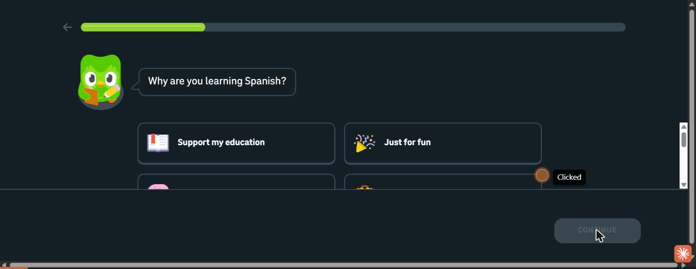

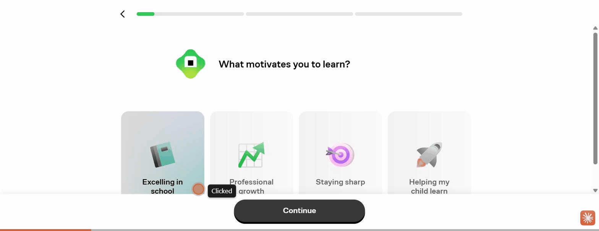

Brilliant extends personalization to the guide itself, letting the user choose the tutor's
voice, making the AI tutor feel chosen and owned.

**Why this feature works (rationale).** A guide character lowers cognitive load and adds
warmth, turning a form into a conversation, which reassures first-time and low-context users
that they are being led. Icon-first, low-text choices reduce the reading and typing burden
that blocks low-literacy and non-native learners, and personalizing the guide creates early
ownership that motivates completion. [ref: Lester et al. 1997 (persona effect) and Sweller
1988 (cognitive load); see references.md]

**How to validate this feature in the future.** Usability test with low-literacy learners:
can they complete the intake without assistance, and does the guide character reduce
hesitation at each step (measure time-per-step and requests for help)? Compare icon-card
questions against text-radio equivalents for completion rate.

---

## Feature 9: Momentum and motivation scaffolding

**Short description.** Small structural devices woven through the flow that make it feel
short, reversible, and worth finishing: progress bars, outcome projections, positive
feedback, and gentle re-engagement.

**Key findings.** Duolingo brackets its questionnaire with a progress bar and a back arrow
(finite and reversible), reinforces value with an outcome projection ("That's 50 words in
your first week!"), gives instant positive feedback on placement answers ("Nice!"), and
even deploys an exit-intent retention modal if the user tries to quit mid-placement.

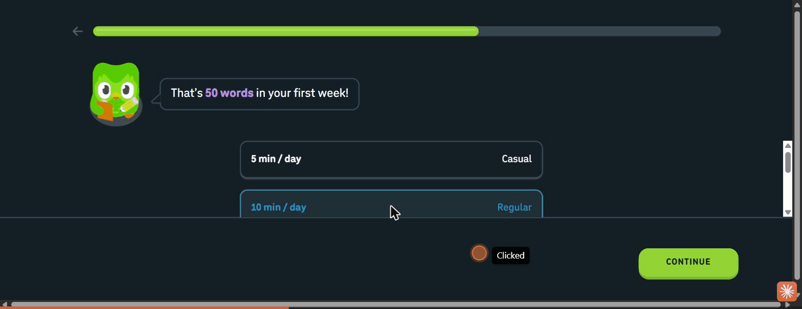

Brilliant threads credibility and reassurance interstitials between questions ("Built by the
best minds in education," "You can make progress in both subjects later on"). Both apps also
tease locked features with a concrete unlock condition ("complete 3 more lessons to start
competing") to set a near-term goal rather than overwhelming a new user.

**Why this feature works (rationale).** A visible, bounded progress indicator reduces the
anxiety of an open-ended form, and reversibility lowers the stakes of each choice. Outcome
projections and instant positive feedback supply motivation to continue, and teasing a
gated feature with a clear condition converts overwhelm into a single next goal. Together
they sustain a low-context user through a multi-step flow. [ref: Kivetz, Urminsky & Zheng
2006 (goal-gradient) and Nunes & Drèze 2006 (endowed progress); see references.md]

**How to validate this feature in the future.** Instrument step-level drop-off with and
without a progress bar and outcome-projection screens; measure completion of the full
intake. Test whether the feature-unlock teaser increases return-for-second-session rate.

---

## Feature 10: Deep localization of the onboarding

**Short description.** Delivering the entire onboarding (value proposition, intake,
feature claims, CTAs) in the learner's native language, detected automatically.

**Key findings.** Elsa geo-redirects to a fully localized site (Indonesian, on an `id.`
subdomain): the value proposition, feature descriptions, and CTAs are all in the learner's
language, not just the course content.

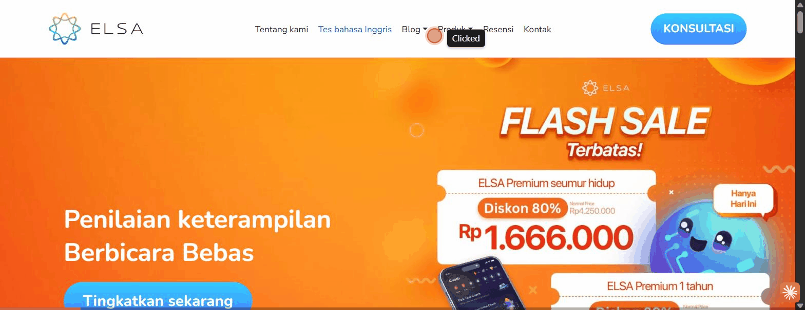

**Why this feature works (rationale).** For learners studying a foreign language with low
proficiency, native-language *chrome* (instructions, buttons, value framing) is the
difference between comprehension and abandonment: a learner who cannot yet read the target
language must still understand what to do. Localizing only the content while leaving the
interface in English recreates the exact comprehension wall these learners face. [ref: L2
reading cognitive-load and UI-translation eye-tracking studies; see references.md]

**How to validate this feature in the future.** Comprehension test the onboarding in native
language vs. English-interface with the target learner population: task success and
self-reported understanding at each step. Prioritize localizing interface strings and error
messages, not just lesson content.

---

## Gaps & caveats

- **Desktop-web capture; mobile/native not fully observed.** All captures are desktop web at
  a fixed ~1280px viewport (true mobile emulation was unavailable through the tooling). The
  onboarding *logic* is consistent across breakpoints, but touch-target sizing, vertical
  stacking, OS-level permission prompts, and native-app-only steps were not directly
  observed. This matters most for **Elsa** (true onboarding is app-only; we captured the
  marketing site plus a real web speaking test and app mockups) and to a lesser degree for
  Duolingo and Brilliant (native apps mirror the web logic). Per-platform notes flag the
  specific divergences.
- **CodeSignal's assessment interior is unseen.** Its signature skill-assessment placement is
  behind mandatory account creation; by decision we documented the gate rather than creating
  an account, so CodeSignal contributes a cautionary account-first data point but not an
  evaluated placement flow.
- **Single observed variant per platform.** Onboarding is heavily A/B-tested across all five;
  each teardown reflects one session/region and should not be read as the platform's only
  flow. Step order and copy may differ for other users.
- **No transactions; some flows sit behind paywalls.** Brilliant's first lesson and Elsa's
  full plan sit behind subscription paywalls we did not cross, so the *first-task activation*
  endpoint was reached cleanly only in the guest-friendly flows.
- **Activation endpoint reached unevenly.** Duolingo's placement and first-lesson entry were
  observed; for the wall-first and paywalled platforms the first true "win" was not reached,
  so cross-platform time-to-first-win is directional, not measured.
- **Advanced-user lens is well covered; the low-tech-literacy lens leans on inference.**
  Problem-recognition placement, icon-first intake, permission priming, and localization are
  strong evidence for the low-literacy case, but confirming they *work* for that population
  requires the usability tests proposed under each feature.

---

## Principal Researcher QA — 2026-07-13

**Readiness verdict: Ready for `/review-research` once the flagged items are resolved.** The
synthesis is well structured and evidence-grounded: all 10 features carry the five required
fields in order, every embedded image path resolves to a real file on disk, and each "how to
validate" is a concrete, testable experiment. The flags below are precision and
attribution fixes, not structural rework; none invalidates a feature.

- **Structure & paths.** 10/10 features have the five required fields in order. All 20
  embedded screenshot paths verified present under `platforms/*/screenshots/`. No broken
  links. All validation steps are concrete.
- **Prose pass.** 24 em-dashes removed and replaced with the correct punctuation across the
  title, headings, and body (SYNTHESIS.md). 4 em-dashes were intentionally kept because they
  sit inside quoted on-screen UI copy (Duolingo's "Start from scratch"/"Find my level" cards
  and Brilliant's "Arithmetic"/"Calculus" level labels), which the prose rule preserves as
  verbatim evidence. No AI-slop rewrites were required; the prose was already clean. No
  finding, number, attribution, or citation was changed.
- **External validation.** 10/10 feature rationales checked against retrieved, cited
  literature (logged in `references.md`). 8 directly supported (F1, F2, F3, F6, F7, F8, F9,
  F10); 2 partially supported (F4, F5) where the principle holds but the specific applied /
  conversion claim is untested and correctly left to each feature's own validation plan.
  None contradicted. Inline `[ref: …]` tags added to every rationale.
- **Flagged for resolution (6 inline callouts):**
  1. **Overview headline 4 / Feature 5** — "excellent placement" (CodeSignal) asserts quality
     for an assessment that was never observed (gated; "reportedly" excellent in notes).
  2. **Feature 1** — "first lesson run in a guest session" overstates the capture; the first
     lesson was not completed (flow diverted to placement, then exited to `/learn`).
  3. **Feature 5** — "scored by its AI … speak, get scored" overstates Elsa; the mic fired on
     a silent clip, no score returned, and the scored result is shown only as a mockup.
  4. **Feature 5** — literature qualifier: the testing effect (Roediger & Karpicke 2006)
     supports "assessment is real learning" but not the before-the-wall conversion claim.
  5. **Feature 4** — literature qualifier: Standing 1973 supports recognition-over-recall but
     not the stronger "recognition placement is more accurate" claim (hypothesis, not result).
  6. **Features 3 & 4 overlap** — same placement moment; cross-reference as framing vs.
     mechanic rather than two independent features.
- **Overall:** Substance is sound and honestly caveated (the Gaps section already flags the
  gated/paywalled/uneven-activation limits). Resolve the six inline callouts (mostly softening
  three unobserved-quality/observation overclaims) before `/review-research`.

### Resolution (researcher, 2026-07-13)
All 6 flagged items resolved in place; the inline `> [Principal Researcher]` callouts were
removed once addressed:
1. Overview headline 4 — "excellent placement" softened to "a reportedly strong placement
   mechanic"; "Duolingo's playable first lesson" reworded to "guest-first flow (a real lesson
   is reachable before any account)".
2. Feature 1 — dropped "and first lesson"; now states the guest session reached
   personalization, placement, and the `/learn` home, with the first lesson noted as beyond
   the capture (per Gaps).
3. Feature 5 (key findings) — removed "scored by its AI"/"speak, get scored"; now states the
   sentence/audio/mic mechanic was observed and the AI score appeared only as a mockup.
4. Feature 5 (rationale) — added the qualifier that the testing-effect literature supports
   only "assessment is real learning," while the before-the-wall conversion claim rests on the
   Elsa-vs-CodeSignal contrast and the A/B plan.
5. Feature 4 (rationale) — softened "more accurate" to "likely more accurate," with the
   accuracy claim explicitly framed as a hypothesis for the validation plan.
6. Features 3 & 4 — cross-referenced as two facets of one placement moment (F3 = framing/
   optionality, F4 = selection mechanic).

**Status: ready for `/review-research`.**

---

## Agent Review

### Review — 2026-07-13 (goal: benchmark feeding a build decision)

Three stakeholder personas reviewed the 10 synthesized features, chained so each read the prior. Goal: inform our mobile-first, 0-to-1, guest-friendly onboarding for low tech-literacy, low-context, and advanced learners.

### Product Manager — soundness
8 of 10 Sound; 2 need refinement. **F1 deferred registration** is the spine (resolves email-less / cold-wall / duplicate-account pains) and highest-leverage, alongside **F2 single-CTA landing** (our "CTA-as-ad" problem). **F3+F4** should be treated as *one placement surface* (framing + mechanic), the core answer to novice-vs-advanced. **F5 assessment-as-onboarding, Needs refinement:** highest evidence risk (Elsa's score observed-as-claimed-not-returned; CodeSignal's interior unseen); sequence after F4/F7. **F9 momentum, Needs refinement:** a grab-bag to decompose (the bounded progress bar is the near-free win). **F6** rank hinges on whether program/facilitator links are a primary acquisition channel. Top priorities: **F1+F2, then F6 (if links primary), then F3+F4**. Cross-cutting concern: **personalization-depth vs. time-to-first-win**, since our own "goal → level → profile → path" model is itself pre-win extraction, in tension with "win first, wall later."

### Tech Lead — build effort & feasibility (read the PM review)
Cheapest strong levers are **F2, F4, F8-icon-first (Low)**; **F5 is High** (a net-new ML pronunciation-scoring engine with no observed reference, so it must not be smuggled into the MVP). Three load-bearing risks: **(1) guest-to-registered account-merge** (where the duplicate-account pain reappears if botched), **(2) i18n architecture from day one** (ruinous to retrofit), **(3) on-device mic-permission handling plus the scoring engine** (the OS mobile prompt was never observed). Sequencing: **infra first** (guest-session/account-merge, i18n layer, design-system primitives), then F2+F1, then F3+F4, then F8-icon plus F9-progress-bar, then F6 (if links primary), then F7, then **F5 last, as its own scoped workstream.** The guest-session infra is exactly what makes "extract minimum to route, defer the rest" cheap.

### Head of Product — final call (read both)
**The synthesis is fit to drive our build direction: yes, with confidence.** Trustworthy precisely because it is honestly caveated (it owns the desktop-web, single-variant, unseen-interior, and Elsa-scoring limits). Standing limitation accepted: every finding is a desktop-web hypothesis while our product is mobile-first, so this sets direction, it does not replace our first usability round. **The one strategic decision to resolve first:** how much personalization we extract *before* the first win vs. after, with the steer being *extract the minimum to route, defer the rest post-activation* (guest-session infra makes this cheap). **The single biggest risk accepted:** the guest-to-registered account-merge, which must be resourced as a first-class workstream inside F1 or we ship the old duplicate-account problem in a new wrapper.

### Consolidated verdict

| Feature | PM | Tech Lead | Head of Product |
|---|---|---|---|
| F1 — Deferred "try-first" registration | Sound | Medium | **Go** |
| F2 — Single-CTA landing | Sound | Low | **Go** |
| F3 — Optional placement fork | Sound | Low–Medium | **Go** |
| F4 — Recognition-based level selection | Sound | Low | **Go** |
| F5 — Assessment-as-onboarding before the wall | Needs refinement | High | **Conditional Go** — decouple from ML scoring; ship after F7; own workstream |
| F6 — Code-first linked entry | Sound | Medium | **Conditional Go** — confirm program/facilitator links are a primary acquisition channel |
| F7 — Permission priming + fallback | Sound | Medium | **Go** |
| F8 — Character-guided, icon-first intake | Sound | Low (icon-first) | **Go** — build icon-first; defer the guide character |
| F9 — Momentum & motivation scaffolding | Needs refinement | Low–Medium | **Conditional Go** — build the progress bar now; defer the trigger-driven pieces |
| F10 — Deep localization | Sound | Medium | **Go** — as a day-one i18n architecture decision |

### Legend
- **PM soundness** — *Sound* (right feature for the goal, well-scoped and coherent, ship/validate as-is) · *Needs refinement* (valuable but has scope, framing, or evidence gaps to resolve before committing) · *Reject* (not the right feature for the goal).
- **Tech Lead build effort** — *Low* (authored content/config or standard components; no novel infra or ML) · *Medium* (non-trivial but well-trodden engineering: state, routing, aggregation; no major new risk surface) · *High* (a major workstream: novel infra, a security surface, or recurring ML/inference cost plus eval).
- **Head of Product call** — *Go* (build it; clear impact and fit) · *Conditional Go* (pursue once the stated condition is met) · *No-Go* (do not build now).

**Verdict summary:** 7 Go, 3 Conditional Go, 0 No-Go. The synthesis is endorsed to drive the build, with F5/F6/F9 gated on stated conditions and one strategic decision (pre-win vs. post-win extraction) to resolve first.
