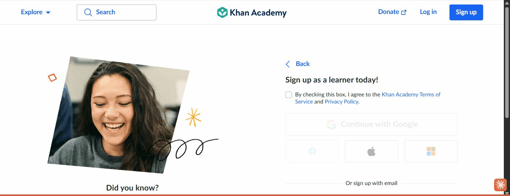
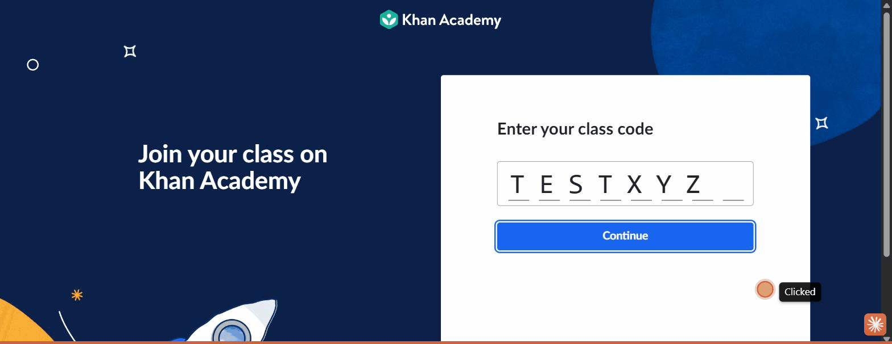
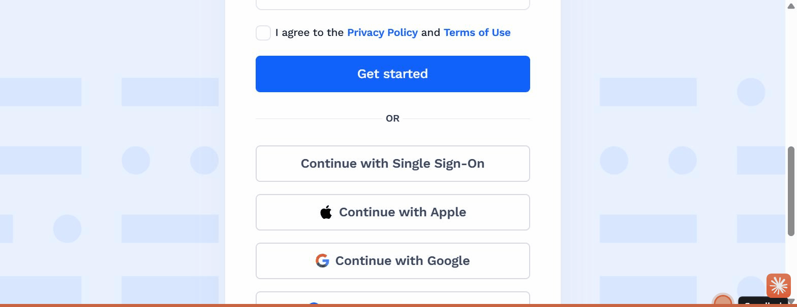
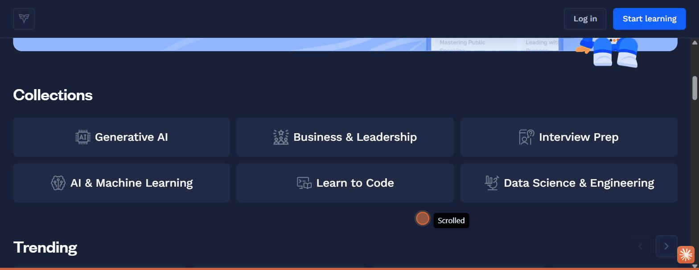

# Lens — Heuristic Evaluation (Nielsen's 10)

## Overview

**Study:** Onboarding & Activation in Education Apps (benchmark).
**Goal it serves:** judge the captured onboarding flows against established usability
heuristics, to harvest reusable strengths and avoid recurring faults as we design a
0-to-1 onboarding for low-tech-literacy, low-context, and advanced learners.
**Platforms evaluated:** Duolingo, Khan Academy, Brilliant, CodeSignal, Elsa Speak.
**Method:** expert review against Nielsen's 10 heuristics, grounded only in the captured
stills and flow recordings (desktop web, logged-out, 2026-07-13). No live browsing. Both
violations and exemplary uses are recorded (benchmarking harvests good patterns, not just
faults). Severity uses Nielsen's 0-4 scale; positive findings are marked with a dash.

**Issue tally (violations only, by severity):**

| Severity | Count | Examples |
|---|---|---|
| 4 (catastrophe) | 0 | — |
| 3 (major) | 3 | CodeSignal account-first wall; Khan mandatory-account-before-content; Elsa no permission priming (on real device) |
| 2 (minor) | 3 | Khan `invalidCode` raw error; Khan grade-catalogue recall burden; Elsa paywall-dominated landing |
| 1 (cosmetic) | 1 | Brilliant funnel length vs. efficiency |
| Exemplary (—) | 12 | see per-platform sections |

---

## Duolingo

### H1 — Visibility of system status  ·  Exemplary (—)
**Observation.** Once the questionnaire proper begins, a progress bar and back arrow sit at
the top of every step, so the user always knows how far they are and that the sequence is
finite and reversible. Placement answers get instant feedback ("Nice!").
**Evidence.** 
**Recommendation (takeaway).** Bracket any multi-step intake with a bounded progress
indicator and a back control; give immediate positive feedback on each answer.

### H6 — Recognition rather than recall  ·  Exemplary (—)
**Observation.** Proficiency is chosen from a signal-bar ladder and every intake question is
a set of icon cards, so users select from visible options rather than recalling or typing.
**Evidence.** 
**Recommendation (takeaway).** Prefer pictorial, selectable options over free-text or
jargon labels for every onboarding choice.

### H3 — User control & freedom  ·  Exemplary (—)
**Observation.** A back arrow throughout, an exit-intent modal that still offers "End
session," and a "can't speak now" escape on the speaking task all preserve the user's
ability to back out or opt out without being trapped.
**Evidence.** 
**Recommendation (takeaway).** Always provide a no-penalty escape from a hardware-dependent
task (mic, camera) so a missing capability never traps the user.

### H5 — Error prevention  ·  Exemplary (—)
**Observation.** Registration is deferred to a guest session, which structurally prevents the
duplicate/abandoned-account errors that a cold up-front signup produces; the mic task is
auto-disabled after a skip so the user is not repeatedly blocked.
**Evidence.** 
**Recommendation (takeaway).** Prevent the error class (duplicate accounts, blocked
permissions) by design rather than recovering from it after the fact.

### H2 — Match between system and the real world  ·  Exemplary (—)
**Observation.** A mascot narrates in plain, conversational language ("Why are you learning
Spanish?", "I'll remind you to practice so it becomes a habit"), matching everyday speech
rather than product jargon.
**Evidence.** 
**Recommendation (takeaway).** Write intake as a conversation in the user's words.

---

## Khan Academy

### H7 — Flexibility & efficiency of use  ·  Severity 3
**Observation.** The organic learner must complete role selection, an age gate, and a full
account (Google/social/email + ToS) before reaching any content; there is no guest path for
a user who just wants to try. This is high friction for a low-context, email-scarce learner.
**Evidence.** 
**Recommendation.** Offer a guest/try-first path to a first task; defer the account to a
"save your progress" moment (contrast Duolingo).

### H9 — Help users recognize, diagnose, recover from errors  ·  Severity 2
**Observation.** An invalid class code returns the raw error key `invalidCode` rather than a
human-readable message telling the learner what went wrong or how to fix it.
**Evidence.** 
**Recommendation.** Replace the error key with plain guidance ("That code was not found.
Check with your teacher and try again"), in the learner's language.

### H6 — Recognition rather than recall  ·  Severity 2
**Observation.** Without a class code, the learner must know their grade and self-locate in a
long grade-organized catalogue, relying on recall of where they belong.
**Evidence.** 
**Recommendation.** Route linked learners by code (below) and, for the un-routed, ask a
quick grade/goal question that filters the catalogue for them.

### H8 — Aesthetic & minimalist design  ·  Exemplary (—)
**Observation.** The `/join` page is a single-task screen: a title, a segmented code input,
and one button, with no nav or catalogue to distract. It is the cleanest screen in the study.
**Evidence.** 
**Recommendation (takeaway).** For a single-purpose entry (code, invite), strip all other UI.

### H5 — Error prevention  ·  Exemplary (—)
**Observation.** The segmented, fixed-length code input makes the expected format obvious and
constrains entry; the DOB age gate prevents compliance errors by branching under-13 users.
**Evidence.** 
**Recommendation (takeaway).** Use segmented inputs for fixed-format codes to prevent entry
errors before they happen.

---

## Brilliant

### H6 — Recognition rather than recall  ·  Exemplary (—) — study standout
**Observation.** The level selector shows an actual worked problem on each card (from `5 × ½`
to a shaded integral) plus a plain "I can…" statement, so the user recognizes their level
from concrete examples rather than recalling an abstract self-rating.
**Evidence.** 
**Recommendation (takeaway).** Place users by recognition of real examples; it is the most
accurate and most literacy-inclusive placement pattern observed.

### H3 — User control & freedom  ·  Exemplary (—)
**Observation.** After an advanced self-pick, Brilliant recommends a foundation course but
still lets the user jump straight to the harder content, respecting autonomy while nudging.
**Evidence.** 
**Recommendation (takeaway).** Recommend, do not force; keep the override one tap away.

### H2 — Match between system and the real world  ·  Exemplary (—)
**Observation.** A guide character (Koji) with a user-chosen voice narrates in plain language;
choices are motivation and subject cards in everyday terms.
**Evidence.** 
**Recommendation (takeaway).** Personalizing the guide (voice) builds early ownership.

### H8 — Aesthetic & minimalist design / H7 efficiency  ·  Severity 1
**Observation.** Each screen is clean and single-purpose, but the funnel is ~10 steps
(motivation, tutor voice, subject, level, start point, daily goal, schedule, interstitials)
before any content, and the first task sits behind both an account wall and a paywall. Clean
per screen, heavy in aggregate for a user who wants to start quickly.
**Evidence.** 
**Recommendation.** Keep the excellent per-step design but shorten the path to a first win;
allow a fast "skip to a lesson" for impatient or low-context users.

---

## CodeSignal

### H7 — Flexibility & efficiency of use  ·  Severity 3
**Observation.** "Start learning" jumps straight to a full account form (first name, last
name, email, password) with no value, guest path, or taste of content first. It is the
highest-friction entry in the study.
**Evidence.** 
**Recommendation.** Do not gate the first experience behind a full form; let the assessment
or a sample task run first (as Elsa does), then ask to save results.

### H4 — Consistency & standards  ·  Exemplary (—)
**Observation.** The signup follows platform conventions (standard field order, clearly
labeled inputs, familiar SSO/Apple/Google/Facebook options), so the form itself is not
confusing, only ill-timed.
**Evidence.** 
**Recommendation (takeaway).** Conventional auth patterns are fine; the problem is placement
in the flow, not the form design.

### H6 — Recognition rather than recall  ·  Exemplary (—)
**Observation.** The catalogue is organized into recognizable topic collections (Generative
AI, Interview Prep, Learn to Code, Data Science), letting a browser recognize a goal-area.
**Evidence.** 
**Recommendation (takeaway).** Goal/topic collections are a viable catalogue organization for
a mixed-audience product.

---

## Elsa Speak

### H2 — Match between system and the real world  ·  Exemplary (—) — most audience-relevant
**Observation.** The entire onboarding surface (value prop, feature claims, CTAs) is
localized to the learner's language via a geo-detected `id.` subdomain, not just the lesson
content.
**Evidence.** 
**Recommendation (takeaway).** Localize the interface and value framing, not only content;
for low-proficiency learners the chrome must be in their language.

### H1 — Visibility of system status  ·  Exemplary (—)
**Observation.** The mic record button changes color (blue to green) to clearly signal the
recording state, an unambiguous system-status cue important for low-literacy users.
**Evidence.** 
**Recommendation (takeaway).** Signal hardware-capture state with a large, obvious visual
change, not just a subtle icon.

### H5 — Error prevention / H9 — error recovery  ·  Severity 3 (on a real first-time device)
**Observation.** The speaking test fires the mic capture on click with no rationale-first
priming and no observed fallback for a denied/blocked mic. On this pre-granted browser
profile no prompt appeared, but on a first-time device this is the cold OS prompt that
strands low-tech-literacy users with no recovery path.
**Evidence.** 
**Recommendation.** Prime the mic with a rationale before the OS prompt and add a no-penalty
"can't speak now" fallback (adopt Duolingo's pattern).

### H8 — Aesthetic & minimalist design  ·  Severity 2
**Observation.** The landing is dominated by an aggressive Flash Sale subscription promo that
competes with the value proposition and the free assessment hook.
**Evidence.** 
**Recommendation.** Lead with the playable free assessment; hold the subscription push until
after the user has experienced value.

---

## Cross-platform heuristic patterns

**Recurring strengths worth stealing:**
- **Recognition over recall is universal and best-in-class (H6).** Signal bars (Duolingo),
  problem cards (Brilliant), topic collections (CodeSignal), icon intake (all) consistently
  replace typing and jargon with selectable, pictorial choices. Brilliant's problem-based
  level cards are the standout.
- **Bounded, reversible progress (H1 + H3).** Progress bars, back arrows, and no-penalty
  escapes appear wherever onboarding is done well (Duolingo, Brilliant) and reassure
  low-context users that the flow is finite and safe to explore.
- **Minimalist single-task screens (H8).** Khan's `/join` and Duolingo's landing show that
  stripping a screen to one action is the clearest possible design for a low-literacy user.
- **Match the real world (H2).** Mascot-narrated plain language and, in Elsa's case, full
  localization, keep the system legible to the target learner.

**Recurring violations worth avoiding:**
- **Account/assessment gating before value (H7).** Khan and CodeSignal both wall content
  behind mandatory registration; this is the study's most consequential recurring fault for a
  low-commitment, email-scarce audience.
- **Cold hardware permissions (H5/H9).** Where speaking is involved, priming and a fallback
  are essential; Elsa's un-primed mic is the cautionary case against Duolingo's primed one.
- **Developer-facing errors (H9) and recall-heavy catalogues (H6).** Khan's `invalidCode` and
  grade-self-location show how quickly a low-context learner can be stranded.

---

## Limits

An expert review over stills and short flow recordings cannot fully judge the
interaction-timing heuristics. Specifically:
- **H1 (system status) timing, H9 (error recovery), and H3 (control/undo)** need live use to
  confirm feedback latency, actual error-message copy in situ, and whether undo/redo behave as
  expected. We captured the *presence* of these cues, not their real-time behavior.
- **CodeSignal's onboarding interior (H1-H6) is unjudged** because the assessment is behind a
  mandatory account we did not create; only its entry wall and catalogue were evaluable.
- **Elsa's true (native-app) onboarding is unevaluated** — the web test and mockups were
  assessed, but the in-app coach-pick, scored-placement, and personalized-plan screens were
  not observed and would need the app to judge.
- **H10 (help & documentation)** was largely not surfaced in any onboarding capture; whether
  contextual help exists would need deeper navigation or live use to assess.
- All findings reflect a **single observed A/B variant** per platform; heuristic conformance
  may differ in other variants.
