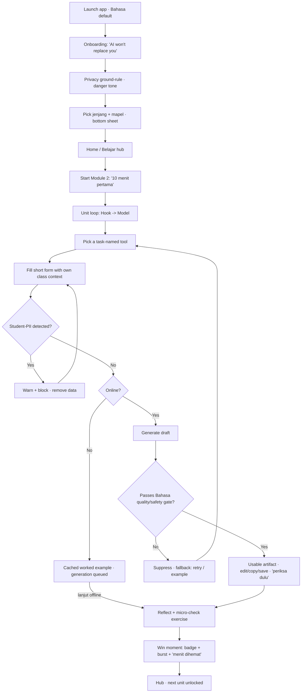
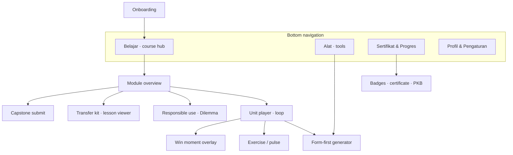

# Spec: AI-Literacy Upskilling App for Indonesian Teachers (v1)

- **Source study:** `2026-07-14-ai-literacy-upskilling-indonesian-teachers` (Type: benchmark)
- **Derived from:** `SYNTHESIS.md` (reviewed — `## Agent Review` 2026-07-15), plus
  `CURRICULUM-MAP.md` (content) and `DESIGN-FOUNDATIONS.md` (tokens + language).
- **Audience:** design (Figma pickup) + engineering (scoping).
- **Working name:** "GuruAI" *(placeholder — naming not settled; see Assumptions).*
- **Status:** Reviewed (Principal Designer Mode S: *revise → must-fixes addressed*); pending user approval.

## Overview

A **mobile-first, Bahasa-Indonesia, offline-capable micro-learning app** that takes a time-poor,
low-confidence Indonesian teacher along one arc: **fear down → first win → fluency → responsible
use → ready to teach students**, credentialed in terms teachers already value (PKB / PD-hours).

**Scope is the reviewed v1 consensus, not the whole synthesis.** The stakeholder review greenlit a
fluency-first spine (F7 course delivery → F1 first-win generation → F2 fluency ladder, plus F4
responsible-use sequencing, F6 transfer lessons, and F8 localized onboarding) and **held two
features to a later phase: F3 (a built Socratic tutor) and F5 ("Rooms") are No-Go for v1** — they
appear here only under *Won't (this release)*. Two make-or-break conditions from the review are
encoded as guardrail requirements: a **Bahasa AI-output quality/safety gate** (FR-12) and a
**strict student-PII boundary** (FR-13); the inference-funding and PKB-recognition questions are
carried as open dependencies.

The research shaped this end to end: the module arc and unit loop come from `CURRICULUM-MAP.md`;
the interaction patterns (form-first, recognition-over-recall, ethics-after-the-win) from the
synthesis features; the visual + language system from `DESIGN-FOUNDATIONS.md`.

---

## 1. Functional Requirements

MoSCoW-prioritized. Priority follows the `## Agent Review` calls (a No-Go feature is never a Must).
"Source" back-references the synthesis feature (F1–F8) and its evidence.

### FR-01 — Offline-capable micro-course delivery · Priority: Must
- **Requirement:** The system must deliver the course as chaptered, self-paced units that load and
  complete on a low-bandwidth / intermittent connection, caching content for offline use.
- **Source:** SYNTHESIS §F7 (micro-course spine; "build first") [Elements of AI `01-positioning-demystify.png`; Google `01-specialization-5-courses.png`].
- **Acceptance criteria:**
  - Given a previously-opened module and no network, when the teacher opens a text/exercise unit, then it renders and progress is recorded locally and syncs later.
  - Given a slow connection, when a unit loads, then non-generative content appears without blocking on the network.
- **Edge cases:** first-ever launch with no network (show what ships bundled + a clear "connect to download more"); sync conflict on reconnect (last-write-wins per unit, never lose completion).

### FR-02 — Onboarding: fear-reduction + privacy rule + jenjang/mapel · Priority: Must
- **Requirement:** First-run onboarding must (a) reduce fear ("AI won't replace you"), (b) state the student-PII ground rule, and (c) segment by **jenjang** and **mapel** in Bahasa before the hub.
- **Source:** SYNTHESIS §F8 (localized, segment-by-level onboarding — the "Go" half) [Ruangguru `01-bahasa-onboarding-modal.png`]; §F4 (M1 fear-reduction framing).
- **Acceptance criteria:**
  - Given a first launch, when onboarding runs, then the teacher sees a fear-reduction message, a privacy ground-rule shown in the `danger`/never-do tone, and a jenjang→mapel picker (bottom sheet).
  - Given jenjang+mapel chosen, when onboarding completes, then the hub and later tool forms are pre-contextualized to that jenjang/mapel.
- **Edge cases:** teacher teaches multiple jenjang/mapel (allow multi-select + a default); skip-to-explore path that still captures context later.

### FR-03 — Form-first generation ("no blank box") — the first win · Priority: Must
- **Requirement:** The system must let a teacher produce a usable teaching artifact from a **structured form** (task-named tool → short fields using their own class context) — no free-form prompt required.
- **Source:** SYNTHESIS §F1 (form-first, "no blank box"; Go) [MagicSchool `03-teacher-tools-showcase.png`, `05-ai-for-teachers.png`].
- **Acceptance criteria:**
  - Given a task-named tool (e.g., *Rencana Pembelajaran*), when the teacher fills the short form and submits, then a complete first-draft artifact is returned that they can edit, copy, and save.
  - Given the teacher never typed a "prompt", when they receive the artifact, then the flow is complete (form is the only required input).
- **Edge cases:** empty required field (inline validation); generation failure/timeout (FR-12/§5); output must pass the Bahasa quality gate (FR-12) before display.

### FR-04 — The unit learning loop · Priority: Must
- **Requirement:** Every unit must follow the four-beat loop: **Hook → Model (worked example) → Do-it-with-your-own-material → Reflect + micro-check.**
- **Source:** SYNTHESIS §F7 [Elements of AI inline-exercise structure]; `CURRICULUM-MAP.md` §3.
- **Acceptance criteria:**
  - Given a unit, when the teacher progresses, then they encounter, in order, a hook, a worked example, an own-material activity, and a reflect/micro-check step.
  - Given the Do step, when it is a skill unit (M2/M4), then the activity is an authentic artifact task (not a quiz).
- **Edge cases:** interrupted mid-unit (resume at the last beat); reflect step skippable but micro-check recorded.

### FR-05 — Fluency-ladder sequencing (shield → minimize → teach) · Priority: Must
- **Requirement:** Modules must be sequenced so prompting is **shielded first (form-first win), then minimized (guided), then taught explicitly**, with the responsible-use module placed after the first win.
- **Source:** SYNTHESIS §F2 (fluency ladder; Conditional Go — collapse F1 as rung 1) + §F4 (ethics sequenced after the win) [Elements of AI Ch.6/6; Google course 4/5].
- **Acceptance criteria:**
  - Given the module map, when a teacher starts, then M2 (shield/first-win) precedes M3–M4 (minimize→teach prompting), and M5 (responsible use) comes after M2.
  - Given F1, when represented in the map, then it is counted as rung one of the ladder (not a separate track).
- **Edge cases:** teacher wants to jump ahead (allow, but flag prerequisites softly). The "teach prompting" rung's content is **authored/localized for teachers, not lifted** from Google AI Essentials' generic productivity material (F2's Conditional-Go condition).

### FR-06 — Responsible-use module + Dilemma Discussion · Priority: Must
- **Requirement:** A responsible-use module must cover verification, bias, privacy, and **academic integrity**, using a **structured "Dilemma Discussion"** activity ("is using AI cheating?").
- **Source:** SYNTHESIS §F4 (responsible use; Go) + §F6 (Dilemma Discussion format) [Common Sense `01-ai-literacy-lessons-collection.png`, "Is It Plagiarism?"].
- **Acceptance criteria:**
  - Given M5, when the teacher works through it, then it includes a scenario-sorting integrity activity and a facilitatable discussion script.
  - Given a "cheating / not cheating / depends" sorting task, when completed, then the teacher submits a short rationale (judgment, not MCQ).
- **Edge cases:** the "structured discussion improves values learning" claim is a hypothesis (see Assumptions) — ship the activity, measure it.

### FR-07 — Per-module exercises + pulse checks · Priority: Must
- **Requirement:** Each module must include a practice exercise matched to its target (MCQ/sorting for concept & judgment; authentic task for skill), and that exercise **doubles as the module's pulse signal**.
- **Source:** `CURRICULUM-MAP.md` §9 (exercises = pulse); SYNTHESIS §F7 (retrieval practice) [`references.md` Roediger & Karpicke].
- **Acceptance criteria:**
  - Given a concept/judgment module, when the exercise runs, then it uses MCQ or sorting/spot-the-error and is auto-graded.
  - Given any module completion, when the teacher finishes, then completion, artifact-produced, a 1-tap confidence pulse, and transfer-intent are recorded.
- **Edge cases:** exercise failure/low score (offer a retry + the model again, never a dead-end); pulse must be ≤1 tap and skippable.

### FR-08 — Grab-and-go classroom-transfer kit · Priority: Must *(conditional: authored + localized)*
- **Requirement:** M6 must provide ready-to-run, ~15–20-minute classroom assets: an AI-literacy lesson, an integrity discussion script, a student activity, and a **class AI-use policy template**, all authored/localized to Kurikulum Merdeka + Bahasa.
- **Source:** SYNTHESIS §F6 (grab-and-go lessons; Conditional Go — author, don't lift) [Common Sense `01-ai-literacy-lessons-collection.png`]; §F3 concept of a *coaching-mode* student surface (taught as content, not a built tutor).
- **Acceptance criteria:**
  - Given M6, when the teacher opens the kit, then each asset is downloadable/usable offline and sized for a single class period.
  - Given the kit references a coaching/answer-withholding AI mode for students, then it is *guidance content*, not an in-app tutor we build (see Won't FR-17).
- **Edge cases:** assets must be original/localized (licensing) — no lifting of the US source.

### FR-09 — Laddered credential (Sertifikat + Jam PKB framing) · Priority: Must *(recognition = open dependency)*
- **Requirement:** The system must issue a laddered completion credential (per-module badges → a course certificate) framed as **competence recognition** in PKB / PD-hour terms.
- **Source:** SYNTHESIS §F8 (credential; Conditional Go) [PMM context-only; MagicSchool/Elements/Google certificate patterns]; `DESIGN-FOUNDATIONS.md` §5.
- **Acceptance criteria:**
  - Given a completed module, when finished, then a badge is awarded; given the course completed, then a shareable certificate is issued.
  - Given the certificate, when displayed, then it uses competence-recognition language (not a controlling-reward framing).
- **Edge cases:** **official PKB/PD-hour recognition is unconfirmed** — the certificate must not *claim* official hours until recognition is validated (see Assumptions); until then, frame as "competence certificate" without an unverified hour count.

### FR-10 — Capstone: teach one lesson, report back · Priority: Must
- **Requirement:** A capstone must ask the teacher to deliver one AI-literacy lesson to real students and submit evidence (a reflection, optionally a photo or student-work sample).
- **Source:** `CURRICULUM-MAP.md` capstone (authentic assessment of the goal's "teach students" half); SYNTHESIS §F5/F6 (classroom transfer, as *content*).
- **Acceptance criteria:**
  - Given course modules complete, when the capstone opens, then the teacher can submit a written reflection (photo/upload optional, offline-queued).
  - Given a submission, when accepted, then the certificate (FR-09) is unlocked.
- **Edge cases:** uploads must be optional and offline-tolerant; **redact/consent** for any student image (see FR-13 / §5) — default to text-only reflection.

### FR-11 — Design-system compliance (mobile-first, pill, SVG, a11y) · Priority: Must
- **Requirement:** All screens must implement `DESIGN-FOUNDATIONS.md`: mobile-first 360–390px layout, pill-first components, SVG (Lucide) icons, the theme-aware token palette (light default + dark), and the a11y guardrails (≥4.5/7:1 contrast, ≥44px targets, ≥16px body, reduced-motion).
- **Source:** `DESIGN-FOUNDATIONS.md`; SYNTHESIS Gaps (mobile/Bahasa unverified) + `lenses/a11y-audit.md` (contrast fails to avoid), `lenses/heuristic-eval.md` (recognition, no clutter).
- **Acceptance criteria:**
  - Given any screen at 360px portrait, when rendered, then it is single-column, thumb-reachable, and passes automated contrast checks.
  - Given a meaning-colour, when used, then it is accompanied by an SVG icon + text label (never colour-alone).
- **Edge cases:** dark mode parity; long Bahasa strings must not clip pill controls (≥20px input padding).

### FR-12 — Bahasa AI-output quality & safety gate · Priority: Must *(make-or-break guardrail)*
- **Requirement:** No AI-generated content is shown to a teacher (or, later, student) unless it passes a **Bahasa-Indonesia quality-and-safety check**; failures are suppressed with a graceful fallback.
- **Source:** `## Agent Review` make-or-break condition #1 (no first-hand evidence of good Bahasa output anywhere); SYNTHESIS Gaps.
- **Acceptance criteria:**
  - Given a generation request, when the output fails the quality/safety gate, then it is not displayed; the teacher sees a fallback (retry, a worked example, or "coba lagi nanti") and the event is logged.
  - Given the gate, when generation succeeds, then the artifact is shown with a "periksa dulu" (verify) reminder.
- **Edge cases:** gate itself unavailable (fail closed — don't show ungated output); this requirement gates FR-03 and any generative feature.

### FR-13 — Student-PII boundary · Priority: Must *(guardrail)*
- **Requirement:** The system must prevent student personal data (names, grades, identifiers) from being sent to AI, warn in the `danger` tone when detected, and never require such data.
- **Source:** SYNTHESIS §F4 (trust/privacy) [MagicSchool `06-trust-and-safety.png`]; workspace + `DESIGN-FOUNDATIONS.md` §5.
- **Acceptance criteria:**
  - Given a tool input, when likely student-PII is detected, then submission is blocked with a clear warning and a way to remove it.
  - Given any data-handling copy, when shown, then it truthfully reflects what is/ isn't sent to AI.
- **Edge cases:** false positives (allow override with a confirmation); capstone student images handled as text-first + explicit consent (see §5).

### FR-14 — Habit mechanic rewarding consistency (not speed) · Priority: Should
- **Requirement:** The app should include a light return/streak mechanic and a weekly "still using it?" nudge that rewards **consistency**, never answer-speed.
- **Source:** SYNTHESIS §F8 (gamification is culturally legible, but reward return not speed; Ruangguru Starchamps = anti-pattern) [`references.md` Deci et al.; gamification meta-analysis].
- **Acceptance criteria:**
  - Given repeated-day use, when the teacher returns, then a streak/return signal is shown (competence framing, not points-for-speed).
- **Edge cases:** never penalize; reduced-motion respected on any celebratory animation.

### FR-15 — Light cohort / share-your-work · Priority: Could
- **Requirement:** The app could let a teacher share a produced artifact to a school cohort or export it (echoing PMM "Bukti Karya").
- **Source:** SYNTHESIS §F8 (Bukti Karya portrait behaviour) — thin evidence; low priority.
- **Acceptance criteria:** Given an artifact, when the teacher taps share, then they can export it or post to a cohort feed.
- **Note:** **no dedicated v1 screen** — deferred; if built, it attaches to S10/S14 as an export affordance. Excluded from the IA until prioritized.

### Won't (this release) — explicitly out of v1 per the stakeholder review
- **FR-16 — "Rooms" / bounded student surface with per-interaction logging.** *Won't (v1).*
  **Source/why:** SYNTHESIS §F5 — **No-Go now** (heaviest build: minors' PII/consent, logging
  pipeline, child-safe LLM) on entirely second-hand evidence. Phase 2, gated on confirmed mechanics
  + a minor-data-compliance decision.
- **FR-17 — A built Socratic answer-withholding student tutor.** *Won't (v1).*
  **Source/why:** SYNTHESIS §F3 — **No-Go for v1** (heaviest pure-ML; "scaffold-not-refuse" is an
  open eval problem). v1 *teaches the concept* (FR-08 content) but does not ship a tutor. Phase 2,
  scoped to "teach teachers to configure one" + a passing guided-scaffold eval.

---

## 2. User Flow

**Core flow (first run → first win):** launch → onboard → hub → Module 2 unit → form-first generate → **win**.

**Written step-by-step:**
1. **Launch** — app opens in Bahasa; if returning, resume last unit; if first-run, go to onboarding.
2. **Fear-reduction** — a short reassurance screen ("AI tidak akan menggantikan Anda…"); the teacher taps *Lanjut*.
3. **Privacy ground-rule** — the never-do rule shown in the `danger` tone (SVG shield/alert); acknowledge to continue.
4. **Context** — a bottom-sheet picker for jenjang then mapel; selection personalizes the hub and tool forms.
5. **Hub** — the module list with progress + streak; Module 2 is the highlighted first win.
6. **Unit loop (Hook→Model)** — a relatable pain, then a narrated worked example.
7. **Pick a tool** — a task-named tool grid (recognition, not a blank box).
8. **Fill the form** — short fields (topik, tujuan) pre-filled with jenjang/mapel; *PII check* on submit → warn/block if detected.
9. **Generation** — if online, generate. **If offline, the teacher continues the unit using the cached worked example and their generation is queued for reconnection** — they are never blocked from finishing the unit (they proceed to reflect/micro-check, step 12).
10. **Quality gate** — for online generation, output must pass the Bahasa quality/safety gate; on fail, suppress + fallback; on pass, show the artifact with a "periksa dulu" verify reminder.
11. **Use the artifact** — edit / copy / save the real, usable draft.
12. **Reflect + micro-check** — a 1-tap confidence pulse + the module's exercise (spot-the-flaw here).
13. **Win moment** — badge + subtle amber burst + "Anda menghemat ~40 menit"; next unit unlocks; back to hub.

*Friction/branches:* the only hard stops are the PII block (intended) and a gate failure (graceful fallback, never a dead-end). No blank-box friction by design.

---

## 3. Information Architecture

| Screen | Purpose | Parent | Satisfies FRs |
|---|---|---|---|
| Onboarding (S1–S3) | Fear down, privacy rule, jenjang/mapel | — (pre-nav) | FR-02, FR-13 |
| Belajar hub (S4) | Module list + progress + streak | Bottom nav | FR-01, FR-05, FR-14 |
| Module overview (S5) | Units, objective, badge | Belajar | FR-05, FR-07, FR-09 |
| Unit player (S6) | The four-beat loop | Module | FR-04, FR-07 |
| Form-first generator (S7) | Task-named tool → artifact | Unit / Alat | FR-03, FR-12, FR-13 |
| Exercise (S8) | MCQ/sort/spot-error/scenario + pulse | Unit | FR-07 |
| Win moment (S9) | Celebrate first win | overlay | FR-03, FR-11 |
| Alat / tools hub (S10) | Reuse generators (habit) | Bottom nav | FR-03, FR-14 |
| Responsible use / Dilemma (S11) | Integrity + bias + privacy | Module (M5) | FR-06 |
| Transfer kit viewer (S12) | Grab-and-go classroom assets | Module (M6) | FR-08 |
| Capstone submit (S13) | Deliver + report | Module | FR-10, FR-13 |
| Sertifikat & Progres (S14) | Badges, certificate, PKB, pulses | Bottom nav | FR-09, FR-07, FR-14 |
| Profil & Pengaturan (S15) | Theme, language, account | Bottom nav | FR-11 |

---

## 4. Screen list (wireframe-level)

### S1–S3 — Onboarding
- **Purpose:** de-fear, set the privacy rule, capture jenjang/mapel.
- **Key blocks:** reassurance copy + illustration; privacy rule (danger tone, shield icon); jenjang→mapel bottom-sheet picker.
- **Primary action(s):** *Lanjut* → *Setuju & lanjut* → *Selesai*.
- **Satisfies:** FR-02, FR-13, FR-11.
- **States:** default; multi-jenjang selection; skip-to-explore (context captured later).

### S4 — Belajar hub
- **Purpose:** home; show the arc + progress.
- **Key blocks:** module cards (soft-rounded, with badge state), progress ring, streak chip, resume CTA.
- **Primary action(s):** *Lanjutkan* / start Module 2.
- **Satisfies:** FR-01, FR-05, FR-14.
- **States:** empty (nothing started → highlight M2 first-win), loading (skeleton), offline (cached banner), success (progress).

### S5 — Module overview
- **Purpose:** orient to a module's units + objective + badge.
- **Key blocks:** objective, unit list, badge preview, estimated minutes per unit (time labels — heuristic-eval takeaway).
- **Primary action(s):** *Mulai unit*.
- **Satisfies:** FR-05, FR-07, FR-09.
- **States:** locked (prereq soft-flag), in-progress, complete.

### S6 — Unit player (the loop)
- **Purpose:** run Hook→Model→Do→Reflect.
- **Key blocks:** hook, worked example, the Do step (embeds S7 for skill units or S8 for concept), reflect + pulse.
- **Primary action(s):** *Lanjut* / *Buat dengan materi saya*.
- **Satisfies:** FR-04, FR-07.
- **States:** per-beat; resume mid-unit; offline (Do step queued if generative).

### S7 — Form-first generator
- **Purpose:** the "no blank box" first win.
- **Key blocks:** task-named tool header, short structured form (jenjang/mapel prefilled), generate button (sticky bottom pill), result view with edit/copy/save + "periksa dulu" reminder.
- **Primary action(s):** *Buat* → *Simpan*.
- **Satisfies:** FR-03, FR-12, FR-13.
- **States:** empty form, validation error, PII-blocked, offline (cached example + queued), generating (progress), gate-fail (fallback), success (artifact).

### S8 — Exercise / pulse
- **Purpose:** practice + pulse signal.
- **Key blocks:** MCQ / sorting / spot-the-error / scenario-sort; 1-tap confidence + transfer-intent pulse.
- **Primary action(s):** *Periksa* / *Kirim*.
- **Satisfies:** FR-07.
- **States:** unanswered, correct, incorrect (retry + re-show model), submitted.

### S9 — Win moment (overlay)
- **Purpose:** the key emotional beat.
- **Key blocks:** amber check + subtle burst (≤600ms), badge, "menit dihemat" value line (SVG clock).
- **Primary action(s):** *Lanjut*.
- **Satisfies:** FR-03, FR-11.
- **States:** default; reduced-motion (static badge + value line).

### S10 — Alat (tools hub)
- **Purpose:** return to reuse generators (drives the weekly-use pulse).
- **Key blocks:** task-named tool grid, "sering dipakai" favourites.
- **Primary action(s):** open a tool → S7.
- **Satisfies:** FR-03, FR-14.
- **States:** empty (curated "mulai dari sini" subset for novices — avoids the MagicSchool density fail), full grid, offline.

### S11 — Responsible use / Dilemma Discussion
- **Purpose:** M5 integrity + bias + privacy.
- **Key blocks:** scenario cards, "curang / tidak / tergantung" sorting, rationale field, facilitatable discussion script.
- **Primary action(s):** *Kirim penilaian*.
- **Satisfies:** FR-06.
- **States:** in-progress, submitted.

### S12 — Transfer kit viewer
- **Purpose:** M6 grab-and-go classroom assets.
- **Key blocks:** lesson plan, discussion script, student activity, class AI-use policy template; download/offline.
- **Primary action(s):** *Unduh* / *Gunakan di kelas*.
- **Satisfies:** FR-08.
- **States:** available offline, downloading.

### S13 — Capstone submit
- **Purpose:** authentic assessment.
- **Key blocks:** reflection field, optional photo/student-work upload (text-first default), consent note.
- **Primary action(s):** *Kirim*.
- **Satisfies:** FR-10, FR-13.
- **States:** empty, offline-queued, submitted → unlocks certificate.

### S14 — Sertifikat & Progres
- **Purpose:** credential + motivation + pulse view.
- **Key blocks:** badges, certificate (competence-recognition framing), PKB note (guarded — see FR-09), streak/consistency.
- **Primary action(s):** *Bagikan sertifikat*.
- **Satisfies:** FR-09, FR-07, FR-14.
- **States:** in-progress, course complete, certificate issued.

### S15 — Profil & Pengaturan
- **Purpose:** account + preferences.
- **Key blocks:** theme (light/dark), language, jenjang/mapel, account, data/privacy info.
- **Primary action(s):** save settings.
- **Satisfies:** FR-11.
- **States:** default.

---

## 5. Edge cases & error states (cross-cutting)

- **Offline / intermittent** — cached content works; generative steps queue with a clear "akan diproses saat online"; progress syncs on reconnect (never lose completion). *(FR-01)*
- **AI generation failure / slow on low bandwidth** — timeout → graceful fallback (retry, cached worked example); never a spinner dead-end. *(FR-03, FR-12)*
- **Bahasa quality/safety gate fails** — output suppressed; fallback shown; logged for the eval. Fail *closed*. *(FR-12)*
- **Student-PII detected** — block + warn in danger tone; allow removal or confirmed override; never required. *(FR-13)*
- **Empty states** — nothing started (highlight the M2 first-win); tools hub shows a curated starter subset, not the full grid. *(S4, S10)*
- **Validation failure** — inline, specific, in Bahasa; pill inputs never clip the message.
- **Interrupted session** — resume at the last beat/unit.
- **Certificate before PKB recognition confirmed** — issue a competence certificate without an unverified official hour count. *(FR-09)*
- **Capstone student images** — default text-only; any image requires explicit consent + is not sent to AI. *(FR-10, FR-13)*

---

## 6. Traceability matrix

| FR | Synthesis source | Screen(s) |
|---|---|---|
| FR-01 | §F7 (spine) | S4, S5, S6, S12 |
| FR-02 | §F8 (onboarding) + §F4 (M1) | S1–S3 |
| FR-03 | §F1 (form-first) | S7, S10, S6, S9 |
| FR-04 | §F7 + CURRICULUM §3 | S6 |
| FR-05 | §F2 + §F4 | S4, S5 |
| FR-06 | §F4 + §F6 | S11 |
| FR-07 | §F7 + CURRICULUM §9 | S8, S5, S14 |
| FR-08 | §F6 (+ §F3 as content) | S12 |
| FR-09 | §F8 (credential) | S14 |
| FR-10 | CURRICULUM capstone (+ §F5/F6 as content) | S13 |
| FR-11 | DESIGN-FOUNDATIONS + a11y/heuristic lenses | all |
| FR-12 | Agent Review make-or-break #1 | S7 (+ any generative) |
| FR-13 | §F4 (trust/privacy) | S1–S3, S7, S13 |
| FR-14 | §F8 (gamification, reward consistency) | S4, S10, S14 |
| FR-15 | §F8 (Bukti Karya) | — (deferred; no dedicated v1 screen) |
| FR-16 *(Won't)* | §F5 (No-Go) | — |
| FR-17 *(Won't)* | §F3 (No-Go v1) | — |

Every FR traces to a synthesis feature or a review condition; the two Won't items are the review's No-Go features, explicitly excluded rather than smuggled in.

---

## 7. Assumptions & open questions

- **Assumption — the module skeleton (M1–M6 + capstone)** is the design proposal from
  `CURRICULUM-MAP.md`; individual modules trace to features, but the *arc shape* is a design
  decision, not a benchmark finding. Validate by piloting the sequence.
- **Open / make-or-break — Bahasa AI-output quality:** no first-hand evidence any benchmarked tool
  produces sound Bahasa pedagogical output (Agent Review). FR-12 assumes a gate can be built;
  **validate with a Bahasa eval spike before committing to FR-03's backend.**
- **Open / make-or-break — inference funding:** recurring per-generation cost on a must-be-free
  product is unresolved (Agent Review). Validate the business model; if unfunded, FR-03/FR-12
  collapse the app to static content (FR-01/FR-06/FR-08 still stand).
- **Open — PKB / PD-hour recognition (FR-09):** attainability of official recognition is unconfirmed
  (PMM was gated). Validate with Kemendikdasmen/primary teacher research before claiming hours.
- **Open — primary Indonesian-teacher research (F8):** which credential framing and onboarding move
  activation is unvalidated; the Head of Product made this the top precondition. Run before scaling.
- **Assumption — mobile/Bahasa device reality:** no core platform was captured on mobile; FR-11's
  360px/offline targets are design commitments to **verify on a real low-end Android in daylight.**
- **Open — values-learning via Dilemma Discussion (FR-06):** a design hypothesis, not a proven
  method; ship and measure.
- **Deferred — F3 (tutor) and F5 (Rooms):** phase 2, per review; not in v1 scope.
- **Assumption — product name "GuruAI":** placeholder; naming not settled.
