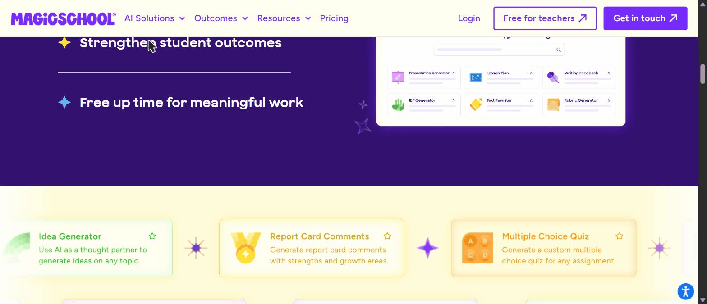
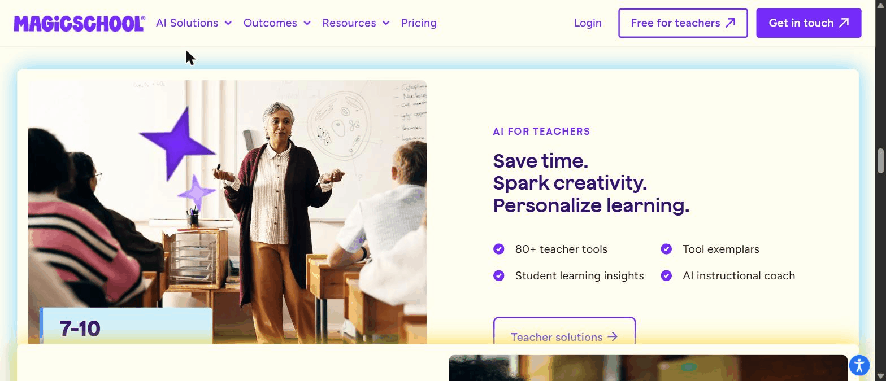
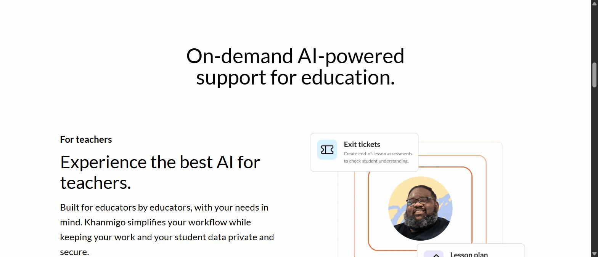
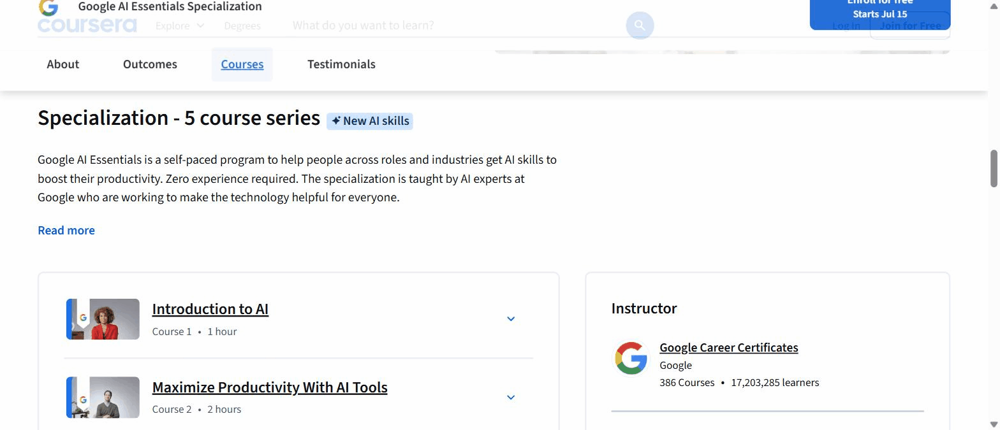
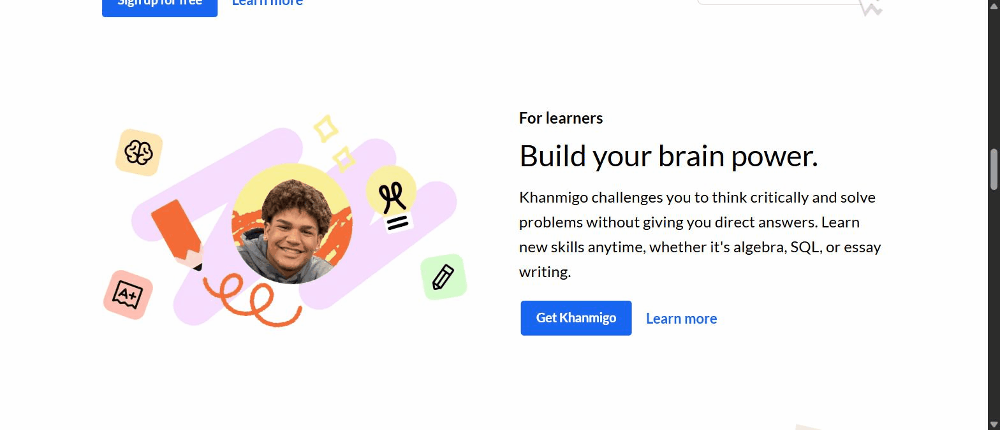
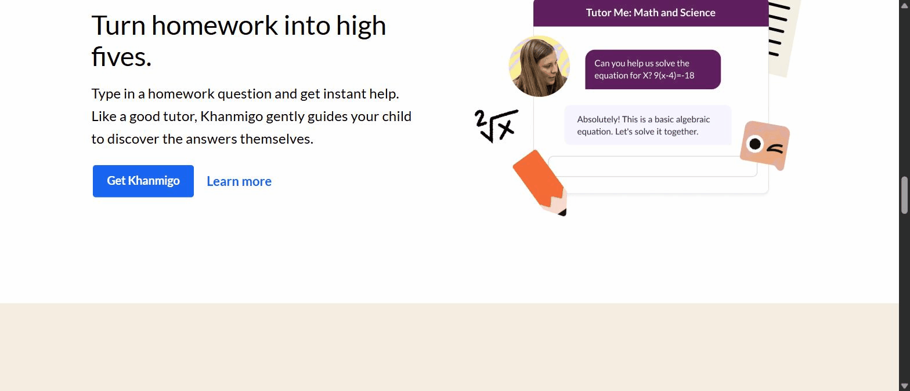
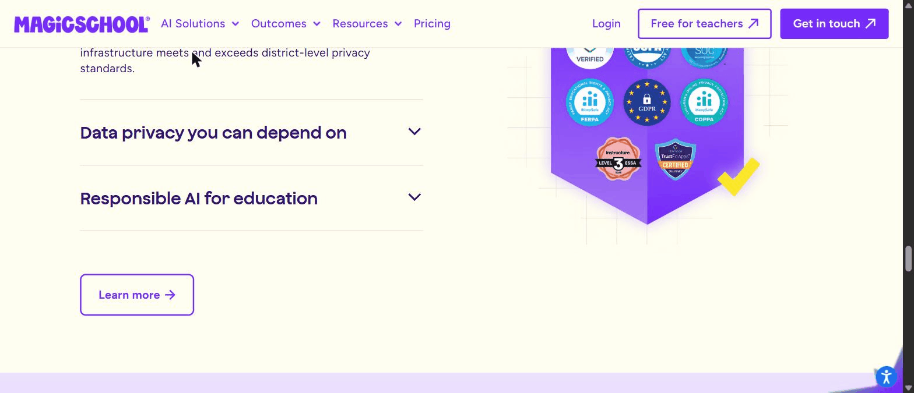
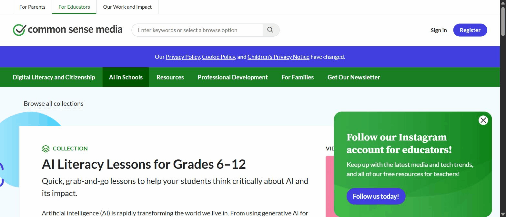
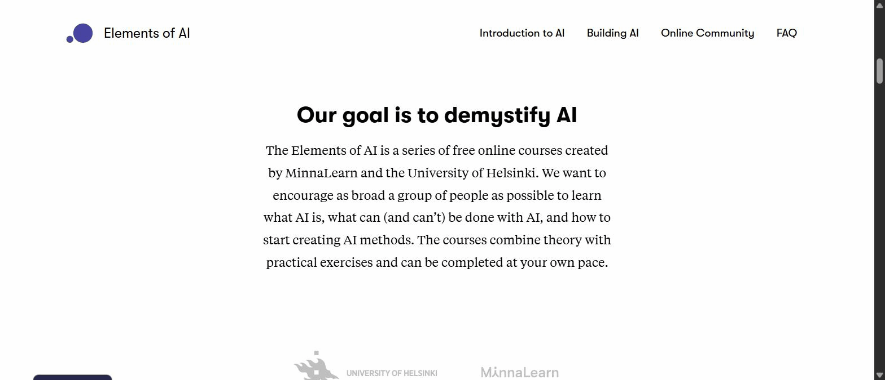

# Synthesis: AI-Literacy Upskilling for Indonesian Teachers

## Overview

**Goal this serves.** Ground the design of a mobile-first course + app that builds an Indonesian
teacher's *own* AI fluency first, then equips them to teach students the *proper* use of AI. This
is input to a build decision; the features below are the reusable patterns the design should adopt
or deliberately reject.

**Platforms studied (7).** Core (deep): **MagicSchool AI**, **Khanmigo**, **Elements of AI**.
Secondary (targeted): **Common Sense AI Literacy**, **Google AI Essentials**, **Platform Merdeka
Mengajar (PMM)**, **Ruangguru**. Core AI-tool platforms are login-gated, so their in-app detail is
externally cited (not first-hand); PMM was inaccessible (govt login) and is context-only. See
`sources.md` and each `platforms/*/notes.md` for the evidence basis.

**Headline takeaways.**
1. The strongest platforms get a non-technical teacher to a **usable artifact from their own
   material in minutes** by replacing a blank chat box with a structured form (MagicSchool).
2. There is a **"fluency ladder"** across the set: *shield* the teacher from prompting, then
   *minimize* prompting, then *teach* prompting (MagicSchool → Khanmigo → Google AI Essentials). Our
   course should walk teachers **up** this ladder rather than pick one rung.
3. The "teach students proper use" half of the goal is answered two ways: by **product design**
   (Khanmigo's answer-withholding tutor) and by **ready-made lessons** (Common Sense's grab-and-go
   kit, incl. an academic-integrity "Dilemma Discussion").
4. Everyone **sequences ethics after a first win**, not before (Elements of AI puts it in the final
   chapter; Google in course 4 of 5), corroborating a "win first, ethics once they can reason"
   design.
5. The **Indonesian context rewards free + professionally-recognized + mobile + Bahasa**: PMM has
   already trained teachers to expect short self-paced modules with recognized certificates, and
   Ruangguru normalized Bahasa, mobile, gamified UX. Anything paid or English-first meets friction.

---

## Feature 1. Form-first generation on your own material ("no blank box")

**Short description.** Instead of a freeform chat, the teacher picks a task-named tool and fills a
short structured form (grade, subject, topic); the tool returns a complete first draft. The teacher
supplies their real class context and leaves with a usable artifact.

**Key findings.** MagicSchool's product is a grid of discrete, job-named tools (*Lesson Plan,
Rubric Generator, Multiple Choice Quiz, Worksheet Generator, IEP Generator, Text Rewriter, Report
Card Comments, AI Tutor*), each framed as "generate X for any topic/assignment."

The homepage sells the outcome, not the technology: *"Save time. Spark creativity. Personalize
learning,"* with *80+ teacher tools* and *7–10 hours saved per week*.

Reviewers are consistent that the design deliberately removes prompt engineering: *"you pick a
tool, fill a short form, and it writes the first draft, with no blank box to stare at,"* using
guided prompts, dropdown menus and ready-made buttons (⟶ external: Unite.AI, Skywork; see
`platforms/magicschool-ai/notes.md`). Khanmigo reaches a similar low-effort outcome through a
different route (a chat tuned for "good results with minimal prompting").

> [Principal Researcher] The *7–10 hours saved per week* and "in minutes" first-win figures are
> vendor marketing plus login-gated reviewer reports, not independently measured. Keep them as
> claims to test (see "How to validate"), not as established efficacy.

**Why this feature works (rationale).** Our learner is time-poor and low-confidence; a blank chat
box demands the exact skill (and confidence) they lack, which is a classic activation barrier. A
structured form carries the cognitive load and guarantees a good first output, producing the fast
"first win" that drives adoption and self-efficacy. The tool names also do recognition work: a
teacher recognizes "Lesson Plan," not "a large language model." [ref: Bandura self-efficacy —
enactive mastery is the strongest source; Reijnen et al. 2023 (enactive mastery raises digital-tech
attitudes via self-efficacy) — see references.md]

**How to validate in the future.** Prototype two onboarding variants for the same task (a
form-first "Lesson Plan" tool vs. an open chat) and run an unmoderated usability test with
low-confidence teachers; measure **time-to-first-usable-artifact**, completion rate, and a
post-task confidence item (SEQ + a 1–5 "I could do this again"). Target: form-first reaches a
usable artifact faster and with higher confidence.

---

## Feature 2. The fluency ladder: shield → minimize → teach prompting

**Short description.** Across the benchmark, platforms take three different stances on prompting.
They are not competitors so much as **rungs on a ladder** our course can climb: shield the teacher
from prompting, then minimize it, then teach it as a transferable skill.

**Key findings.** Three distinct models were observed:
- **Shield (MagicSchool):** remove prompting entirely; a form produces the draft (Feature 1).
- **Minimize (Khanmigo):** keep a chat but tune it so teachers *"get good results quickly with
  minimal prompting,"* backed by 25+ structured activities and standards alignment (⟶ external;
  `platforms/khanmigo/notes.md`).

  

- **Teach (Google AI Essentials):** prompting is an explicit skill: a whole course, *"Discover the
  Art of Prompting,"* plus "write clear and specific prompts" and named "prompt patterns."

  

**Why this feature works (rationale).** A shield gets the fastest first win but teaches the least
transferable skill; teaching prompting builds durable capability but demands more confidence up
front. Sequencing them resolves the tension: begin where success is guaranteed (shielded), then, as
confidence accrues, expose and teach the underlying prompting so the teacher's skill generalizes
beyond any single tool, which is the actual definition of "AI fluency" in our goal. [ref: van de
Pol, Volman & Beishuizen 2010 (scaffolding = contingency + fading + transfer of responsibility);
Lazonder & Harmsen 2016 (guidance d = 0.50) — see references.md]

**How to validate in the future.** A/B two course structures with the same teachers over ~3 weeks:
(A) form-first throughout vs. (B) form-first first win → guided chat → explicit prompting. Measure a
**transfer task** (write a good prompt in a *generic* AI tool with no form) and 2-week retention.
Hypothesis: the laddered group transfers better without hurting first-session success.

---

## Feature 3. Socratic, answer-withholding tutor (proper use, by design)

**Short description.** An AI tutor engineered to *withhold the answer* and coach the learner to
reach it themselves, the product-level embodiment of "using AI properly," directly countering the
"AI as cheating machine" fear.

**Key findings.** Khanmigo's learner promise is explicit: *"challenges you to think critically and
solve problems without giving you direct answers."*

The behaviour is shown in a tutoring mockup: asked to solve an equation, it responds *"Let's solve
it together"* and guides step by step rather than answering.

A Washington Post pull-quote notes students *"posing more questions to Khanmigo than they might
typically ask"* (`platforms/khanmigo/notes.md`).

**Why this feature works (rationale).** The central anxiety in the brief ("proper" use) is that AI
lets students offload thinking. An answer-withholding tutor converts the tool from an answer-vending
machine into a thinking coach, so "proper use" is enforced by interaction design rather than by
policy text or teacher policing. It also models, for the teacher, what good AI-mediated learning
looks like. The active ingredient is the *guidance*, not the withholding itself: guided discovery
outperforms direct instruction, but *unguided* discovery underperforms it, so the spec must require
an answer-withholding student mode to *actively scaffold* (leading questions, hints, step checks),
never merely refuse the answer. [ref: Alfieri et al. 2011 (guided d = 0.50, unguided d = -0.38);
Lazonder & Harmsen 2016 — see references.md]

> [Principal Researcher, resolved 2026-07-15] Rationale updated so guidance (not withholding) is the
> stated mechanism, with an active-scaffold constraint carried into the future SPEC requirement.

> [Principal Researcher] The literature *qualifies* this claim rather than simply backing it.
> Guided discovery improves learning (d = 0.50), but *unguided* discovery is worse than direct
> instruction (Alfieri et al. 2011, d = -0.38). So the win comes from the *guidance* Khanmigo layers
> in ("Let's solve it together," step-by-step questions), not from withholding the answer alone. Our
> spec should require an answer-withholding mode to also *actively scaffold*, or it may harm learning.

**How to validate in the future.** Build a lo-fi "guided-discovery" chat mode and test with
students on a set problem against a "direct-answer" mode; measure independent problem-solving on a
follow-up unaided task and teacher-rated appropriateness. In our course, test whether teachers can
recognize and configure an "answer-withholding" student mode after a single module.

---

## Feature 4. Responsible use as ambient + practical, sequenced after the first win

**Short description.** Responsible use shows up two ways: **ambient** (trust/privacy cues and
oversight woven throughout the product) and **practical** (concrete tools like AI-resistant
assignments). And as *curriculum*, it is consistently placed **after** learners have had a value
win, not before.

**Key findings.** MagicSchool treats trust as a first-class surface: a wall of compliance badges
(SOC 2, FERPA, COPPA, GDPR, ESSA Level 3, TrustEd Apps) and "we don't use your data to train AI,"
plus a 95% Common Sense privacy rating and an *AI-Resistant Assignments* tool for integrity
(⟶ external).

As *curriculum*, ethics is a destination: **Elements of AI places "Implications" (bias, privacy,
AI-generated content, the future of work) as the final chapter, Chapter 6 of 6** (⟶ external;
`platforms/elements-of-ai/notes.md`), and **Google AI Essentials places "Use AI Responsibly" as
course 4 of 5**, after the productivity win and prompting. Both put reasoning about harm *after*
foundational understanding.

**Why this feature works (rationale).** Front-loading ethics to a fearful novice is abstract and
demotivating; once a teacher has personally seen AI be useful (and, ideally, seen it be confidently
wrong), "verify everything" and "watch for bias" become lived lessons rather than slogans. Ambient
trust cues, meanwhile, lower the adoption barrier for a risk-averse audience (data safety is a top
concern for schools). [ref: Knowles andragogy (adults are relevancy-oriented and problem-centred);
trust drives continued teacher AI use, Scientific Reports 2025 — see references.md]

> [Principal Researcher] The andragogy support is theoretical (a framework, not an RCT on
> ethics-*sequencing*). The nuance from `platforms/elements-of-ai/notes.md` is worth keeping in view:
> Elements defers ethics to the very end because it is a *conceptual* course, whereas our learner
> uses AI from Module 2, so unsafe use can happen early. "After the first win but not delayed to the
> finale" is the defensible middle path; the A/B below is the real test.

**How to validate in the future.** Test two module orders with teachers: ethics-first vs.
ethics-after-first-win; measure completion, a scenario-based "responsible-use judgment" quiz, and
self-reported anxiety. Separately, test whether surfacing trust/privacy cues at onboarding raises
willingness-to-start among risk-averse teachers.

---

## Feature 5. Bounded student surface with oversight ("Rooms")

**Short description.** Rather than turning students loose on raw AI, the teacher opens a *bounded,
observable* student space, choosing which tools are available and seeing every interaction. This is
the concrete unit of classroom transfer.

**Key findings.** MagicSchool's **"Rooms" / MagicStudent**: a teacher creates a Room, hand-picks
which of 50+ student tools are available for a given instructional goal and maturity level, and
**every student interaction is logged and visible to teacher + admin** via a *Student Room Insights*
dashboard (⟶ external; `platforms/magicschool-ai/notes.md`). The homepage frames the student side as
teacher-led: *"Teacher-led activities, safe settings for students, designed to build AI skills."*
Khanmigo similarly gives teachers an oversight view of student tutoring.

> [Principal Researcher] The Rooms mechanics (tool-picking, per-student logging, the Insights
> dashboard) are entirely **second-hand** (login-gated; sourced from Skywork/humai.blog, not observed
> by us). This is the strongest classroom-transfer pattern in the study, so confirm it against a
> logged-in session or official docs before the spec depends on the specific mechanics.

**Why this feature works (rationale).** It resolves the core transfer risk: a fluent teacher wants
students to *use* AI without it becoming unsupervised or unsafe. A bounded, logged surface gives the
teacher control and visibility (and a defensible answer to parents/administrators), which is what
makes them willing to bring AI into the classroom at all. [ref: Scherer, Siddiq & Tondeur 2019
(perceived usefulness/ease + facilitating conditions drive teacher adoption); trust as adoption
prerequisite, Scientific Reports 2025 — see references.md]

**How to validate in the future.** Prototype a "class AI space" where the teacher toggles allowed
tools and reviews a session log; test with teachers whether the oversight features raise their
stated willingness to let students use AI, and test with students whether a bounded space still
feels useful. Metric: % of teachers who would deploy it to a real class.

---

## Feature 6. Grab-and-go transfer lessons + structured "Dilemma Discussion"

**Short description.** A free library of self-contained, ~15–20-minute lessons a teacher can run
tomorrow to teach students about AI, including a packaged **ethical-debate format** aimed squarely
at the academic-integrity question.

**Key findings.** Common Sense's **AI Literacy Lessons for Grades 6–12** is nine grab-and-go lessons
(mostly 15–20 min): *What Is AI? · How Is AI Trained? · AI Chatbots: Who's Behind the Screen? · AI
Chatbots & Friendship · Understanding AI Bias · How AI Bias Impacts Our Lives · AI Algorithms · Facing
Off with Facial Recognition · Artificial Intelligence: Is It Plagiarism?* Several use a **"Dilemma
Discussion"** format, and Lesson 9 ("Is It Plagiarism?") is a ready-made academic-integrity debate.

They sit inside a ~150-lesson, 100%-free curriculum with a recommended per-grade scope & sequence,
paired with a self-paced *AI Basics for K–12 Teachers* PD course (⟶ external;
`platforms/common-sense-ai-literacy/notes.md`).

**Why this feature works (rationale).** A time-poor teacher will not build an AI-literacy lesson from
scratch; a 15-minute, self-contained, standards-friendly lesson is the exact altitude they can adopt
without extra prep. The "Dilemma Discussion" turns the hardest, most values-laden topic ("is this
cheating?") into a structured, facilitatable activity, lowering the teacher's fear of running it.
[ref: reduced prep burden maps to TAM perceived ease-of-use / facilitating conditions, Scherer et al.
2019 — see references.md]

> [Principal Researcher] Two evidence notes. (1) The "reduce prep burden → adoption" half is backed
> (TAM), but the "structured discussion improves *values* learning" half is not externally validated
> here; treat it as a design hypothesis, not an established finding. (2) Individual lesson interiors
> (slides/handouts) were account-gated and not captured; the lesson *count, timings, and formats* are
> first-hand from the collection page, the pedagogical quality inside each lesson is not observed.

**How to validate in the future.** Give teachers one grab-and-go lesson (incl. the integrity
Dilemma) and observe whether they can run it with minimal prep; measure prep time, teacher
confidence, and student engagement/understanding. Compare a 15-minute lesson vs. a longer unit for
adoption likelihood.

---

## Feature 7. Self-paced micro-course spine: concept → exercise → reflection (multilingual, low-bandwidth)

**Short description.** A chaptered, self-paced course that pairs a short plain-language concept with
an immediate exercise and (later) reflection, delivered in a light, multilingual, text-and-exercise
format that tolerates low bandwidth.

**Key findings.** Elements of AI's stated goal is to *"demystify AI"* and leave learners *"empowered,
not threatened,"* with *"no complicated math or programming required … at your own pace."*

Its Part 1 is 6 chapters that pair short readings with **inline exercises** and later
**peer-reviewed short essays** (⟶ external; `platforms/elements-of-ai/notes.md`); it reaches 2M+
learners across 170 countries and is offered in many languages. Google AI Essentials mirrors the
*shape*: five short courses (~10h total), each 1–2 hours, self-paced, with 17 languages available.

**Why this feature works (rationale).** Short concept→do loops keep cognitive load low and give
constant small wins, which suits time-poor, low-confidence adults far better than long lectures; the
explicit "demystify / not threatened" framing directly addresses learner anxiety. A text-and-exercise
format (vs. heavy video) is also the most tolerant of the low-bandwidth, mobile reality of many
Indonesian teachers. [ref: Sweller/cognitive-load & worked-example research 2010 (low load for
novices); Roediger & Karpicke 2006 (immediate exercise = retrieval practice) — see references.md]

> [Principal Researcher] The cognitive-load and retrieval-practice citations back the concept→exercise
> loop, but *spacing* (distributed practice) is a different mechanism and is **not** earned by the
> design as drawn: a single concept→exercise loop is massed, not spaced. Either add deliberate
> spaced revisits (retrieval of earlier units across days) and keep the spacing claim, or drop
> "spacing" from the rationale. As written it overclaims.

**How to validate in the future.** Build 2–3 micro-units in the concept→exercise→reflect shape and
test completion and knowledge retention against a longer-form equivalent; instrument on low-bandwidth
mobile to confirm the format loads and completes on typical Indonesian devices/connections.

---

## Feature 8. Designing for the Indonesian teacher: recognized PD credential + context-anchored, gamified onboarding

**Short description.** The adoption levers that fit the Indonesian context: a certificate framed in
terms teachers already value (professional-development recognition), onboarding anchored to the local
schooling structure and language, and culturally-legible motivation mechanics.

**Key findings.** **PD-recognition is the native lever.** Platform Merdeka Mengajar (the govt app
every Indonesian teacher knows) already trains teachers via **~5-hour self-paced modules with
recognized completion certificates** (⟶ external, context-only: the site was gated for us;
`platforms/platform-merdeka-mengajar/notes.md`). Free certification recurs across the set as a
motivation device: MagicSchool's free Level 1–3 courses + "Pioneer" identity, Elements of AI's
certificate, Google's shareable career certificate.

**Localized onboarding is expected.** Ruangguru greets users in Bahasa and **segments by schooling
level on the first screen** ("Ingin tahu produk untuk jenjang apa?" → PAUD/SD/SMP/SMA → *Pilih
kelas*).

**Gamification is culturally legible.** Ruangguru's *Starchamps* (points for correct/fast answers,
badges, competition) is the engagement grammar Indonesian learners already know (reported ~30%
engagement lift in 2024; ⟶ external).

> [Principal Researcher] The ~30% engagement-lift figure comes from a single non-peer-reviewed
> business blog, tied to Ruangguru's own AI + gamification bundle; report it as a vendor-adjacent
> claim, not an independent result.

**Why this feature works (rationale).** In Indonesia, motivation to complete teacher training is
strongly extrinsic and social; a certificate that counts toward professional recognition reliably
drives *completion*, provided it is framed as **competence recognition** (an informational signal of
what the teacher can now do) rather than a controlling reward. Expected tangible rewards can
otherwise erode intrinsic interest, so the credential should signal capability, not act as a bribe.
Matching the format teachers already use (PMM-style modules) lowers the learning curve for the
*product itself*. Anchoring onboarding to jenjang/subject makes the tool feel built for them, and a
familiar points/badges vocabulary is legible where a foreign metaphor would not be. Caveat from the
gamification evidence and prior workspace studies: reward *return/consistency*, not shallow speed
(Ruangguru's Starchamps rewards fast answers, the pattern to avoid). [ref: Deci,
Koestner & Ryan 1999 (challenges "proven driver"); gamification meta-analysis 2023 (motivation up,
competency flat); M-Pesa localization study 2024 — see references.md]

> [Principal Researcher] External research *challenges* the strongest wording here. Deci, Koestner &
> Ryan (1999): tangible, expected, completion/performance-contingent rewards significantly undermine
> intrinsic motivation (d ≈ -0.28 to -0.40). A certificate reliably drives *completion*, but "a proven
> driver" overstates it and risks eroding intrinsic interest if it reads as controlling. Frame the
> credential as *competence recognition* (informational), not a bribe. The gamification meta-analysis
> (2023) adds: points/badges lift engagement but have minimal effect on competency and shift focus to
> the reward, which corroborates the synthesis's own "reward consistency, not speed" caveat. The
> Ruangguru *Starchamps* model rewards *fast* answers, exactly the pattern to avoid copying wholesale.

**How to validate in the future.** Interview/survey Indonesian teachers on which credential framing
(PD-hours, *sertifikasi*, badge, Pioneer-style identity) most motivates completion; A/B a
context-anchored onboarding (segment by jenjang/subject in Bahasa) vs. a generic one and measure
activation. Confirm PMM's certificate/PD mechanics with a logged-in teacher before relying on them.

---

## Gaps & caveats

- **Login/paywall gating on the core tools.** MagicSchool and Khanmigo gate the actual in-app
  experience; per the agreed method we captured public surfaces first-hand and attributed in-app
  detail to cited external reviews. In-app claims (Rooms, insights dashboards, tool interiors) are
  therefore **second-hand** and should be confirmed with a logged-in session before being treated as
  firm.
- **PMM is context-only.** The government platform's site errored/needs `belajar.id`; there is **no
  first-hand evidence** for it and its certificate/PD claims are external. Its AI-literacy coverage
  is unconfirmed (it may have none, itself a useful gap).
- **No mobile-viewport or Bahasa evidence for the core platforms.** The two most Indonesia-critical
  unknowns (does the experience hold up on a low-bandwidth phone; does it work in Bahasa) are
  unverified for MagicSchool/Khanmigo/Elements of AI; only Ruangguru gave first-hand Bahasa UX.
- **Efficacy is asserted, not proven.** Time-saved and engagement figures come from vendor/press
  sources, not independent studies. The rationale sections have now been validated against external
  research in the Principal Researcher QA pass (see `references.md` and inline `[ref: …]` markers):
  most rationales are corroborated, while the extrinsic-reward ("proven driver") and spacing claims
  are challenged, and the answer-withholding claim is qualified (guidance, not withholding, drives it).
- **Student-facing sources skew Western.** Common Sense (US) and Google are English-first; their
  transferability to Indonesian classrooms needs localization checks.
- **PII handling.** Third-party testimonial frames (MagicSchool, Khanmigo) were deliberately excluded
  from committed stills; no account or third-party PII is stored in this study.

---

## Principal Researcher QA — 2026-07-15
- Prose pass: 2 AI-slop tightenings; ~165 em-dashes removed across `SYNTHESIS.md` (29 prose/heading
  em-dashes) and all seven platforms' `notes.md` + `flow.md` (~135, every prose/heading/source-label
  em-dash converted). Preserved: em-dashes inside verbatim quotes, the canonical `[ref: …]` marker
  format, the one image `alt` string, and numeric en-dashes (e.g. 7–10, 15–20).
- External validation: 6 rationales corroborated by cited research (F1 self-efficacy/enactive
  mastery; F2 scaffolding + fading; F5 teacher-adoption trust/TAM; F7 cognitive load + retrieval; the
  supported half of F4 adult-learning relevance + trust; the engagement half of F8 gamification/
  localization). 3 claims challenged or qualified by the literature: F8 "certificate is a proven
  driver" (challenged by Deci et al. 1999); F7 "spacing" (not earned by a massed loop); F3
  answer-withholding (qualified: guided discovery works, unguided harms). See `references.md` and
  the inline callouts.
- Flagged for resolution: 7 content issues (inline `> [Principal Researcher]` callouts on F1 vendor
  efficacy figures, F3 guided-vs-unguided, F5 second-hand Rooms mechanics, F6 unvalidated values-
  learning claim + gated interiors, F7 spacing overclaim, F8 ~30% figure provenance, F8 extrinsic-
  reward challenge).
- Overall: **needs the flagged items resolved first** (soften the F8 "proven driver" wording, fix or
  drop F7 "spacing," and add a scaffolding requirement to F3) before `/review-research`. All five
  required fields are present and correctly ordered for every feature; the synthesis answers the
  stated goal.

### Lead-designer resolution — 2026-07-15
The three review-blocking flags are resolved:
- **F3** — rationale rewritten so *guidance* (not withholding) is the stated mechanism, with an
  active-scaffold constraint carried into the future SPEC requirement (Alfieri et al. 2011).
- **F7** — "spacing" was already removed when the placeholder ref was replaced with cognitive-load +
  retrieval-practice citations; the rationale no longer claims distributed practice. (To *earn* a
  spacing claim, the build must add spaced revisits of earlier units, noted for SPEC.)
- **F8** — "proven driver" reframed to *reliably drives completion when framed as competence
  recognition, not a controlling reward* (Deci, Koestner & Ryan 1999), with the Starchamps
  reward-for-speed anti-pattern called out.
The four remaining flags are honest caveats, not fixes, and are carried into `## Gaps & caveats`
for `/review-research`: F1 vendor-sourced efficacy figures, F5 second-hand Rooms mechanics, F6
unvalidated values-learning claim + gated lesson interiors, and F8's ~30% engagement figure
provenance. **Status: ready for `/review-research`.**

---

## Agent Review

_Stakeholder review — 2026-07-15. Goal: input to a build decision (mobile-first course + app;
personal fluency first, then teach students proper use). Three personas, chained so each sees the
prior reviews. All judgments trace to the synthesis and captured evidence._

### Product Manager — soundness
- **F1 Form-first ("no blank box") — Sound.** Sharpest expression of fluency-first; first-win on the
  teacher's own material; real validation. Form-mechanic + 7–10h figure are second-hand (test, don't
  assume).
- **F2 Fluency ladder — Sound.** The best strategic idea and the right spine, but F1 *is* rung one, so
  collapse the overlap; the "teach" rung leans on generic Google content we must author.
- **F3 Socratic tutor — Needs refinement.** Right pattern; decide *build a student tutor* vs *teach
  teachers to configure one* (the latter is in scope). Behavioural evidence is paywalled/second-hand.
- **F4 Responsible use, sequenced late — Sound.** Ethics-late is corroborated; split the two bundled
  mechanisms (ambient trust cues vs curriculum sequencing).
- **F5 Rooms/oversight — Needs refinement.** Weakest evidence *and* heaviest build; all mechanics
  second-hand. Push to a scoped phase 2.
- **F6 Grab-and-go lessons + Dilemma Discussion — Sound.** Right altitude; author-and-localize (don't
  lift the US set); values-learning claim is a hypothesis.
- **F7 Micro-course spine — Sound.** The delivery engine; the only validation that instruments
  low-bandwidth Indonesian mobile. Backbone.
- **F8 Designing for the Indonesian teacher — Needs refinement.** Most goal-critical yet thinnest
  evidence (PMM context-only; gamification from a business blog; Starchamps rewards speed =
  anti-pattern). Primary Indonesian-teacher research is a precondition.
- **Bottom line:** Opportunity = F1+F2+F7 fluency-first spine for v1. Risk = the two most goal-decisive
  bets (F8 Indonesia-fit; F3/F5/F6 transfer) rest on the flimsiest, second-hand evidence, and
  mobile/Bahasa is unverified everywhere. Wants primary Indonesian-teacher research, an explicit
  v1/v2 boundary, and the F1/F2 overlap collapsed.

### Tech Lead — feasibility
- **Architectural fault line:** mobile-first, low-bandwidth, must-be-**free**, yet the flagship value
  features (F1, F3, F5) are **server-side LLM features** with per-call cost, connectivity dependence,
  and no first-hand evidence of good Bahasa output anywhere in the study.
- **F1 — High.** The form is trivial; the real deliverable is a generative backend + a **Bahasa
  quality/safety eval harness**. Single-shot tolerates latency, so it is the right *first* LLM feature.
- **F2 — Medium.** Config over F7+F1; cost hides in the open-ended-chat "teach" rung (bigger safety/eval
  surface).
- **F3 — High (heaviest pure-ML).** Multi-turn + enforce "scaffold, not refuse" is an open eval problem;
  many round-trips = cost + latency on bad connections.
- **F4 — Low–Medium.** UI + sequencing cheap; but ambient trust cues are only credible if the
  data-handling behind them is actually engineered (real infra/legal commitment once data routes
  through an LLM API).
- **F5 — High, heaviest.** A second product: minors' PII + consent, per-interaction logging pipeline,
  dashboard, child-safe LLM, the largest security surface, on entirely second-hand evidence. Phase 2.
- **F6 — Low (eng).** Content viewer; cost is instructional-design + localization labour. Ships in v1,
  gated by content, not platform.
- **F7 — Medium.** Standard LMS, but **offline caching + sync is architecturally defining and can't be
  retrofitted**. Build first.
- **F8 — Medium (eng).** Onboarding/certificate is standard; the real risk is external, the credential
  value depends on official PMM/Kemendikdasmen PD-hour recognition (belajar.id SSO/accreditation),
  unverified and bureaucratic.
- **Bottom line:** Phase 1 = F7 (offline backbone) → F1 (one bounded LLM feature + Bahasa eval) → F2
  sequencing → F8 onboarding/credential (recognition tracked as risk) → F4 ethics + truthful trust; F6
  lands v1. Phase 2 = F3 then F5. Biggest risk: the generative value prop vs the constraints, no
  flagship feature ships without a Bahasa quality+safety eval harness and an answer on who funds
  inference.

### Head of Product — business call
- **F1 — Go.** Highest impact, exact fit; ships once the Bahasa eval harness exists.
- **F2 — Conditional Go** — collapse the F1 overlap into one ladder; own/author the "teach" content.
- **F3 — No-Go for v1 (Conditional Go, phase 2)** — scope to *teach teachers to configure* a tutor + a
  passing guided-scaffold eval first.
- **F4 — Go** — curriculum sequencing Go outright; ambient trust cues Go **only if** the data-handling
  is genuinely engineered.
- **F5 — No-Go for now** — revisit only with first-hand mechanics confirmation *and* an explicit
  decision to take on minor-data compliance.
- **F6 — Conditional Go** — author + localize to Bahasa/Indonesian curriculum; treat values-learning as
  a hypothesis.
- **F7 — Go, build first** — offline-first foundation everything sits on.
- **F8 — Conditional Go (the pivotal condition of the program)** — localized onboarding is Go; the
  **credential half** is conditional on primary Indonesian-teacher research + a real read on whether
  official PD-hour recognition is attainable.
- **Bottom line:** A sound basis for a **phased** build, not a full 8-feature greenlight. Make-or-break
  conditions: (1) a Bahasa quality+safety eval harness that passes; (2) an answer to *who funds
  inference* on a free product; (3) low-bandwidth mobile verified; (4) official credential recognition
  confirmed or de-risked. Fund next, in order: (1) primary Indonesian-teacher research (the single most
  important next step), (2) a Bahasa eval spike on F1's single-shot generation.

### Consolidated verdict

| Feature | PM | Tech Lead | Head of Product |
|---|---|---|---|
| F1 Form-first ("no blank box") | Sound | High | **Go** |
| F2 Fluency ladder | Sound | Medium | **Conditional Go** (collapse F1 overlap; author "teach" content) |
| F3 Socratic tutor | Needs refinement | High | **No-Go (v1)** → Conditional Go phase 2 |
| F4 Responsible use, sequenced late | Sound | Low–Medium | **Go** (trust cues must be real) |
| F5 Rooms / oversight | Needs refinement | High | **No-Go (now)** |
| F6 Grab-and-go lessons + Dilemma | Sound | Low (eng) | **Conditional Go** (author + localize) |
| F7 Micro-course spine | Sound | Medium | **Go — build first** |
| F8 Indonesian teacher (credential + onboarding) | Needs refinement | Medium | **Conditional Go** (primary ID-teacher research + recognition) |

### Legend
- **PM soundness** — *Sound* (right feature for the goal, well-scoped, validate as-is) · *Needs
  refinement* (valuable but has scope/framing/evidence gaps to resolve before committing) · *Reject*
  (not the right feature).
- **Tech Lead build effort** — *Low* (authored content/config; no novel infra/ML) · *Medium*
  (non-trivial but well-trodden, state, sync, aggregation) · *High* (major workstream: novel infra,
  security surface, or recurring ML/inference cost + eval).
- **Head of Product call** — *Go* (build it) · *Conditional Go* (pursue once the stated condition is
  met) · *No-Go* (don't build now).

**Consensus:** a strong fluency-first v1 spine (F7 → F1 → F2, plus F4 + F6), the classroom-transfer
strand (F3/F5) held for phase 2, and F8's Indonesia-fit gated on primary teacher research, all under
one make-or-break reality: a Bahasa output eval harness + an inference-funding answer.
