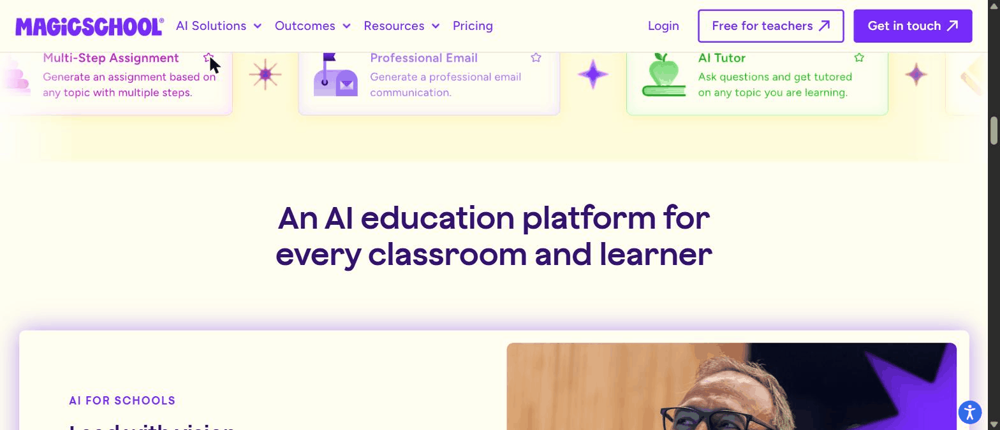
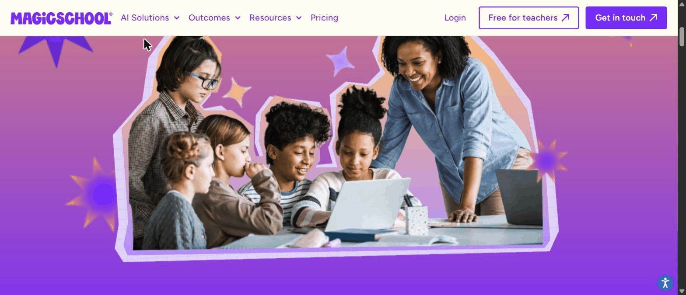
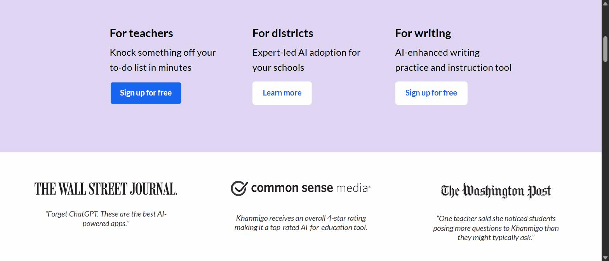

# Heuristic Evaluation — AI-Literacy Upskilling for Indonesian Teachers

## Overview

- **Study & goal:** benchmark to ground a mobile-first course + app that builds Indonesian
  teachers' own AI fluency first, then equips them to teach students proper AI use.
- **Platforms evaluated (6):** MagicSchool AI, Khanmigo, Elements of AI, Common Sense (AI
  Literacy), Google AI Essentials, Ruangguru. **Excluded:** Platform Merdeka Mengajar (no
  screenshots — context-only).
- **Method:** expert review against **Nielsen's 10 usability heuristics**, over **captured
  marketing stills + written flows only** (the products' in-app interiors are login/paywall-gated
  and were not captured). Severity uses Nielsen's 0–4 scale; `—` marks an exemplary/positive
  finding. Because the evidence is public marketing surfaces, this evaluation is strongest on
  H2/H4/H6/H8 (language, consistency, recognition, minimalism) and cannot fairly judge the
  interaction-only heuristics (see **Limits**).

**Issue tally (observable from captures):**
| Severity | Count | Notes |
|---|---|---|
| 4 — catastrophe | 0 | none observable from marketing stills |
| 3 — major | 0 | none observable |
| 2 — minor-to-moderate | 5 | "free" vs paywall framing (Khanmigo, Google), intrusive interstitials (Common Sense, Ruangguru), tool-grid density (MagicSchool) |
| 1 — cosmetic | 3 | promo clutter, immediate modal, mild expectation gaps |
| — exemplary | 15+ | recognition-over-recall, plain teacher language, credibility/trust, localized onboarding |

The headline: these platforms are, on the whole, **strong on the heuristics that matter most for
our anxious, low-confidence learner** — plain language (H2), recognition over recall (H6), and
minimalist first screens (H8). The recurring *faults* are commercial, not usability: "free"
framing that hides a paywall, and promo interstitials that interrupt.

---

## MagicSchool AI

**1. Recognition rather than recall (H6) — exemplary.**
- *Observation:* the product surface is a grid of **task-named tools** (Lesson Plan, Rubric
  Generator, Multiple Choice Quiz, IEP Generator, Report Card Comments, Text Rewriter), each a
  card with icon + name + one-line description. The teacher *recognizes* the job to do instead of
  recalling what to type into a blank box.
- *Severity:* —
- *Evidence:* 
- *Takeaway:* the single most reusable pattern for our first-win module — present recognizable,
  job-named entry points, not an empty prompt.

**2. Match between system & the real world (H2) — exemplary.**
- *Observation:* every tool is named in a teacher's own vocabulary and framed as a job ("Generate
  report card comments with strengths and growth areas"), not in AI/technical terms.
- *Severity:* —
- *Evidence:* 
- *Takeaway:* speak the teacher's language; the tool label does the wayfinding.

**3. Consistency & standards (H4) — exemplary.**
- *Observation:* one consistent card component (icon · title · one-liner · favourite star) repeats
  across dozens of tools; nav and CTA styles are consistent; the signup is a standard email/password
  form.
- *Severity:* —
- *Evidence:* `03-teacher-tools-showcase.png`, `04-tools-and-ai-tutor.png`; signup per `flow.md`.

**4. Flexibility & efficiency of use (H7) — exemplary.**
- *Observation:* a **favourite star** on each tool card (an accelerator for a teacher's
  frequently-used tools) and a search field over the 80+ tools.
- *Severity:* —
- *Evidence:*  (80+ tools, tool exemplars, AI instructional coach)
- *Takeaway:* let returning users pin their handful of real tools so the catalogue doesn't tax them.

**5. Help & documentation (H10) — exemplary.**
- *Observation:* "Tool exemplars", an "AI instructional coach", and free certification courses are
  signposted as scaffolding around the tools (not just a help link).
- *Severity:* —
- *Evidence:* `05-ai-for-teachers.png` + `notes.md` (certification/PD).

**6. Visibility of system security status (H1, applied to trust) — exemplary.**
- *Observation:* a dedicated trust wall surfaces the *state of data safety* up front — FERPA,
  COPPA, GDPR, SOC 2, ESSA badges + "we don't use your data to train AI."
- *Severity:* —
- *Evidence:* 
- *Takeaway:* making safety *visible* is itself a usability move for a risk-averse audience.

**7. Aesthetic & minimalist design (H8) — minor violation.**
- *Observation:* the hero is clean and single-message, but the tool showcase is **dense** — many
  multicoloured cards competing at once, which can overwhelm a low-confidence first-timer.
- *Severity:* 2
- *Evidence:* contrast  with `03-teacher-tools-showcase.png`.
- *Recommendation:* for novices, gate the full catalogue behind a curated "start here" subset;
  reveal the 80+ grid only once confidence is established.

---

## Khanmigo

**1. Match between system & the real world (H2) — exemplary.**
- *Observation:* the home splits cleanly by real audience mental models — **Teachers / Learners /
  Parents** — each with its own promise and CTA; the tutor speaks natural language ("Let's solve
  it together").
- *Severity:* —
- *Evidence:* 

**2. Recognition rather than recall (H6) — exemplary.**
- *Observation:* teacher tools are surfaced as named cards ("Exit tickets — create end-of-lesson
  assessments", "Lesson plan").
- *Severity:* —
- *Evidence:* 

**3. Aesthetic & minimalist design (H8) — exemplary.**
- *Observation:* generous whitespace, one idea per section, a single dominant CTA per audience —
  low cognitive load.
- *Severity:* —
- *Evidence:* 

**4. Match / credibility (H2) — exemplary.**
- *Observation:* third-party credibility (WSJ, Washington Post, a Common Sense 4-star rating) and
  explicit "your work and student data private and secure" copy build trust without jargon.
- *Severity:* —
- *Evidence:* `01-audiences-and-press.png`, `02-for-teachers-tools.png`.

**5. Match / user expectation (H2) — minor violation.**
- *Observation:* "Sign up for **free**" is repeated prominently, but the **learner/parent tier is a
  paid subscription** (documented in `notes.md`); the "Get Khanmigo" learner CTA leads toward
  payment. A parent could reasonably expect the whole thing to be free.
- *Severity:* 2
- *Evidence:*  ("Get Khanmigo") + `notes.md` (paid learner tier).
- *Recommendation:* disclose "free for teachers / paid for families" at the CTA, not after the click.

---

## Elements of AI

**1. Aesthetic & minimalist design (H8) — exemplary.**
- *Observation:* extreme, editorial minimalism — one centred message ("Our goal is to demystify
  AI"), vast whitespace, greyscale partner logos, no decorative noise.
- *Severity:* —
- *Evidence:* 
- *Takeaway:* calm, uncluttered first screens suit an anxious adult learner.

**2. Match between system & the real world (H2) — exemplary.**
- *Observation:* reassurance-first plain language — "demystify AI", "no complicated math or
  programming required", "at your own pace" (from `notes.md`/`flow.md`).
- *Severity:* —
- *Evidence:* `01-positioning-demystify.png` + `notes.md`.

> Only the landing page was captured (course interior is on a permission-gated subdomain), so
> H1/H3/H5/H7/H9 for Elements of AI **cannot be assessed** from this evidence — see Limits.

---

## Common Sense — AI Literacy

**1. Consistency & standards (H4) — exemplary.**
- *Observation:* the lesson library is a consistent, scannable row pattern — each lesson a
  title + guiding question + standard metadata tags (Grades, Time, and format: Video / Dilemma
  Discussion / Podcast).
- *Severity:* —
- *Evidence:*  + `notes.md` (9-lesson list).
- *Takeaway:* the metadata-tagged list is a strong model for our "grab-and-go lesson kit" UI.

**2. Recognition rather than recall (H6) — exemplary.**
- *Observation:* each lesson exposes time ("15 mins.") and format up front, so a teacher can
  scan-and-pick by what fits their slot — decisions by recognition.
- *Severity:* —
- *Evidence:* `notes.md` lesson list; header in `01-ai-literacy-lessons-collection.png`.

**3. Aesthetic & minimalist design (H8) / User control (H3) — minor violation.**
- *Observation:* an **"Follow our Instagram" newsletter interstitial pops over the content on
  load**, covering the right column of the lesson collection before the user has done anything.
- *Severity:* 2
- *Evidence:* the green popup overlay in 
- *Recommendation:* defer the newsletter prompt (on exit-intent or after a scroll), never over the
  primary content on first paint.

---

## Google AI Essentials (on Coursera)

**1. Visibility of system status (H1) — exemplary.**
- *Observation:* strong expectation-setting — course durations ("Course 1 · 1 hour"), a start date
  ("Starts Jul 15"), enrolment count, and tabbed structure (About / Outcomes / Courses) tell the
  learner exactly what they're committing to and where they are.
- *Severity:* —
- *Evidence:* 
- *Takeaway:* label every unit with its time cost — decisive for a time-poor teacher.

**2. Recognition rather than recall (H6) / Consistency (H4) — exemplary.**
- *Observation:* a familiar Coursera accordion of titled, time-stamped courses; standard, learnable
  layout.
- *Severity:* —
- *Evidence:* `01-specialization-5-courses.png`.

**3. Match / user expectation (H2) — minor violation.**
- *Observation:* "**Enroll for free**" is the dominant CTA, but the **certificate is paywalled**
  (audit-only free; documented in `notes.md`), and a "Unlock 3 months of Google AI Pro" upsell
  rides alongside. The "free" promise sets an expectation the credential doesn't meet.
- *Severity:* 2
- *Evidence:* "Enroll for free" in `01-specialization-5-courses.png` + `notes.md` (paywalled cert).
- *Recommendation:* if we offer a certificate, state its cost/recognition at the enrol point — no
  "free" bait for a paid credential.

---

## Ruangguru

**1. Match between system & the real world (H2) — exemplary (the best in the set).**
- *Observation:* the welcome modal is **Bahasa-first and segments by the Indonesian schooling
  structure on the very first interaction** — "Ingin tahu produk untuk jenjang apa?" → PAUD / SD /
  SMP / SMA / UTBK-SNBT, then "Pilih kelas" (Kelas 10/11/12).
- *Severity:* —
- *Evidence:* 
- *Takeaway:* anchor onboarding to jenjang/mapel in Bahasa on first contact — the model for our F8.

**2. Recognition rather than recall (H6) — exemplary.**
- *Observation:* level and class are offered as tappable chips (recognition), with the current
  choice highlighted ("SMA", "Kelas 12").
- *Severity:* —
- *Evidence:* `01-bahasa-onboarding-modal.png`.

**3. User control & freedom (H3) — cosmetic.**
- *Observation:* the personalization modal appears immediately on load, interrupting the page,
  though it does expose a clear **✕ dismiss** control.
- *Severity:* 1
- *Evidence:* modal + ✕ in `01-bahasa-onboarding-modal.png`.
- *Recommendation:* keep the escape hatch (good), but consider triggering the personalizer inline
  rather than as a blocking modal.

**4. Aesthetic & minimalist design (H8) — minor violation.**
- *Observation:* the surface is promo-heavy — a discount banner ("Diskon 52%"), a "Festival"
  badge, and the modal all compete at once, which is visually busy.
- *Severity:* 2
- *Evidence:* the layered promo elements in `01-bahasa-onboarding-modal.png`.
- *Recommendation:* one promotional message at a time; don't stack banner + badge + modal on entry.

---

## Cross-platform heuristic patterns

**Recurring strengths worth stealing:**
- **Recognition over recall (H6) is the dominant winning pattern.** MagicSchool's task-named tool
  grid, Khanmigo's tool cards, Common Sense's tagged lesson list, and Ruangguru's level chips all
  let the user *pick from labelled options* rather than recall what to do. For our low-confidence
  teacher this is the highest-leverage heuristic — build entry points to recognize, not blank
  fields to fill.
- **Plain, real-world language (H2).** Every strong platform names things in the user's terms
  ("Lesson Plan", "Exit tickets", "jenjang/kelas") and reassures ("demystify", "no math required").
- **Making trust/status visible (H1).** MagicSchool's compliance wall and Google's per-course time
  labels reduce anxiety by exposing state (safety, time cost) up front.
- **Consistency (H4) via one repeated card/row component** (MagicSchool tools, Common Sense
  lessons, Google courses) keeps large catalogues learnable.

**Recurring violations worth avoiding:**
- **"Free" framing that hides a paywall (H2 expectation).** Both Khanmigo (free teacher / paid
  family) and Google AI Essentials (free enrol / paid certificate) set an expectation the product
  later breaks. For an Indonesian audience that is highly price-sensitive, we must be honest about
  cost at the decision point.
- **Interstitials that interrupt first paint (H8/H3).** Common Sense's Instagram popup and
  Ruangguru's stacked promos/modal cover primary content before the user acts.
- **Catalogue density for novices (H8).** MagicSchool's 80+ tool grid is powerful but can overwhelm
  a first-timer; curate a "start here" subset.

---

## Limits

- **This is an expert review over static marketing captures, not live use.** The following
  heuristics **cannot be fairly judged** from what was captured and would need live use or a
  moderated test to confirm:
  - **H1 Visibility of system status** — real-time feedback (generation spinners, save states,
    progress) is not observable; only static status labels (durations, badges) were captured.
  - **H3 User control & freedom** — undo/cancel/escape *within* the tools (mid-generation cancel,
    back out of a flow) is not observable.
  - **H5 Error prevention** — inline form validation, constraint handling, and confirmations were
    not captured (only the static signup form).
  - **H9 Help users recognize/diagnose/recover from errors** — no error states were captured at
    all; entirely unevaluable here.
  - **H7 Flexibility & efficiency** — only partly judgeable (MagicSchool's favourites/search were
    visible); keyboard shortcuts, power-user paths, and personalization depth are not.
- **In-app interiors are gated** (login for MagicSchool/Khanmigo; permission-blocked subdomain for
  Elements of AI; paywall for Google/Ruangguru), so every judgment is of the **public shell**, not
  the working product. Single-screenshot platforms (Elements of AI, Common Sense, Google,
  Ruangguru) are especially thin — absence of a finding is not evidence of a strength or a fault.
- **PMM not evaluated** (no captures). Nothing here reflects state variants, dark mode, or mobile
  viewports (captures were desktop-width).
- Findings are grounded strictly in the cited captures; where a heuristic wasn't observable, it is
  named above rather than guessed.
