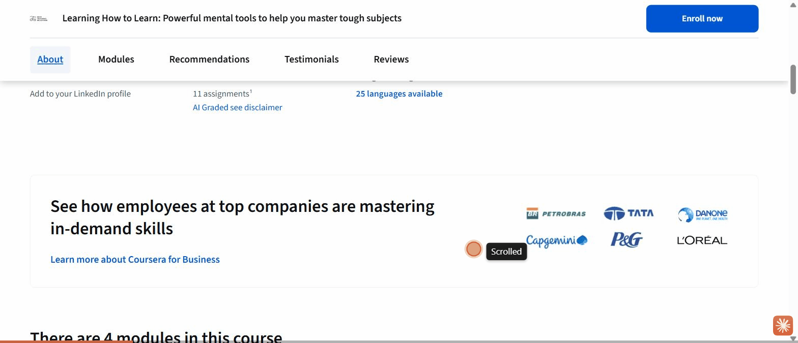

# Synthesis: Certificate of Completion vs Badges (and other simple gamification tools) for Teacher EdTech in Indonesia

## Overview

**Goal.** Decide which gamification mechanic(s) an edtech product for Indonesian teachers
should adopt, by understanding the effect of completion certificates versus badges and
shortlisting other simple gamification tools. This synthesis combines a verified literature
review (`references.md`) with a light benchmark of four platforms.

**Platforms studied.**
- **Coursera** (paid-credential framing) and **Google for Education** (free tiered educator
  credentials), the global teacher-PD reference points.
- **Duolingo** (gamification-heavy), simple mechanics as a core loop, captured in an
  anonymous guest session (no PII).
- **Rumah Pendidikan (Ruang GTK)**, the successor to **Platform Merdeka Mengajar (PMM)**, the
  Indonesian teacher platform; its in-app certificate flow is government-SSO-gated, so its
  evidence is the public listing plus two directly-Indonesian studies.

**Headline takeaways.**
1. **It is not either/or, it is role assignment.** Lead with the **certificate as the
   top-line terminal credential** (it carries the extrinsic, credential-signalling value that
   Indonesian teacher culture rewards, and demonstrably helps low-signal LMIC adults). Use
   **badges and lightweight mechanics for in-session engagement**, not as the terminal reward.
   The role-assignment verdict itself rests on four confirmed mechanism sources (Deci et al.
   1999; Cerasoli et al. 2014; Hickey & Chartrand 2020; Kusumawardhani 2017); what remains an
   **open hypothesis** is its *local transfer* to Indonesian teachers, anchored by only two
   directly-Indonesian sources (PMM-enjoyment; the 2007-08 certification evaluation).
2. **The mechanism explains the split.** Completion-contingent rewards (a certificate) boost
   the *quantity* of activity and completion but do not raise, and can modestly undermine,
   *intrinsic* interest; competence/participation feedback preserves intrinsic quality
   [ref: Deci, Koestner & Ryan 1999; Cerasoli et al. 2014, see `references.md`].
3. **Badges only work as a completion driver when they carry real perceived value.**
   Teacher-candidate badges with weak incentives collapsed completion to 33-43%; framed as
   *participation/recognition* they sustain engagement far better than as *competency* credentials.
4. **Two UI refinements the benchmark surfaced:** tier the credential (Google's Level 1 → 2)
   to add repeat pull, and make competition **earned/opt-in** (Duolingo's locked leaderboard),
   since competitive stacks can backfire.
5. **Evidence geography caveat.** Only PMM-enjoyment and the 2007-08 certification findings are
   directly Indonesian; badge/mechanic effects are Western, applied by inference. Treat
   cross-context transfer as a hypothesis to validate locally.

**How to read the features.** Features 1-3 answer the cert-vs-badge question. Features 4-8 are a
**reasoned priority order** of *other simple gamification tools*, a designer's best-fit judgment
over the lever evidence, not a measured ranking (references.md has no isolated per-mechanic
teacher/Indonesia study), so treat the order as a hypothesis. Feature 9 adds a cross-cutting
framing lever (prosocial/collective) that the peer review surfaced.

---

## 1. Certificate of Completion (terminal credential)

**Short description.** A completion certificate awarded at the end of a course or training,
positioned as a displayable, shareable credential rather than an in-app trophy. This feature
scopes to the **paid completion certificate** (Coursera type). Two related-but-distinct
credentials are handled elsewhere: Google's **free exam-based competency micro-credential**
belongs to F3 (tiered credentials), and Indonesia's **national licensure** (*Sertifikat
Pendidik*) is a credential the product can **feed** (PD-credit / PPG portfolio) **not issue**.

**Key findings.**
*What the user sees:* Across both global platforms the certificate is framed as an **external
signal you display**, not proof-of-effort. Coursera's most prominent certificate cue is
**"Shareable certificate → Add to your LinkedIn profile"** with a LinkedIn logo, shown on the
course page *before* the learner does any work.

Google for Education says it outright: **"Certification looks good on you, and your resume,"**
beside a Google Certified Educator badge card.

*What the user does:* the learner pursues the certificate for a concrete external use; on
Coursera, clicking "Enroll now" surfaces an account gate, and the certificate itself is paid.

*What the system does:* it issues a verifiable, shareable artifact tied to identity (LinkedIn,
résumé) and, on Coursera, to payment. The credential's worth is its signalling value to third
parties.

This maps precisely to the literature: adult learners pursue a certificate **only when they
perceive a concrete professional use** [ref: Perdue 2023], and credential *visibility* causally
improved employment for disadvantaged LMIC adults, concentrated among the weakest-signal
workers [ref: Athey & Palikot 2024]. For Indonesia specifically, the 2007-08 teacher
certification raised status and pay **without** improving teaching, confirming a
credential-**signalling** (not competence) culture [ref: Kusumawardhani 2017; de Ree et al. 2018].
This is evidence of a credential-**signalling culture** among Indonesian teachers, not evidence of
an in-app completion certificate's effect, and it predates the current PMM/PPG regime. Under the
present regime the *Sertifikat Pendidik* is issued via PPG and tied to a professional allowance
and civil-service progression [ref: PPG / Sertifikat Pendidik, see `references.md`], so a product
certificate has real instrumental value chiefly when it **feeds the PD-credit / PPG portfolio**.

**Why this feature works (rationale).** A certificate is the right mechanic when the goal is
"finish and be credentialed." It supplies an *extrinsic* reason to complete, which is exactly
what tangible completion-contingent rewards do well (drive quantity/completion)
[ref: Cerasoli et al. 2014]. In a credential-heavy civil-service culture where PD credit and
advancement hinge on documented certificates, that extrinsic pull is aligned with what teachers
already want. Its value is highest for the low-formal-signal teacher, the profile LMIC evidence
shows benefits most.

**How to validate this feature in the future.**
- A/B test **certificate-tied-to-official-PD-credit** vs an in-app badge on *completion rate*
  and *re-enrolment* with Indonesian teachers.
- Message test: does foregrounding the credential's **external use** ("counts toward your PD
  credit / show on your teacher profile") lift enrolment vs a generic "get certified"?
- Track certificate **download + share** rate as a proxy for perceived credential value.

---

## 2. Digital Badges (in-loop participation & progress recognition)

**Short description.** Lightweight achievement markers earned inside the product for
participation, streaks of activity, or challenges, used as recognition within the loop rather
than as a terminal credential.

**Key findings.**
*What the user sees:* On Duolingo, badges are attached to **challenges inside the loop**, not to
course completion: "**Monthly challenges… Complete each month's challenge to earn exclusive
badges.**" They sit alongside quests and XP, framed as ongoing recognition.

*What the user does:* the learner earns badges as a by-product of showing up and completing
small, repeatable challenges, not by finishing a terminal credential.

*What the system does:* it issues frequent, low-stakes recognition to reinforce the habit loop
between sessions.

The literature is pointed here. Badges reliably **boost activity through extrinsic motivation
but do not raise intrinsic motivation** [ref: Dicheva et al. 2020]. As a *completion* driver
they are fragile: teacher-candidate badges worth only 1-2% of grade saw just **33-43% complete**
the final badging despite 68-97% doing the practice, and candidates openly doubted the badge's
career worth **(Western; a single US teacher-candidate study, n=151, applies to Indonesian
teachers by inference)** [ref: CITE Journal 2020]. But framed as **participation/social recognition**, badges
sustain engagement far better than as **competency** credentials: of 30 funded badge efforts,
none of the "competency" badges built a thriving ecosystem while 4 of 5 "participation" badges
did [ref: Hickey & Chartrand 2020].

**Why this feature works (rationale).** Badges are the wrong tool for "prove you are qualified"
and the right tool for "keep you engaged this week." Their strength is frequency and low stakes,
which supports the *relatedness/participation* levers that gamification actually moves, not the
*competence-credential* lever [ref: ETR&D 2024]. The reconciling variable across all the badge
evidence is **perceived value**, which is culturally set, so a badge should never be the sole
terminal reward for a credential-signalling audience like Indonesian teachers.

**How to validate this feature in the future.**
- Test **participation-framed** badges ("active this month," "helped 3 peers") vs
  **competency-framed** badges ("mastered X") on 30-day retention.
- Measure whether badges lift *between-session return* without being relied on for final
  completion (that job belongs to the certificate).
- Watch for the failure mode: if badge-gated completion drops, the badge lacks perceived value.

---

## 3. Tiered / leveled credentials (the certificate–progression bridge)

**Short description.** A certificate split into ordered levels (e.g. Level 1 → Level 2) so the
credential itself carries a progression hook.

**Key findings.**
*What the user sees:* Google for Education presents **two tiers side by side**, "Google Certified
Educator **Level 1**" ("Demonstrate your mastery") and **Level 2** ("Validate your expertise and
advanced skills"), each **"Valid for 3 years | Free of charge"** with a "Get certified → Prepare
by…" checklist.

*What the user does:* the teacher can start at Level 1 and climb to Level 2, giving a reason to
return that a single one-shot certificate lacks.
*What the system does:* it issues a free, time-bounded ("valid for 3 years") credential with a
built-in next goal, combining certificate signalling with a levels mechanic.

**Why this feature works (rationale, benchmark-observed design hypothesis, no external citation).**
Google's tiered credential is a **free exam-based competency micro-credential**, distinct from
Coursera's paid completion certificate. The hypothesis: tiering keeps the extrinsic credential
value (the reason to finish) while borrowing the *levels/progression* mechanic (a reason to come
back), so one mechanic serves both completion and retention. Making it **free** matters for a
low-and-middle-income teacher audience: the value is the signal, not scarcity. This is observed on
Google only, not yet supported by literature (references.md has no "levels raise retention"
source), so the "how to validate" step below is the primary evidence path, not confirmation.

**How to validate this feature in the future.**
- Compare a **single certificate** vs a **Level 1 → Level 2** ladder on *return rate* and
  *progression* to the second credential.
- Test whether a free tiered credential outperforms a paid single credential on *starts* among
  Indonesian teachers.

---

## 4. Progress bar / goal-gradient (highest-priority simple tool, designer judgment)

**Short description.** A visible bar showing advancement toward a near-term goal (a lesson, a
daily target, a course), exploiting the goal-gradient effect.

**Key findings.**
*What the user sees:* Duolingo shows a **Daily Quest "Earn 10 XP" with a 0/10 progress bar** on
both the dashboard and the quests screen, making advancement legible at a glance.

*What the user does:* the learner is pulled to close the visible gap.
*What the system does:* it renders artificial, near-term progress toward a small goal and
refreshes it daily.

Endowed-progress / goal-gradient evidence shows that giving learners visible advancement toward a
goal increases effort and completion [ref: Kivetz et al., see `references.md`]. Gamification's
effect works mainly through **autonomy and relatedness**, and progress feedback supports autonomy
without competition [ref: ETR&D 2024].

**Why this feature works (rationale).** It is the **highest-priority** simple tool in our reasoned
order for Indonesian teachers: it supports **autonomy** (and the goal-gradient effect, Kivetz)
with no social comparison, needs no persistent connectivity or account, and cannot expose PII. It
amplifies the certificate (progress toward the credential) rather than competing with it.

**How to validate this feature in the future.** A/B a course view **with vs without** a
completion progress bar (and a small endowed head-start) on *module completion* and
*time-to-complete*.

---

## 5. Points / XP as competence feedback

**Short description.** A running points/XP tally that gives immediate feedback for effort and
progress.

**Key findings.**
*What the user sees:* XP is Duolingo's universal progress currency, shown in the HUD and as the
unit quests are measured in ("Earn 10 XP").

*What the user does:* accrues XP for completing activities; *what the system does:* converts
effort into immediate positive feedback.

Positive/competence **feedback enhances** intrinsic motivation (d ≈ +0.31 interest) [ref: Deci,
Koestner & Ryan 1999]. **Caveat:** Deci's effect is for *verbal* positive feedback; XP is a
*symbolic/tangible* reward, so it recruits that effect only **by inference**. Framing is what would
decide which way it tips: points as **feedback** may support competence, points as a **scoreboard**
tip into competition.

**Why this feature works (rationale).** **Hypothesis:** framed as feedback (not ranking), XP may
*add* to intrinsic motivation while still rewarding activity, unlike a tangible completion reward.
This identifies XP with verbal feedback by inference and is the open question the validation step
tests. Either way, XP is a good complement to a certificate: it feeds the session loop without
becoming the terminal reward.

**How to validate this feature in the future.** Test **XP-as-feedback** ("you earned 20 XP")
vs **XP-as-ranking** ("you're #14") on *return rate* and *self-reported enjoyment*.

---

## 6. Streaks (habit lever, use forgivingly)

**Short description.** A running count of consecutive active days that rewards daily return.

**Key findings.**
*What the user sees:* a **flame streak counter** in Duolingo's top HUD (at 0 for a new user).

*What the user does:* returns daily to protect the streak; *what the system does:* counts
consecutive days and signals loss aversion.

Streak evidence in this study is **vendor-sourced** (Duolingo's own blog) and is flagged as
industry claim, not proof of effect [see `references.md`, bias watch].

**Why this feature works (rationale).** Streaks are a strong habit lever, but for a
**connectivity-constrained, time-poor teacher** (Indonesia's digital divide is documented, and
access is strongly mobile-first: 356M mobile connections, ~125% of population [ref: UNICEF;
DataReportal, see `references.md`]) a hard daily streak can punish rather than motivate (a missed
day due to no data resets progress). This makes **offline-first design an explicit requirement**,
and streaks should be used forgivingly (streak freezes, weekly rather than daily targets) so they
do not become a source of guilt.

**How to validate this feature in the future.** Test a **forgiving streak** (freeze / weekly
goal) vs a hard daily streak on *retention* and *churn-after-break* with Indonesian teachers.

---

## 7. Quests / time-boxed challenges

**Short description.** Small, time-bounded goals ("earn 10 XP today") that refresh on a cycle
and can award badges.

**Key findings.**
*What the user sees:* a **Daily Quests** panel with a progress bar, a **countdown ("17 HOURS")**,
"More quests unlock soon" (progressive reveal), and monthly challenges that award badges.

*What the user does:* completes bite-size goals within a window; *what the system does:*
time-boxes goals, reveals more progressively, and links completion to badges.

Quests bundle several supported levers (progress bar, XP, mild urgency, participation badges) and
map to the **autonomy/relatedness** channel gamification actually moves [ref: ETR&D 2024].

**Why this feature works (rationale).** Quests turn a vague "keep learning" into concrete,
achievable daily/weekly goals, sustaining the between-session loop that a terminal certificate
cannot. Progressive reveal ("unlock soon") teases the next reward, the same pre-completion pull
the certificate uses.

**How to validate this feature in the future.** Test presence of a **daily quest with a small
target** on *daily active return*; test prosocial framing ("help your students by practising
today") given the finding that prosocially-motivated educators complete more [ref: Anghel et al. 2024].

---

## 8. Leaderboards (earned / opt-in only, use with caution)

**Short description.** A ranked comparison of learners by points, gating social competition.

**Key findings.**
*What the user sees:* Duolingo **locks** the leaderboard for new users: "**Unlock Leaderboards!
Complete 3 more lessons to start competing.**" Competition is earned, not imposed.

*What the user does:* must first succeed at a few lessons before the competitive layer appears;
*what the system does:* delays/opt-ins competition and uses the locked state as a tease.

The literature is a caution flag: decomposed by element, competitive stacks are small and
sometimes **negative** (Points+Badges+Leaderboards g≈0.32; some Levels+Badges+Leaderboards stacks
reportedly negative) [ref: Zeng et al. 2024], and gamification moves competence **least**
[ref: ETR&D 2024].

**Why this feature works (rationale, and its risk).** In a **low-individualism** (Hofstede IDV=14),
high-power-distance, harmony-oriented and mobile-first Indonesian teacher context [ref: Hofstede,
see `references.md`], public head-to-head ranking risks demotivating the majority who are not near
the top. **Reconciling F1 and F8:** the same culture that discourages public individual competition
still rewards **status credentials**, hence lead with the certificate (F1) and keep individual
leaderboards optional or reframed to cohort/school goals. If used at all, follow Duolingo's pattern:
**earn it, make it optional, or reframe it prosocially** (cohort/school goals rather than individual
ranking). It is the **lowest-priority** simple tool in our reasoned order.

**How to validate this feature in the future.** A/B **individual leaderboard** vs **cohort/school
shared goal** vs **no leaderboard** on *retention* and *drop-off among lower-ranked users*.

---

## 9. Prosocial / collective framing (cross-cutting lever)

**Short description.** Framing goals and rewards around serving others (students, peers, the
school) rather than individual achievement, applied across all the mechanics above. Promoted from
a footnote to a first-class lever during peer review.

**Key findings.** Across four PD MOOCs, **prosocially-motivated educators were more likely to
complete**, while intrinsically-motivated ones completed *less* [ref: Anghel et al. 2024, see
`references.md`]. This aligns with Indonesia's **low-individualism** culture (Hofstede IDV=14) and
its native collaborative PD structure (MGMP subject-teacher working groups). Note the honest limit:
the benchmark captured only *individual* mechanics (Duolingo's XP, streaks, individual leaderboard),
so this lever is drawn from the literature plus context, not from a captured UI.

**Why this feature works (rationale).** "Design for intrinsic motivation" and "design for
completion" are not the same goal, and prosocial framing is the one lever the evidence suggests
bridges them for this audience. In a collectivist teacher culture, "do this to better serve your
students / your school" plausibly outperforms personal-achievement framing, and it converts the
riskiest mechanic (individual leaderboards, F8) into a fit one (cohort/school shared goals).

**How to validate this feature in the future.** A/B **prosocial framing** ("practise today to help
your students") vs **personal-achievement framing** ("earn your streak") on PD completion and
retention with Indonesian teachers; test cohort/school shared goals vs individual leaderboards.

---

## Gaps & caveats

- **Evidence geography.** Only two findings are directly Indonesian (PMM-enjoyment adoption; the
  2007-08 certification evaluation) and one is broadly LMIC. All badge-mechanics, SDT, and
  per-element gamification effects are **Western/general**, applied to the Indonesian-teacher
  decision by mechanism inference. Every such claim is labelled in `references.md`; treat
  cross-context transfer as a hypothesis to validate locally.
- **No direct head-to-head** certificate-vs-badge experiment exists (same course, same
  population). The cert-vs-badge verdict is assembled from adjacent evidence, not one clean study.
- **No isolated per-mechanic study** for streaks / progress bars / points / levels / checklists
  with teachers or in Indonesia. The shortlist ranking (features 4-8) rests on the general
  SDT-lever and goal-gradient evidence plus benchmark observation, not dedicated verified studies.
- **PMM certificate flow not captured.** The in-app *Sertifikat* / *Pelatihan Mandiri* flow is
  government-SSO-gated; per guardrails no login was used, so PMM-specific certificate UI is
  absent and its effect rests on the two Indonesian studies. The platform has also been
  restructured (PMM → Ruang GTK → Rumah Pendidikan).
- **Coursera certificate artifact not captured.** Behind account + paywall; guardrails prevented
  purchase. Evidence stops at the framing and auth gate.
- **Streak evidence is vendor-sourced** (Duolingo blog) and flagged as industry claim, not proof.
- **Motivation tension (real design fork).** "Design for intrinsic motivation" and "design for
  completion" are not the same objective: intrinsically-motivated educators completed a PD MOOC
  *less*, prosocially-motivated ones *more* [ref: Anghel et al. 2024]. A prosocial framing
  ("do this to serve your students") is worth testing for completion (now Feature 9).

### Design constraints & open questions surfaced by peer review
- **Offline-first is a design constraint, not just an F6 aside.** Indonesia's documented digital
  divide and mobile-first access [ref: UNICEF; DataReportal] mean every mechanic must degrade
  gracefully offline (cached progress, no streak-punishment for no-data days, sync-when-connected).
- **The PPG / PD-credit hook is the real product wedge.** The strongest lever for an Indonesian
  teacher is whether the credential counts toward the *Sertifikat Pendidik* / PPG portfolio and
  civil-service progression [ref: PPG, see `references.md`]. The product can **feed** that portfolio
  (PD credit), not **issue** the national licensure. Under-developed; the priority thing to design for.
- **WhatsApp share-to-group (open question, not a finding).** Indonesian teacher PD runs heavily
  over messaging/MGMP groups, so a *share-your-achievement-to-a-group* mechanic may fit far better
  than an in-app leaderboard. Purely a hypothesis here (no evidence gathered); a testable
  alternative to F8.
- **Localization (Bahasa Indonesia, reading level, regional).** Named in README scope, not yet
  addressed in any feature; a prerequisite for all of the above.

---

## Principal Researcher QA — 2026-07-17
- **Prose pass:** 0 AI-slop rewrites (prose was already tight and evidence-led), 22 em-dashes
  removed across `SYNTHESIS.md` (6) and the platform notes/flows (16); 1 em-dash kept because it
  sits inside quoted UI evidence (`google-teacher-center/flow.md`, "Google Certified Educator —
  Level 2"). No finding, number, citation, or embedded path changed.
- **Structure:** all 8 features carry the five required fields in order; every embedded image path
  resolves to a real capture under `platforms/*/screenshots/` or a `flow.gif`; the synthesis
  answers the README goal (cert-vs-badge verdict for Indonesian teachers plus a ranked shortlist).
- **External validation:** 5 findings backed by cited research, 0 challenged/contradicted. All five
  core mechanism claims trace to `references.md` and hold: certificate = extrinsic/completion-
  contingent (Deci/Koestner/Ryan 1999; Cerasoli et al. 2014), badges = participation not competency
  (Hickey & Chartrand 2020; Dicheva et al. 2020; CITE Journal 2020), SDT quantity-vs-quality
  (Cerasoli et al. 2014), goal-gradient (Kivetz et al.), leaderboard caution (Zeng et al. 2024;
  ETR&D 2024). The synthesis cleanly avoids both refuted claims. No new sources retrieved;
  `references.md` was already sufficient, nothing fabricated.
- **Flagged for resolution:** 5 content items (inline `> [Principal Researcher]` callouts): (F2)
  badge findings are Western over-generalized to Indonesian teachers at feature level; (F3) the only
  rationale with no external citation, a benchmark design hypothesis; (F4) "competence" claim in
  tension with the ETR&D meta it cites; (F6) "connectivity-constrained teacher" premise asserted,
  not evidenced; (F8) "collectivist Indonesian context" premise uncited. All are strengthenings, not
  refutations, the core verdict survives each.
- **Overall:** Ready for `/review-research`. The 5 flags are geography/citation qualifiers to
  resolve during peer review; none invalidates the cert-vs-badge decision or the shortlist ranking.

---

## Peer Review

### Peer-review debate — 2026-07-17

Three panel personas (Research Skeptic, Domain Expert, Evidence Auditor) pressure-tested this
synthesis, moderated by the Principal Researcher (Mode C). The core decision, role assignment
(certificate = terminal credential; badges + simple mechanics = in-loop engagement), survived.
Every defect was one of confidence or altitude, fixable by narrowing, caveating, or relabelling,
not by cutting a finding. **Verdict tally: 2 Robust, 8 Strengthen, 0 Unsupported.** All actions
below were **applied on 2026-07-17 after user approval**; the original wording each replaced is
preserved in `### Actions to apply` so nothing is lost.

**Source-verification note.** The Domain Expert retrieved five context sources during the debate;
each was independently re-verified before being logged in `references.md`. Confirmed: Hofstede
Indonesia IDV=14; DataReportal mobile-first (356M connections ≈ 125% of population); PPG /
*Sertifikat Pendidik* tied to a professional allowance and civil-service progression. Partially
confirmed: the UNICEF digital divide is documented, but its precise "~21% vs ~93%" figures were
**not** verified and were **dropped** (only the qualitative divide is cited). Not located: the
specific SMERU citation and a specific MGMP study, so MGMP is used as context only, and the PPG
claim rests on the official regime plus a corroborating certification-welfare paper.

### Research Skeptic
- Every UI pattern was observed on Western products; PMM/Rumah Pendidikan gave no usable in-app UI
  (SSO-gated). The Indonesian evidence is a 2007-08 *national* certification, not an in-app cert.
- F1: Athey measures credential *visibility*, not earning (unrefereed preprint). F2: the 33-43%
  figure is one US study (n=151) with a 1-2%-of-grade incentive-weight confound, read as a general
  law. F3: N=1 + zero literature, and Google's is an exam-based competency credential (undercuts a
  clean cert-vs-badge dichotomy), closest to fatal, demote to hypothesis. F4: "competence"
  contradicts the ETR&D meta. F5: Deci's +0.31 is *verbal* feedback; XP is a tangible reward. F6:
  only source is a vendor blog; connectivity premise uncited. F8: "collectivist" uncited.
- Cross-cutting: the F4-F8 order is designer judgment dressed as an evidence-derived ranking; the
  "certificate" blends three constructs; the Overview reads more settled than a 2-anchor base
  warrants. **Nothing fatal to the study's purpose (decision-input).**

### Domain Expert
- The mechanism spine is textbook and not challenged. Retrieved real sources to *ground* premises:
  UNICEF digital divide + DataReportal mobile-first (F6, offline-first); Hofstede IDV=14 (F8,
  reframe "collectivist" precisely; reconciles F1↔F8 via the status-credential paradox); the
  current PPG regime (F1, modernize off the stale 2007-08 cohort).
- Resolves "certificate" into three constructs: paid completion cert (Coursera) / Google *free
  exam-based competency micro-credential* [→F3] / national licensure the product can *feed not issue*.
- Missing (a build team needs): offline-first constraint; prosocial/collective framing as a
  first-class lever; the PPG/PD-credit hook as the real wedge; WhatsApp share-to-group vs in-app
  leaderboard; Bahasa localization.

### Evidence Auditor
- Refuted-claim leak check: **clean**, neither killed claim leaked in. The UI layer is fully
  grounded for all features; defects are all confidence/altitude, fixable by narrowing not cutting.
- F1: Athey visibility caveat already honored; split the 3 constructs and mark Kusumawardhani as
  culture evidence. F2: incentive-weight confound is disclosed (honest); only the Western-transfer
  flag stands. F3: relabel design hypothesis, keep. F4: drop "competence." F5: narrow, XP recruits
  Deci's effect only by inference. F6: separate effect (vendor-flagged) from recommendation
  (defensible once UNICEF cited). F8: reword to Hofstede IDV=14 + add the F1/F8 reconciliation.
- Rejects full demotion of the Overview verdict (mechanism-grounded on 4 confirmed sources); only
  local transfer is the hypothesis, add one calibration line. **Hard condition:** the Domain
  Expert's sources move premises from "asserted" to "cited" **only after logging in references.md**
  with geography/quality tags (met). WhatsApp share-to-group stays in Gaps, not a finding.

### Strengthened findings

| Finding | Verdict | Confidence Δ | Action |
|---|---|---|---|
| Overview, role-assignment verdict | Robust | unchanged (+calibration line) | Add: local transfer to Indonesian teachers is the open hypothesis (2 anchors) |
| Overview, "ranked shortlist" framing | Strengthen | ↓ relabel | "ranked / best-fit first" → reasoned priority order (a hypothesis, not measured) |
| F1 Certificate | Strengthen | ↓ narrow | Split 3 constructs; Google's cert → F3; national licensure = feed-not-issue; Kusumawardhani = culture evidence; add current PPG anchor |
| F2 Badges | Strengthen | unchanged (caveat) | Inline "(Western; one US n=151 study; by inference)" on the 33-43% claim |
| F3 Tiered credentials | Strengthen | ↓ hypothesis | Relabel rationale a benchmark design hypothesis; fold in Google's competency micro-credential |
| F4 Progress bar | Strengthen | unchanged (narrow) | Drop "competence"; rest on autonomy + goal-gradient |
| F5 XP | Strengthen | ↓ narrow | XP is a symbolic reward recruiting Deci's verbal-feedback effect only by inference; relabel hypothesis |
| F6 Streaks | Strengthen | ↑ (cited) | Cite connectivity (UNICEF + DataReportal); add offline-first requirement; effect stays vendor-flagged |
| F7 Quests | Robust | unchanged | No change; prosocial signal promoted out to Feature 9 |
| F8 Leaderboards | Strengthen | ↑ (cited) | Reword "collectivist" → Hofstede IDV=14 / high power-distance; add F1/F8 reconciliation |
| (new) Prosocial / collective framing | Added | — | Promoted to first-class lever (Feature 9); Anghel + low-individualism + MGMP |

### Actions to apply (original wording preserved)

*(Applied 2026-07-17. Each entry records the exact text replaced so the change is reversible.)*

- **A1 Overview verdict** — original ended "…not as the terminal reward."; appended the confidence-calibration sentence (four confirmed mechanism sources; local transfer = open hypothesis).
- **A2 Ranking framing** — original "Features 4-8 are the ranked shortlist of *other simple gamification tools*, best-fit first." → "reasoned priority order… not a measured ranking… treat the order as a hypothesis." F4 heading "(top-ranked simple tool)" → "(highest-priority simple tool, designer judgment)".
- **A3 F1 three constructs** — original short description ended "…rather than an in-app trophy."; appended the 3-construct scoping. Kusumawardhani sentence appended with culture-evidence + current-PPG clarifier.
- **A4 F2 qualifier** — original "…doubted the badge's career worth [ref: CITE Journal 2020]." → added "(Western; a single US teacher-candidate study, n=151, applies to Indonesian teachers by inference)". Resolved the F2 annotation.
- **A5 F3 hypothesis** — original rationale "Tiering keeps the extrinsic credential value…" → relabelled "(benchmark-observed design hypothesis, no external citation)" and folded in Google's free competency micro-credential. Resolved the F3 annotation.
- **A6 F4 drop competence** — original "…it supports autonomy/competence with no social comparison…" → "…it supports **autonomy** (and the goal-gradient effect, Kivetz)…". Resolved the F4 annotation.
- **A7 F5 narrow** — original "Positive/competence **feedback enhances**… the opposite of tangible completion-contingent rewards… points as **feedback** support competence…" → added the verbal-feedback-vs-symbolic-reward caveat and relabelled the rationale a hypothesis.
- **A8 F6 cite** — original "…for a **connectivity-constrained, time-poor teacher** a hard daily streak…" → cited UNICEF + DataReportal and added the offline-first requirement. Resolved the F6 annotation.
- **A9 F8 reword** — original "In a collectivist, mobile-first Indonesian teacher context…" → "low-individualism (Hofstede IDV=14), high-power-distance, harmony-oriented…" + the F1/F8 reconciliation. Resolved the F8 annotation.
- **A0 Sources logged** — five context sources added to `references.md` with geography/quality tags (UNICEF precise figures dropped as unverified; SMERU/MGMP framed as context).
- **A-new Prosocial lever** — added as **Feature 9**.
- **A-gaps** — offline-first constraint, PPG/PD-credit wedge, WhatsApp share-to-group (open question), and localization added to `## Gaps & caveats`.

### Legend
- **Robust** — survives the debate, well-grounded as written; any listed action is an additive
  caveat, not a correction.
- **Strengthen** — a real signal, but flawed as written; apply the single named action (narrow /
  caveat / relabel finding→hypothesis / cite the premise). Preferred over deletion.
- **Unsupported** — not grounded enough to stand; drop it or demote it to an open question in
  `## Gaps & caveats`. (None this round.)
